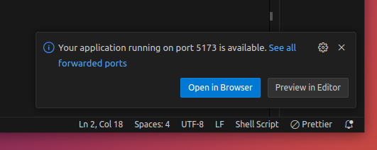

# 🧑‍💻 Contributing for Developers

## Process

If you want to contribute and don't know where to start, here is a step-by-step for a complete lifecycle, from idea to deployment.

1. If you have an idea that is not already in [discussion](https://github.com/webstudio-is/webstudio/discussions) or [issues](https://github.com/webstudio-is/webstudio-builder/issues), please start a discussion or reach out on [discord](https://discord.gg/UNdyrDkq5r)
2. If you are a DEVLOPER, and you want to contribute to the Builder UI, your first step is to become familiar with our design system in figma. Start with the first page of our [Design Docs](https://www.figma.com/file/xCBegXEWxROLqA1Y31z2Xo/%F0%9F%93%96-Webstudio-Design-Docs?type=design\&node-id=234%3A36754\&t=w3VxT162RQF0gTrI-1). And for our design system & components see the [Webstudio Library](https://www.figma.com/file/sfCE7iLS0k25qCxiifQNLE/%F0%9F%93%9A-Webstudio-Library?type=design\&node-id=2647%3A10046\&t=f4xr8mcumXfXkHVh-1). Please read the docs carefully and throughly so you can use our design system properly to create a UI that looks like it's a natural part of Webstudio. If any part of the design is confusing or intimidating you can reach out to us on Discord with questions or feedback.
3.  After submitting an enhancement or a bug we need to agree on a solution. You can jump into implementation right away, but be aware that we have to agree on the solution in the end. Communicating the problem you are solving and why you think the approach you are taking is the best is key for a quick process.

    In fact, we are happy to help communicating your ideas, so if you are not sure - talk to us on discord.
4. When the implementation is in a mergeable state, a core team member will deploy it to production.

### Running the Webstudio Project Using GitHub Codespaces

1. Open the Webstudio repository on GitHub:
   * [Webstudio Repository](https://github.com/webstudio-is/webstudio)
2. Click the green "Code" button.
3. Select "Open with Codespaces".
4. If you don't have a Codespace already, click "New codespace".
   * The Webstudio project will now open in a Codespace with the development environment pre-configured.
5. Wait for the setup to complete:
   * The installation process will take some time as the environment is set up and dependencies are installed.
   * This setup is defined by the `postCreateCommand` in the `.devcontainer` configuration.
6. Run the development server:
   * After the setup completes, open the terminal in Codespaces.
   *   Run the following command:

       ```sh
       pnpm dev
       ```
7. Open the application in your browser
   *   After running `pnpm dev`, you will see a URL in the console that looks like this:

       ```
       ➜  Local:   https://wstd.dev:5173/
       ```
   * Cmd + click on the URL in the console to open it in your browser.

### Running the Webstudio Project Using VS Code

#### Prerequisites

* VS Code installed: [Download VS Code](https://code.visualstudio.com/Download)
* Docker installed: [Install Docker](https://docs.docker.com/get-docker/)

#### Steps

1. Install the "Dev Containers" extension in VS Code:
   * Open VS Code.
   * Go to the Extensions view by clicking the Extensions icon in the Activity Bar on the side of the window.
   * Search for "Dev Containers" and click Install. Alternatively, you can install it from the recommended extensions listed in the Webstudio project.
2. Fork and clone the Webstudio repository:
   * Fork the repository on GitHub.
   * Clone your forked repository to your local machine.
3. Open the repository in VS Code:
   * Open VS Code.
   * Select "File" > "Open Folder" and choose your project folder.
4. Reopen in Container:
   * Once your folder is open, you might see a notification asking if you want to reopen in a container. Click "Reopen in Container".
   * If you don't see a notification, press `F1`, type `Dev Containers: Reopen in Container`, and select it.

VS Code will now build the Docker container and open the Webstudio project inside it. This process will take some time as the environment is set up and dependencies are installed.

5. Run the development server:
   * After the setup completes, open the terminal in VS Code.
   *   Run the following command:

       ```sh
       pnpm dev
       ```
6. Open the application in your browser:
   *   After running `pnpm dev`, you will see a URL in the console that looks like this:

       ```
       ➜  Local:   https://wstd.dev:5173/
       ```
   * Cmd + click on the URL in the console to open it in your browser.


If VS Code shows you an "Open Browser" button, it will lead you to the wrong URL as they are only watching ports. Be sure to use `wstd.dev` and **NOT** `localhost`. The proper URL will show in the console.\
\



### Running the Webstudio Project without Devcontainer

#### Prerequisites

* Docker installed: [Install Docker](https://docs.docker.com/get-docker/)

#### Steps

1. Fork and clone the Webstudio repository:
   * Fork the repository on GitHub.
   * Clone your forked repository to your local machine.
2.  Navigate to the project directory:

    ```bash
    corepack enable
    pnpm install
    pnpm build
    ```
3.  Set up the PostgreSQL database:

    * Navigate to the .devcontainer folder and execute the SQL setup with Docker Compose:

    ```bash
    docker compose  up -d
    ```

    * Go to the project root directory and run the following command to create the database schema:

    ```bash
    pnpm migrations migrate
    ```
4.  Start the development server:

    ```bash
    pnpm dev
    ```

## Login locally

When downloading the app you will have two options for login and they both work in different ways.

### Dev login

Dev login will create you a dev account so you don't need to be online or create a github app. To enable you create a file `.env.development` in `apps/builder` and include two lines:

```
DEV_LOGIN=true
AUTH_SECRET=a random value
```

To login in the app click on the "Dev Login" button and paste the **first four characters** of your `AUTH_SECRET` in the input.\
To log in as another user in dev mode, use the first four characters of your AUTH\_SECRET, followed by : and any email address. For example: \`abcd:example@email.com\`\\

### GitHub Login

To login and use GitHub login you will need to create an OAuth app with the following values:

```
Name: Webstudio
Homepage URL: http://localhost:3000
Authorization callback URL: http://localhost:3000/auth/github/callback
```

> When creating the app with `http://localhost:3000` you will need to always open your app at `http://localhost:3000` for the GitHub login to work.

After the app is created you will need to create a client secret and then copy that value and your client id to the `.env` file:

```
GH_CLIENT_SECRET=
GH_CLIENT_ID=
```

You are done! 🎉

## Develop builder and SDK in parallel

For this we current use [relative-deps](https://github.com/mweststrate/relative-deps) and the way you can run both things is the following:

* Git clone the sdk at https://github.com/webstudio-is/webstudio-sdk
* In the builder run `pnpm dev` and in another window run `pnpm watch:sdk`

This will trigger a build of the SDK whenever make changes to it and that will in turn reload your builder.

## Builder deployment to Vercel

1. [import your Git repository](https://vercel.com/new) into Vercel, and it will be deployed.
2. Add DATABASE\_URL to env variables
3. Redeploy

If you'd like to avoid using a Git repository, you can also deploy the directory by running [Vercel CLI](https://vercel.com/cli):

```sh
npm i -g vercel
vercel
```

It is generally recommended to use a Git repository, because future commits will then automatically be deployed by Vercel, through its [Git Integration](https://vercel.com/docs/concepts/git).

## Release new version of a package

Follow this guide if you would like to release a new version one of our package available to npm.

The flow looks like the following:

1. Modify the code in a branch other than `main`.
2. Every commit on any branch builds and publish to npm with `--dry-run` options.
3. If everything looks fine, bump the version in `package.json`, open a PR and if it's approved, merge it.
4. Every commit on `main` will try publish to npm in case of any files or release process (GitHub Action) changed inside the package directory.
