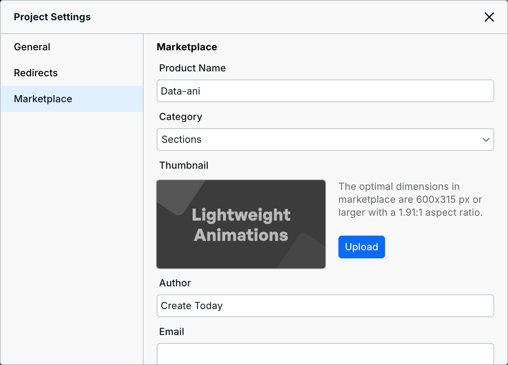
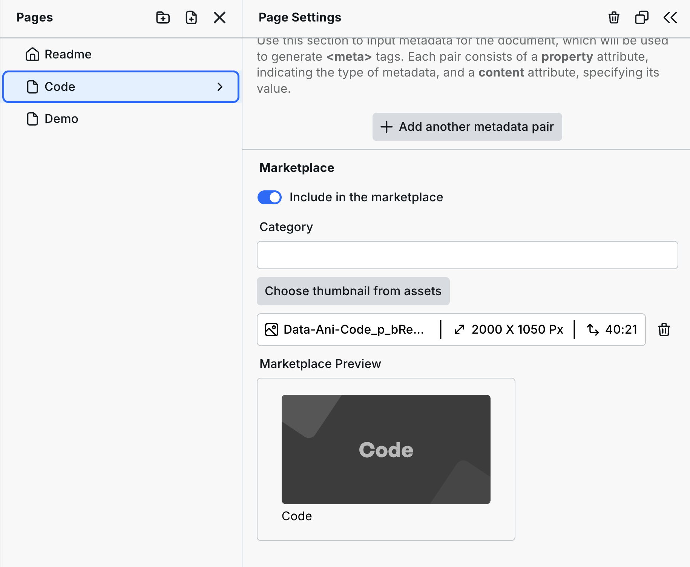

# Contributing to the Marketplace

## Submission Process

### **1. Create a Project**

Create a Project with a page per section or page you want to make available.


When creating sections, ensure there is one parent wrapper for the entire section, as only the first wrapper is inserted when sections are inserted. The Body and its styles are only inserted on pages, not sections.


We recommend creating templates using [Craft](../university/craft.md) — the standard for building with Webstudio. It contains a set of standards, CSS variables, and Tokens that make building websites fast, maintainable, and reusable. While Craft is not mandatory, it’s the recommended way to build in Webstudio. See [Craft](../university/craft.md) for more information.

### **2. Submit the Project**

Navigate to Project Settings > Marketplace, fill out the required fields, select whether your Project includes pages, sections, or integrations, and submit it for review.

<figure><figcaption></figcaption></figure>

Once it’s submitted, Page Settings will now have the following options you can immediately use:

* **Include in Marketplace**: Toggle on or off.
* **Category**: Optionally categorize your pages/sections (e.g., "Contact" if offering various Contact sections/pages).
* **Marketplace Preview**: Add an optional preview image. If none is provided, the page/section name will be displayed.

<figure><figcaption></figcaption></figure>

## Selling Templates

To sell templates, follow the same submission process but include a page with purchasing instructions and a checkout link. Ensure purchases provide immediate access to the template via a Share link so they can clone it. You can redirect your buyers to the Project or send an automated email. Please include “(Paid)” at the end of the template name.

Learn more about the [Marketplace](../university/marketplace.md).

## Related

- [Marketplace](../university/marketplace.md) – Browse and use marketplace templates
- [Craft](../university/craft.md) – The recommended standard for building templates
- [Contributing for Designers](contributing-for-designers.md) – Other ways designers can contribute
- [Design Tokens](../university/foundations/design-tokens.md) – Create consistent, reusable styles
