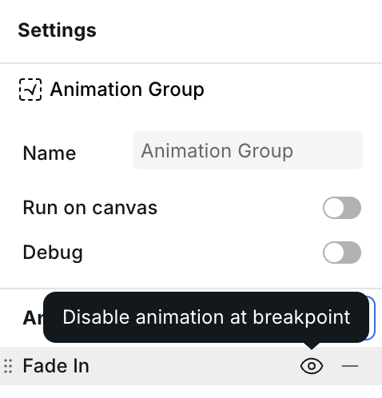

# 🎬 Animation Group

Animation Groups serve as containers that define how their contents animate. You can nest Animation Groups to create complex animations.


Animation Group is one component of the animation engine. See [Animations](../foundations/animations.md) for an overview.


## Settings

### Run on canvas

By default, animations only run on the canvas when the Animation Group is selected in the navigator. Enable this setting to preview animations while designing other elements.

### Type

Choose between two animation trigger types:

- **View-based** – Triggers when an element enters or exits the viewport. Ideal for entrance and exit animations that respond to element visibility.
- **Scroll-based** – Progresses based on scroll position, perfect for scroll indicators.

### Axis

Defines which scroll direction controls the animation:

- **Y-axis** – Vertical scrolling (default).
- **X-axis** – Horizontal scrolling.

### Scroll source (for scroll-based animations)

Select which scrollable container drives the animation:

- **Nearest** – Uses the closest scrolling container affecting the element.
- **Root** – Uses the main document scroll.
- **Closest** – Uses the nearest ancestor element with scrolling enabled.

### Subject (for view-based animations)

Defines which element's visibility determines the animation progress, allowing animations to be triggered by different elements entering or exiting the viewport.

### Inset

Fine-tune animation start and end points relative to the viewport:

- **Top Inset** – Adjusts when the animation begins.
- **Bottom Inset** – Adjusts when the animation ends.

Positive values delay the animation, while negative values trigger it earlier.


For an alternative workflow, the Style Panel accepts `view-timeline-inset` in Advanced on the child instances of the Animation Group. The usage of this property is automatically polyfilled for cross-browser support. If you opt to use the Style Panel, be sure to explicitly set the Top and Bottom Inset values to `auto` in the Animation Group.


### Animations (breakpoint control)

Each animation in the Animation Group can be enabled or disabled per breakpoint. This is useful for:

- Disabling complex animations on mobile for performance
- Creating different animation experiences across screen sizes
- Showing simpler animations on smaller screens while keeping rich effects on desktop

To control animation visibility at a breakpoint:

1. Select a breakpoint in the canvas
2. Hover over an animation in the list
3. Click the eye icon to toggle visibility

When disabled at a breakpoint, the animation won't run, but the element still displays in its final "in" state (as designed on the canvas).

<figure><figcaption>
Hover over an animation to reveal the visibility toggle for the current breakpoint
</figcaption></figure>

### Debug mode


Debug mode is experimental. While it can be very helpful in fine-tuning animations, there are some known issues with it—especially in complex animations.


Enables visualization tools to fine-tune animation timing and progression. When enabled, a small overlay appears displaying animation state details:

- Current status (idle, running).
- Progress percentage.
- Timeline position.

This debugging information is visible only in design mode and does not affect the live site.

## Define your animation

Once your Animation Group settings are configured, define the animation behavior. Webstudio offers preset animations for quick setup while allowing custom animations.

### Animation presets

The available presets depend on the animation type:

#### **View-based animation presets**

- **Fade In** – Smoothly transitions an element from invisible to visible.
- **Fade Out** – Gradually fades an element as it exits the viewport.
- **Fly In** – Moves an element into position upon entry.
- **Fly Out** – Animates an element away upon exit.
- **Wipe In** – Creates a revealing effect.
- **Wipe Out** – Gradually hides content.
- **Parallax In** – Creates depth by moving elements at different speeds during entry.
- **Parallax Out** – Applies a parallax effect as elements exit.

#### **Scroll-based animation presets**

- **Fade In** – Gradually reveals content based on scroll position.
- **Fade Out** – Progressively hides content as the user scrolls.

### Animation properties

Each animation can be customized using the following properties:

#### **Timing**

- **Range Start** and **Range End** – Define when the animation starts and stops, typically based on element position or scroll progress. See [Scroll-driven Animations](https://scroll-driven-animations.style/tools/view-timeline/ranges) for an interactive tool that explains the various options.
  - **Entry** – Animates during the subject element entry (starts entering → fully visible)
  - **Exit** – Animates during the subject element exit (starts exiting → fully hidden)
  - **Contain** – Animates only while the subject element is fully in view (fully visible after entering → starts exiting)
  - **Cover** – Animates entire time the subject element is visible (starts entering → ends after exiting)
  - **Entry Crossing** – Animates as the subject element enters (leading edge → trailing edge enters view)
  - **Exit Crossing** – Animates as the subject element exits (leading edge → trailing edge leaves view)
- **Duration** – Setting a duration will play the animation when it enters the scrollport (taking into account Range Start and Inset), then animate for the duration and end. On the published site, the animation will play just once, but in the builder, it will play multiple times to aid in building. Because the duration dictates when the animation will end, the Range End field will be disabled.
- **Fill Mode** – Controls how an element appears before and after the animation:
  - **None** – Only displays its animation styles _during_ the animation.
  - **Forwards** – The animation transitions from the **canvas styles → animation styles**. Preferred for "_out_" animations.
  - **Backwards** – The animation transitions from the **animation styles → canvas styles**. Preferred for "_in_" animations. For example, the opacity is "1" by default on the canvas so to fade it in, you'd set "0" in the animation. It then transitions from the animation style (0) to the canvas style (1).
  - **Both** – Combines "Forwards" and "Backwards," transitioning smoothly before and after animation.
- **Easing** – Defines the speed curve of the animation:
  - **Linear** – Moves at a constant speed.
  - **Ease-In** – Starts slow, then accelerates.
  - **Ease-Out** – Starts fast, then decelerates.

#### **Keyframes**

- Define specific points in the animation timeline.
- Each keyframe can modify multiple CSS properties.
- Offset values determine when changes occur in the keyframe timeline. Use `0` for the start of the timeline and `1` for the end.

You can stack multiple animations on the same element by adding additional animations to your Animation Group. This enables complex, multi-step effects.

## Helper animation components

Animation Group is the controller for all animation helper components. Put regular instances directly inside an Animation Group when you want the group to animate those instances. Put these helper components directly inside an Animation Group when you need specialized behavior:

- **Text Animation** – Splits descendant text into characters, words, or custom separators and applies the parent Animation Group progress to each part.
- **Stagger Animation** – Applies the parent Animation Group progress across its direct child elements in sequence.
- **Video Animation** – Passes the parent Animation Group progress and visibility state to a Video child.

Text Animation, Stagger Animation, and Video Animation should be direct children of Animation Group because they consume the group’s progress. The actual animated CSS properties still belong in the Animation Group keyframes.

## Structure

Animation Group should wrap the content it controls. The final readable or visible state belongs in the normal Style Panel styles on the animated instances. The Animation Group keyframes define the starting state for "in" animations or the ending state for "out" animations.

Use this same structure for helper components too: Animation Group stays the direct parent, and the helper component receives the group progress.

## CSS input fields

The input fields support various units (`px`, `%`, `vh`, `dvh`, `lvh`, etc.), CSS functions (`calc()`, `clamp()`, etc.), or `"auto"` for default values, and [CSS variables](../foundations/css-variables.md).

Additionally, two special CSS variables are automatically exposed:

- `--index`: Represents the current child's position in the Animation Group sequence (0, 1, 2, etc.).
- `--total`: Represents the total number of children in the Animation Group.

These variables are useful for advanced animation patterns, such as:

- Creating unique rotations for each child element using `calc(var(--index) * 45deg)`.
- Applying varying translations with `calc(var(--index) * 100px)`.
- Adjusting animations relative to the total number of elements, like `calc(100% / var(--total))` for evenly distributed effects.

You can use these variables anywhere in descendant elements or pass them as parameters to nested animations, enabling complex, coordinated motion effects.

## Mental model and design patterns

Thus far, we’ve covered the building blocks of animations. However, there are various strategies to consider when composing animations.

### Mental model

Understanding how to approach animation composition can simplify the process, making it easier to comprehend and reducing mental fatigue during development.

When animating instances _in_ (e.g., fading in or performing complex transitions like translating and rotating scattered items into a neat grid), **the mental model is to set the styles in the Style Panel to their&#x20;**_**final "in" state**_**&#x20;and define the styles in the Animation Group as their&#x20;**_**beginning state**_. For animations transitioning from one value to another (e.g., opacity from 0 to 1), the Animation Group requires only a single keyframe.

Here are examples of animations with their corresponding styles in the Style Panel and Animation Group:


Animations transitioning from a custom style to their default state don’t require the default state to be explicitly defined in the Style Panel. For instance, to fade something in (i.e., opacity `0` → `1`), you only need to specify the non-default value (`opacity: 0`) in the Animation Group. CSS will interpolate to the default state (e.g., `opacity: 1`) automatically. However, you must define a style in the Style Panel if the final "in" state is not a default value (defaults being `0`, `none`, `auto`, etc.). For example, if an image’s final state is slightly rotated, such as `rotate: 3deg`, this must be explicitly set in the Style Panel, as the default rotation is effectively `0`.


| Animation       | Style Panel                                           | Animation Group                                       |
| --------------- | ----------------------------------------------------- | ----------------------------------------------------- |
| Fade in         | Nothing                                               | `opacity: 0`                                          |
| Rotate          | Nothing                                               | `rotate: 50deg`                                       |
| Translate Y     | Nothing                                               | `translate: 0 200px`                                  |
| Grow box shadow | Bigger box shadow: `box-shadow: 0 0 50px 100px black` | Smaller box shadow: `box-shadow: 0 0 25px 50px black` |

This mental model has two key implications:

1. **The canvas reflects the final "in" state.** This approach simplifies designing on the canvas, allowing you to see the site’s final appearance without relying on animations. Sometimes animations can interfere with design work, so being able to turn them off is valuable. You might also want to disable animations at specific breakpoints. Since the canvas is designed for the final "in" state, disabling animations won’t compromise the site’s look—everything still appears polished!
2. **For "out" animations, the opposite mental model applies.** Here, animations transition from the default state to the defined animation state. For example, to fade out, the Animation Group would set `opacity: 0`. This matches the value used for an "in" animation, but there’s a critical difference: **the fill mode must be set to `forwards`**. This ensures the animation moves from the default state to the animation state and stays there, while `backwards` would reverse the direction (from animation state to default). See "[Timing](animation-group.md#timing)" for more details.

### Design patterns

There are multiple ways to structure Animation Groups and their settings, each offering different levels of maintainability and complexity. The best approach often depends on the animation’s complexity.

#### Direct style animation pattern

In this pattern, you directly define animation properties, such as `opacity: 0`, within the Animation Group. This is the method discussed so far.

It works for both simple and complex animations, but maintainability can suffer as complexity grows. The Animation Group controls the styles of its _direct_ children. If multiple levels of nested instances need animation, each level in the hierarchy requires its own Animation Group. As the number of animation groups increases, so does the management overhead and learning curve.

#### Custom property animation pattern

In this pattern, the Animation Group animates custom properties ([CSS variables](../foundations/css-variables.md)), such as `--child-rotate: 50deg`. These properties are both defined and applied in the Style Panel, unlocking features like UI controls and [Tokens](../foundations/design-tokens.md) for reusability.

Beyond accessing Style Panel capabilities, this pattern offers another major advantage: only a single Animation Group is needed for the entire composition. The Animation Group controls the _values_ of the CSS variables, not _where_ they’re applied. In contrast, the direct style pattern manages both values and their application (the group’s direct children).

## Related

- [Stagger Animation](stagger-animation.md) – Stagger animations across multiple children
- [Text Animation](text-animation.md) – Split text for character/word animations
- [Video Animation](video-animation.md) – Control video playback with scroll
- [Animations](../foundations/animations.md) – Animation concepts and workflows
