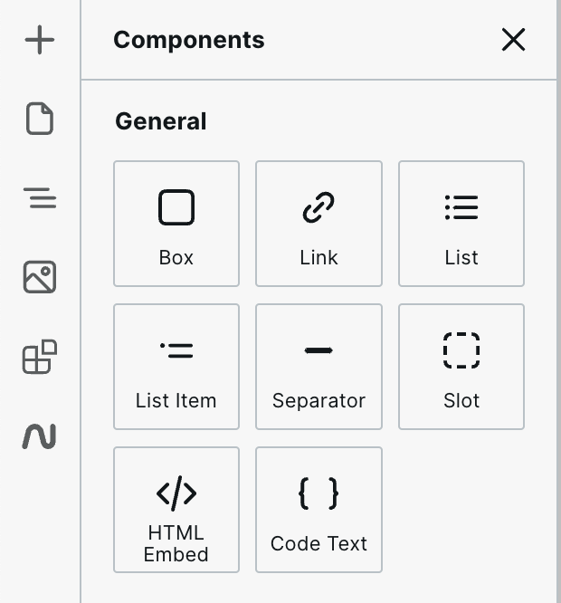

# 📦 Box

### How to use the Box component

The "Box Component" can be found in Components > General, and you can place it on your canvas by dragging and dropping it or clicking it in the Components panel.

<figure><figcaption>
The Webstudio component panel
</figcaption></figure>

The box component is a container for content. By default, it is a DIV, but the tag can be changed in the settings.

This component will be widely used in your project. It can wrap your entire page contents or individual instances.

### How to customize the Box properties

You can change the HTML tag of the box by opening the "Settings Panel" located on the right side of Webstudio.

<figure><figcaption>
Properties panel
</figcaption></figure>
