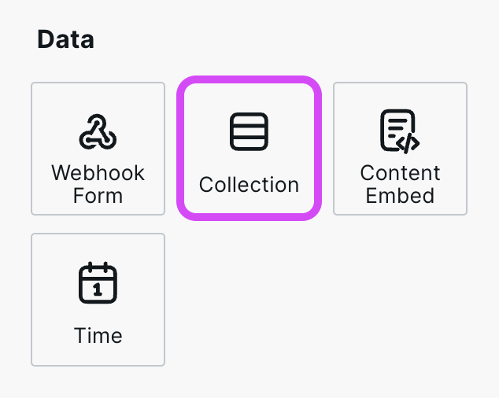
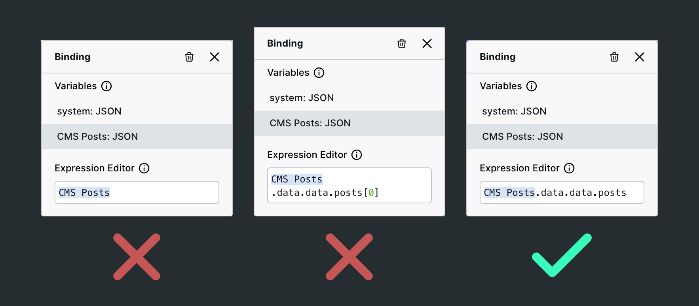
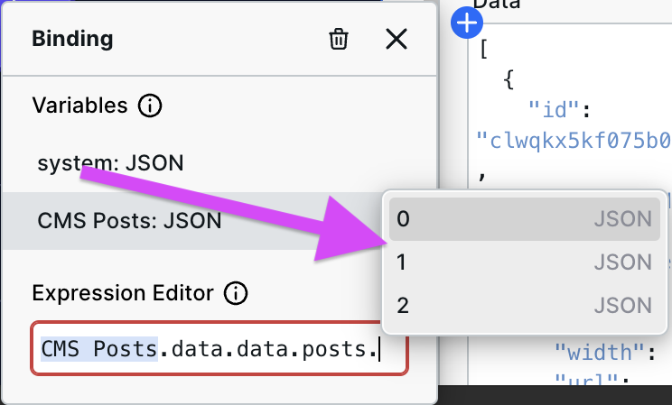
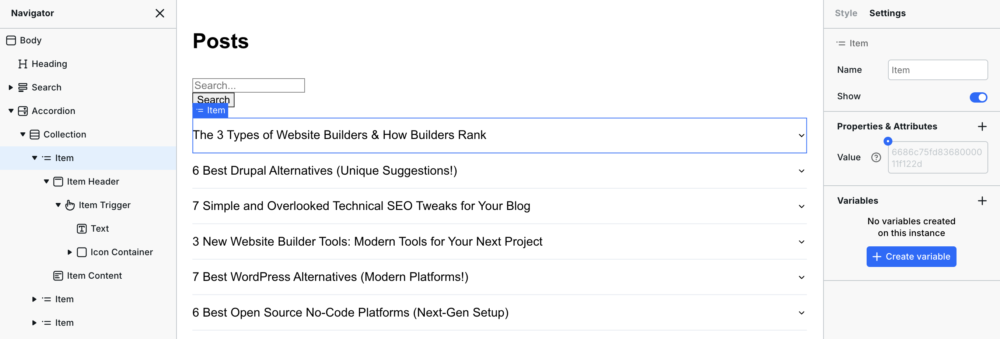

# 💾 Collection

<figure><figcaption></figcaption></figure>

## Why Collections are needed

Let's say you are building a list of all your blog posts. Each blog post will have an image, a title, and a link.&#x20;

You have 50 blog posts. Does this mean you need to duplicate your design 50 times manually? No.&#x20;

Collections let you design something once, and it will repeat it for every item in the array and contain the data for the current iteration (e.g., the blog post title).

## What's an array or object?

Collection can iterate over both **arrays** (lists) and **objects** (key-value pairs).

### Arrays

An array is a list of data. In the case of blog posts, this might look like:

```javascript
[
  { title: "Hello world" },
  { title: "Lorem ipsum" },
  { title: "Webstudio rocks!" }
]
```

When iterating over an array, the Collection Item contains the current item's data.

### Objects

An object is a set of key-value pairs. For example:

```javascript
{
  home: { label: "Home", url: "/" },
  about: { label: "About", url: "/about" },
  contact: { label: "Contact", url: "/contact" }
}
```

When iterating over an object, the Collection Item contains both the **key** (e.g., "home") and the **value** (e.g., `{ label: "Home", url: "/" }`). You can access them via `Collection Item.key` and `Collection Item.value`.


When binding data to a Collection, **you must bind the array or object**, i.e., the data you want to iterate over. If you bind something else, you'll receive an error.


If you are binding external data, the array is nested somewhere within.

<figure><figcaption><p>Example of where the array is at for an external service (will vary for each service)</p></figcaption></figure>

In the image, the data bound to the component is:

1. ❌ Not the array
2. ❌ The first item in the array (0), not the entire list
3. ✅ The array

It's unclear why each item is correct or incorrect by just looking at the image, so let's clarify.

**You'll know when you get to the array when the next items in the autocomplete are numbers.** The numbers represent each item in the list. Once you see the numbers, backspace, as you don't want to select one item; you want the list.

<figure><figcaption><p>The numbers indicate each item in the list/array</p></figcaption></figure>

## How to use Collection

Add the Collection component to the canvas and either manually enter data (less common) or [bind data](../foundations/expression-editor.md#binding) to it (more common).

**The Collection iterates over the array, so you must bind just the array portion of your variable to it. See** [**What's an Array**](collection.md#whats-an-array) **for more info.**

Optionally, rename the default Collection Item variable to something more semantic. If you are iterating over blog posts, name it "Blog Post."

Now, you can add components to the Collection, and the Collection will automatically duplicate it for the number of items in the array. If you have multiple components, wrap everything in a [Box](box.md) component.

Next, [bind](../foundations/expression-editor.md#binding) the Collection Item (or whatever you named it) to the various components. You will see it output a different value depending on the iteration.

## Using Collections with Radix Components <a href="#using-collections-within-accordions" id="using-collections-within-accordions"></a>

When working with [Radix Components](../radix/), you might want to dynamically generate items for various components such as accordions, tabs, or menus.

**You must provide the Value field with a unique value for each item.** This is commonly done by binding an ID or slug from the dynamic data to the field.

### Accordions

<figure><figcaption><p>The Item has a unique value from the dynamic data bound to the Value field</p></figcaption></figure>

### Tabs

On Tabs, you need to manually add the "value" property on both the Tab Trigger and Tab Content by going to Settings > Properties & Attributes > "+".

Tab Triggers and Tab Contents maintain their relationship by having the same value. For example, the Tab Trigger with the value "asdf" will make the Tab Content with the value "asdf" active.

<div>

<figure><figcaption><p>Tab Trigger with custom value</p></figcaption></figure>

<figure><figcaption><p>Tab Content with custom value</p></figcaption></figure>

</div>

Also, you can change the default value on the Tabs instance by binding the first value in the collection to it.
