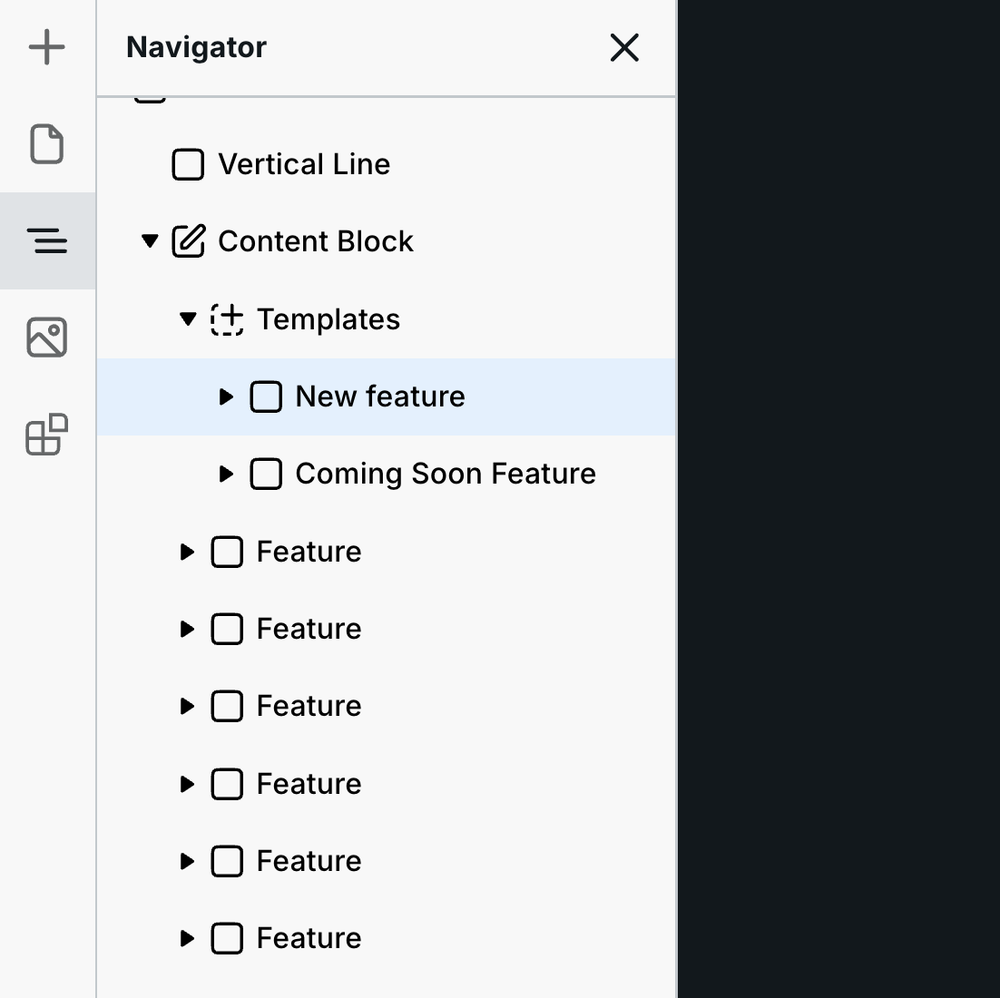
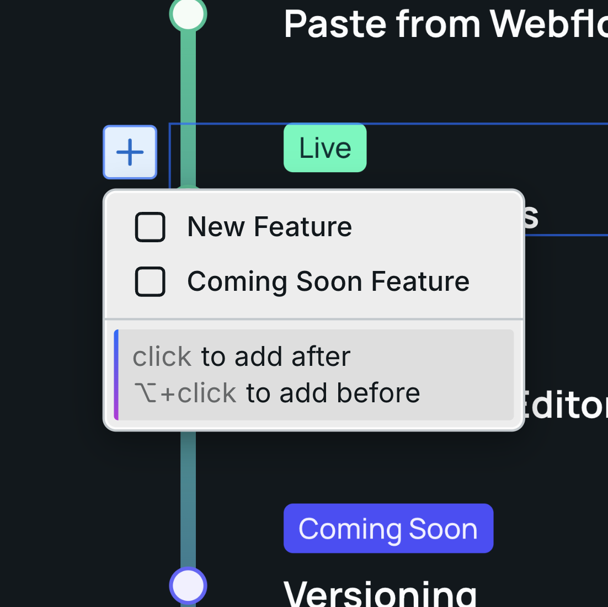
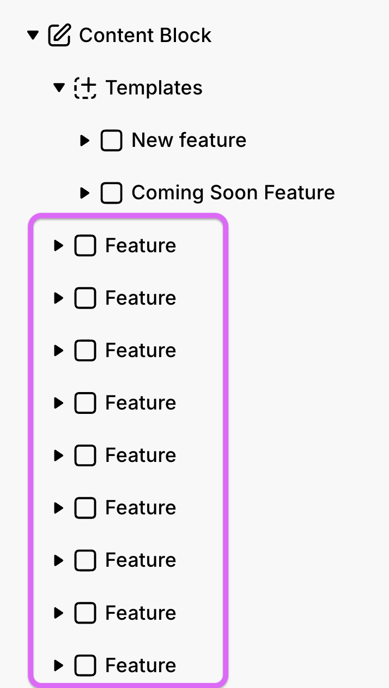
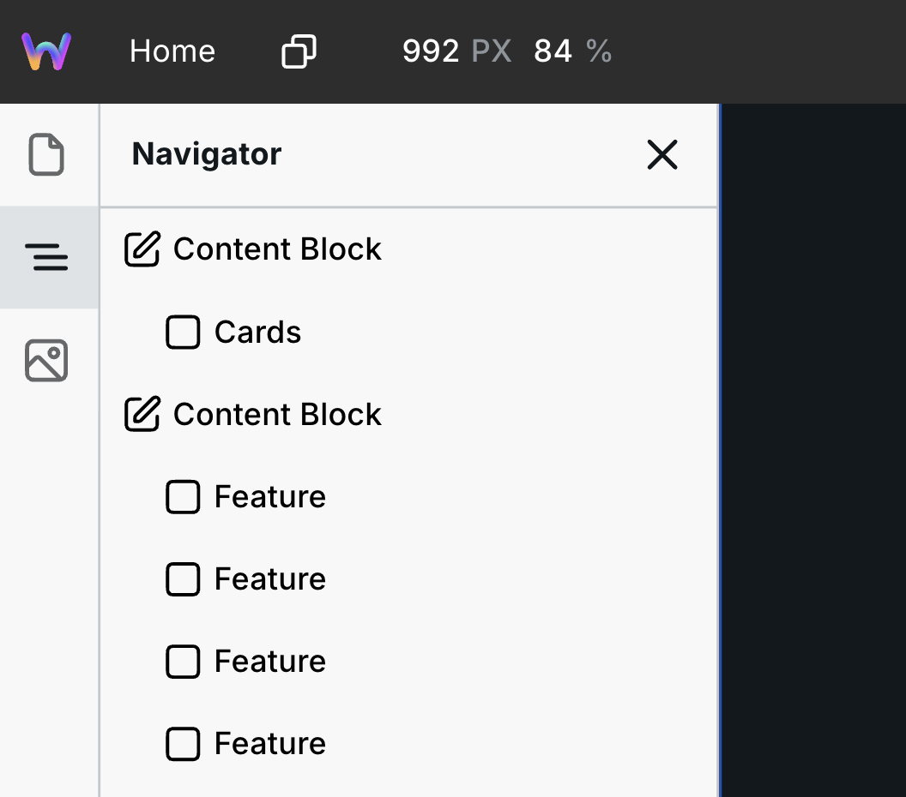
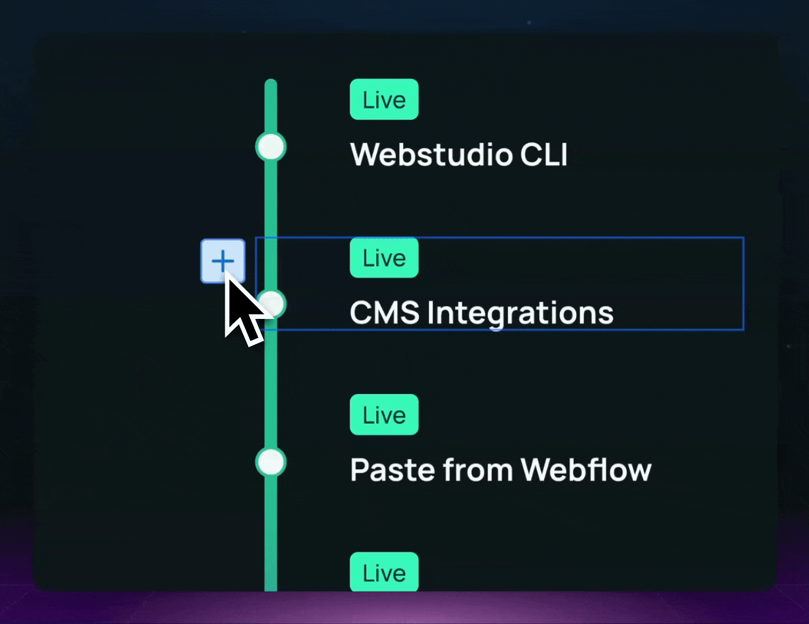

# Content Block

[Content _mode_](../foundations/modes.md#content) enables editing _existing_ content, anywhere on the site. But there are many use cases where editors need to add _new_ content.

Content Block enables adding new content — not just any content, but specifically inserting new instances predefined in Templates.

Designers can create a library of templates, from little cards to fully built sections, and editors can insert instances of these pre-styled templates and modify their content.

Next is a breakdown of Content Block by mode:

1. [Design mode](content-block.md#design-mode) ⬇️
2. [Content mode](content-block.md#content-mode) ⬇️

## Content Block in Design mode

Sometimes providing team members or clients the ability to edit existing content doesn’t help them accomplish everything they need.

Instead, they may want to add new content without asking you.

Content Block enables you to define regions on the site where editors can add instances of templates that you create.

Next is how to use it.

### Step 1: Add Content Block

Add the Content Block to the various regions you want editors to insert new content.

For example, you can add it to a place on the page where entirely new sections can be added, or you can add it within a section for them to add additional content to.

### Step 2: Add templates

Notice that the child of Content Block is Templates.&#x20;

Drag/build the various instances you want to provide editors here.

For example, your client wants to update the section under the hero with the latest promotion. Sometimes the promotion is for an event while other times it’s a product. You can create those two designs, add them to “Templates” within Editable Block, and your client can insert instances of the desired template and edit its content.


Editors don’t have access to the Style Panel, so be sure to provide fully designed templates.


Every top-level instance within Templates will appear in Content mode like this:

<figure><figcaption>
Templates in Design mode
</figcaption></figure> <figure><figcaption>
Template in Content mode
</figcaption></figure>

Each time they insert a template, it will appear as a direct child of Templates.

### Step 3: Add an initial setup (optional)

Optionally, you can add instances as direct children of Content Block.

<figure><figcaption>
The "Feature" instances are provided as a starting point
</figcaption></figure>

Doing so will provide an initial setup for editors.

Just keep in mind that editors have permissions to delete any instances within Editable Block (not within Templates though).

## Content Block in Content mode

In [Content mode](../foundations/modes.md#content), you can edit any _existing_ content. But what if you want to add _new_ content?

You can within Editable Block — region(s) on the page the designer designates as a place you can add new content from building blocks to entire sections.

For example, on your homepage, you change out promotions. Sometimes they are events, and other times they are products. The designer can add the Editable Block to that section on your homepage and provide you with an “Events template” and “Products template”. You can then insert instances of each template, delete them, and change out their content. The design is fully provided for you.

Next is how to use it.

### Step 1: Locate the region you want to change

On the left-hand side, there is the navigator showing you the various Content Blocks on the page.

<figure><figcaption></figcaption></figure>

You can click on them to navigate to that part of the page.

### Step 2: Add template instances

Each Content Block can have a unique set of templates you can choose from.

On the canvas, hover where you want to insert, and the blue + button will appear. Click that, and you’ll see a list of templates provided by the designer.

<figure><figcaption>
Templates the designer provided
</figcaption></figure>

Select the one you want, and it’ll insert an instance/copy of that template.

Click into it to make changes. See more about editing content in [Content mode](../foundations/modes.md#for-editors).

### Step 3: Delete instances

You can delete any instances within the Content Block in one of two ways:

1. The blue + button will turn into a red delete button if you hold the option/alt key on your keyboard.
2.  Select the instance in the navigator, and press delete/backspace on your keyboard.

    <figure><figcaption>
Hold option/alt
</figcaption></figure>


You can’t delete the template itself, so you can always add it back.


Beyond adding new content, you can edit any of the existing content. See [Content mode](../foundations/modes.md#content) for more information.
