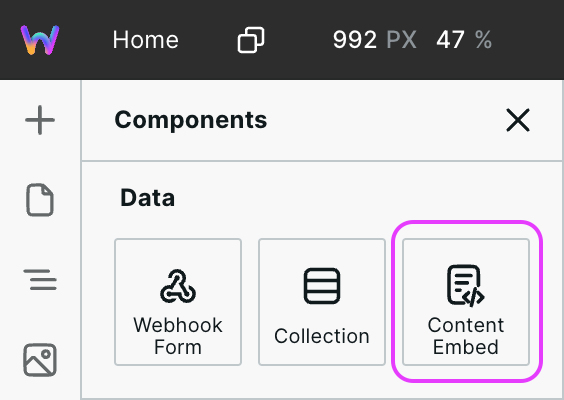
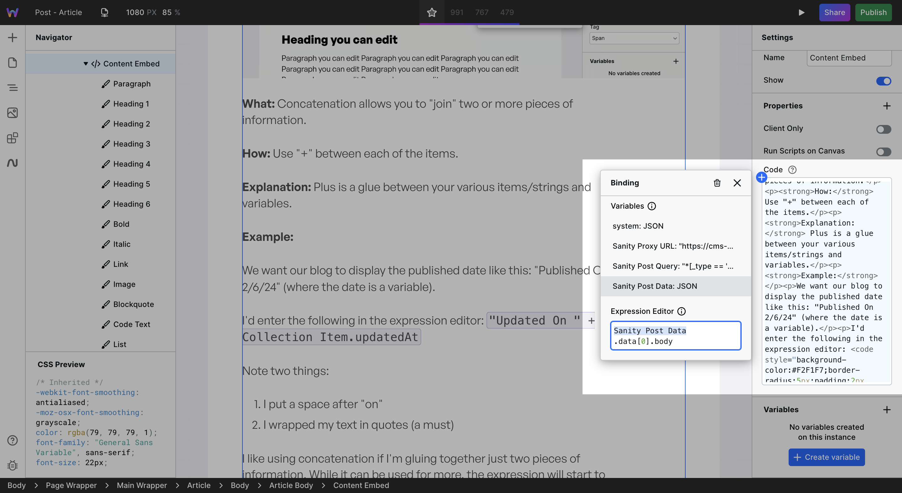
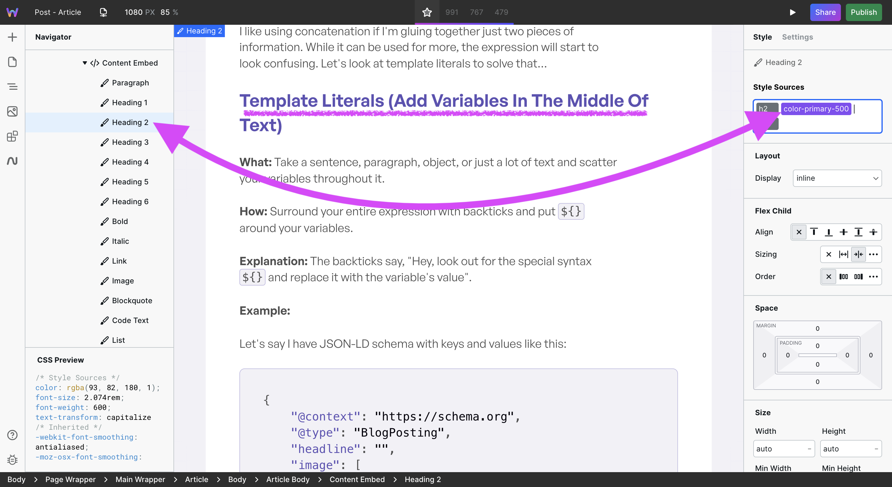

# 🪜 Content Embed

<figure><figcaption></figcaption></figure>

### Why Content Embed is needed

When designing most components on the site, you click on them and style them. However, this can’t be the case for HTML code because the HTML component is all that can be clicked on, not any of the headers, paragraphs, or other tags within.

Content Embed enables applying styles to the various tags contained within HTML.

### How to use Content Embed

Content Embed is located in Components > Data.

#### 1. Add HTML

Once added to the canvas, the right panel will show a Code field. You can either add HTML directly to it or, more commonly, bind HTML to it from a Resource.

<figure><figcaption>
CMS data bound to Content Embed Code
</figcaption></figure>

#### 2. Style

In the Navigator, Content Embed has various HTML tags nested. Expand Content Embed, and you’ll see tags such as Heading 1, Link, Image, and much more.

<figure><figcaption>
Heading 2 selected and styled
</figcaption></figure>

Styles applied to each of these tags will apply to all occurrences of that tag within the Content Embed. For example, if you apply a border on the Image tag, then all images contained within the HTML will have a border.

### HTML Component vs. Content Embed

While very similar, there is one distinct difference: Content Embed enables styling the contained HTML.

If there is no need to apply styles to the contained HTML, then use the [HTML Embed Component](html-embed.md). However, if you need to style the contents (which is typically the case if fetching HTML from a CMS), then use Content Embed.
