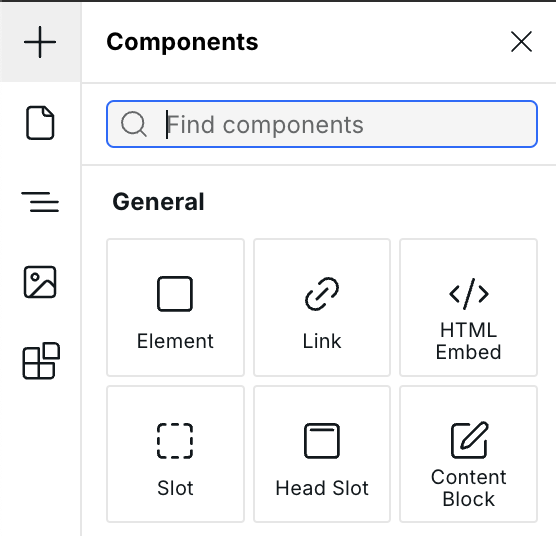
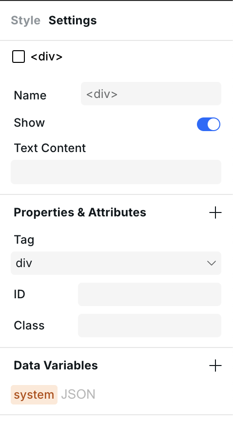

# 📦 Element

The Element component is a versatile component that can represent any HTML element. It provides the flexibility to create semantic HTML structures with any tag type while maintaining full styling capabilities.

---

## How to Use the Element Component

The Element component can be found in **Components > General**, and you can place it on your canvas by dragging and dropping it or clicking it in the Components panel.

<figure><figcaption>
Components panel
</figcaption></figure>

---

## Available Tags

The Element component can be rendered as many HTML tags, including but not limited to:

### Container Elements

- `div` (default) – Generic container
- `section` – Document section
- `article` – Self-contained content
- `aside` – Sidebar content
- `header` – Header section
- `footer` – Footer section
- `main` – Main content
- `nav` – Navigation section

### Text Elements

- `span` – Inline container
- `p` – Paragraph (rendered as block)

### List Elements

- `ul` – Unordered list
- `ol` – Ordered list
- `li` – List item

### Link Element

- `a` – Anchor/link (shows href and target properties)

### Table Elements

- `table` – Table container
- `thead` – Table header group
- `tbody` – Table body group
- `tfoot` – Table footer group
- `tr` – Table row
- `th` – Table header cell
- `td` – Table data cell

### Other Elements

- `address` – Contact information
- `figure` – Figure with optional caption
- `figcaption` – Figure caption
- `label` – Form label
- `dl` – Description list
- `dt` – Description term
- `dd` – Description details

---

## Changing the Tag

You can change the HTML tag of the Element by opening the **Settings Panel** located on the right side of the Builder.

<figure><figcaption>
Settings panel
</figcaption></figure>

The tag dropdown shows all available HTML elements you can use. When you change the tag, the component's properties automatically update to show relevant attributes for that element type.

---

## Tag Labels in Navigator

When viewing Elements in the Navigator, the component label displays the HTML tag name (e.g., "section", "nav", "article"). This makes it easy to identify the semantic structure of your page at a glance.


You can rename Elements in the Navigator by double-clicking to give them more descriptive names like "Hero Section" or "Main Navigation" while still maintaining the correct HTML tag.


---

## Use Cases

### Semantic HTML Structure

Use Element to create proper HTML5 semantic markup:

- `header` for site headers
- `nav` for navigation menus
- `main` for primary content
- `article` for blog posts
- `aside` for sidebars
- `footer` for footers

### Custom Tables

Build accessible data tables using Element with table-related tags (`table`, `thead`, `tbody`, `tr`, `th`, `td`).

### Description Lists

Create glossaries or key-value displays with `dl`, `dt`, and `dd` tags.

### Links with Full Control

Use the `a` tag to create links with full styling control and access to the href and target properties.

---

## Element vs Box

The Element component provides more flexibility than the Box component:

| Feature         | Element            | Box              |
| --------------- | ------------------ | ---------------- |
| Tag options     | Any HTML tag       | div only         |
| Semantic HTML   | ✅ Full support    | ❌ Limited       |
| Navigator label | Shows HTML tag     | Shows "Box"      |
| Use case        | Semantic structure | Quick containers |


For building semantic, accessible websites, prefer Element over Box when you need specific HTML tags.


## Related

- [Slot](slot.md) – Create reusable component slots
- [Link](link.md) – Navigation and anchor elements
- [HTML Embed](html-embed.md) – Custom HTML code
