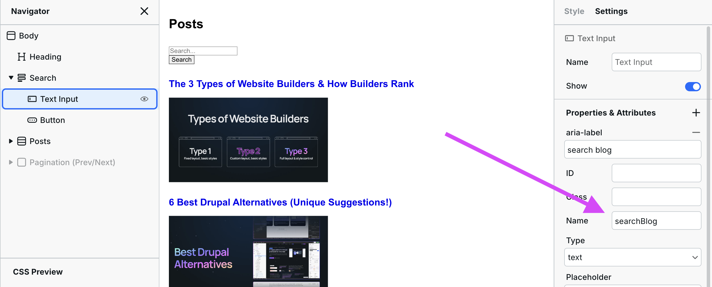
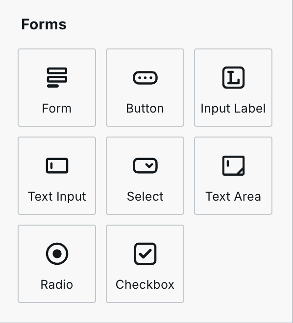
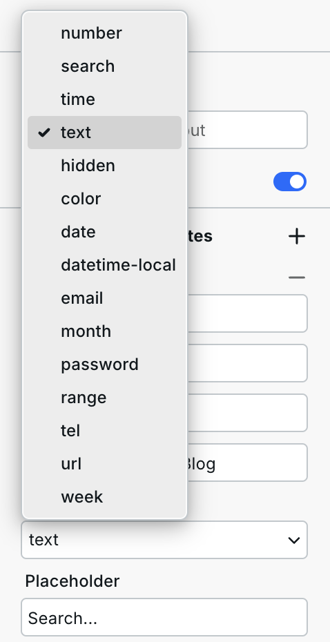
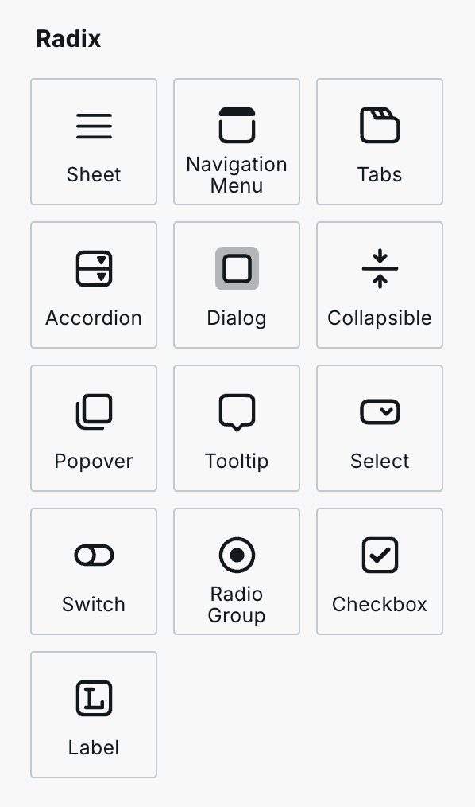

# ✍️ Form


If you need the form submissions to be emailed to you/someone else or sent to a webhook, use [Webhook Form](webhook-form.md).


## When to use Form

When providing visitors with a search field or filters, the submission data does _not_ need to be emailed to you (can you imagine!?). Instead, the submission data is used to modify the page's contents, like a search field on a blog.

## How Form works

When submitting a form, its values are added to the URL as query parameters, triggering [Resources](../foundations/cms.md#resources) to re-fetch APIs and use the query parameters (available in the [System Variable](../foundations/variables.md#system)).

This all happens _without_ a page refresh, improving user experience.

### An example

There's a blog listing page showing 100's blog posts over multiple pages and a Form added to the top with one text input, and its name field value is `searchBlog`.

<figure><figcaption></figcaption></figure>

The goal is simple: only blogs containing the search term will be shown when a visitor submits the form.

**Here's how it works:**

1. A [Resource](../foundations/cms.md#resources) is already responsible for fetching all of those blog posts. The URL path in the Resource might look something like this: `/api/blogs`.
2. The Resource will be modified to include the input value (just one in this case, but you can add as many as you need) like this:

```javascript
`/api/blogs${system.search.searchBlog ? `?search=${system.search.searchBlog}` : ''}`
```

This [expression](../foundations/expression-editor.md#expressions) contains the JavaScript Ternary Operator and Template Literals. It says, "Get the blogs, and if the `searchBlog` value is present, add the search filter to the API call; otherwise, don't."

All the search input values are available in [`system.search`](../foundations/variables.md#system), so if you have an input with a name, `helloWorld` you can access its value with `system.search.helloWorld`.

In summary, when submitting a form, its values are added to the URL as query parameters, which can then be used in [Resources](../foundations/cms.md#resources). Resources are re-fetched when query parameters change so that the Resource can use the values when the form is submitted.

## Form inputs

Many types of inputs can be added to a form.

There are currently two categories of form Components.

### **Webstudio Form Components**

These generate standard HTML inputs. While simple to implement, they have limited styling options, especially for elements like checkboxes, due to the constraints of HTML and CSS.

They can be found in Add Components > Forms:

<figure><figcaption></figcaption></figure>

#### Input types

* **Button** – To submit the form, reset it, or for interactions like opening something. [Buttons are _not_ links](broken-reference). There are three types in Settings:
  * **Button**: Makes it a general element with no specific default action. Mainly used for interactions like opening something.
  * **Submit**: Will submit the form.
  * **Reset**: Will remove any data the user has put into a form.
*   **Text Input** – By default, it's a simple text field, but it can be changed by going to Settings > Type and selecting one of the following types: number, search, time, hidden, color, date, datetime-local, email, month, password, range, tel, url, or week.

    
* **Select** – Provides a dropdown visitors can select one or more options.
* **Text Area** – Allows visitors to add multi-line data as part of their answers. It is similar to the “Text Input” component and the two share the same list of properties.
* **Checkbox** – Provides multiple options that the visitor can check or leave unchecked as part of their input.
* **Radio** – Gives the visitor a list of options and they have to select one.

### **Radix Form Components**

[Radix Form Components](../radix/) provide enhanced styling and control by using dynamic elements. They work by hiding the actual HTML inputs (which have limited styling capabilities) and displaying customizable versions. When users interact with these styled elements, the system automatically updates the state of the hidden inputs, providing a visually rich and flexible user experience.

They can be found in Add Components > Radix:

<figure><figcaption></figcaption></figure>
