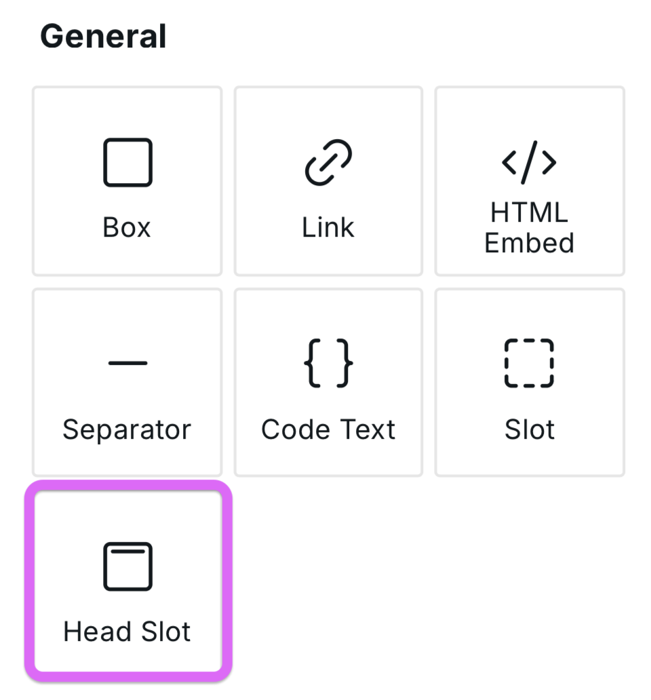

# Head Slot



<figure><figcaption></figcaption></figure>

The Head Slot provides a visual interface for controlling your website's `<head>` section. Instead of writing code, you can manage meta tags, canonical URLs, and other head elements directly in the builder.

## Key information

- Even though the Head Slot is visually in the Body instance, the contents of Head Slot are added to the `<head>`. This hierarchy enables [Data Variables](../foundations/variables.md) defined on the Body to be used in the head.
- If Head Slot and Page Settings define the same data, such as meta title, Head Slot will take priority. Similarly, a default canonical is output on every page and references the current path. By specifying a canonical in Head Slot, the default canonical will not be displayed on the page.
- Head Slot comes with an instance for Title, Link, and Meta. These can be duplicated. If you remove them and later need to add them back, you can copy them from a new Head Slot instance.

## Common Use Cases

### Canonical URLs

Prevent duplicate content issues by specifying the preferred URL:

1. Add a **Link** element inside Head Slot
2. Set `rel` to `canonical`
3. Set `href` to the canonical URL (can be bound to a variable for dynamic pages)

### Alternate Language Links

For multilingual sites, specify language alternatives:

1. Add a **Link** element
2. Set `rel` to `alternate`
3. Set `hreflang` to the language code (e.g., `es`, `fr`)
4. Set `href` to the URL of the translated page

### Custom Meta Tags

Add any meta tag not available in Page Settings:

1. Add a **Meta** element
2. Set the `name` or `property` attribute
3. Set the `content` attribute

### Preconnect and Preload

Improve performance by hinting resource loading:

1. Add a **Link** element
2. For preconnect: `rel="preconnect"` with `href` pointing to the domain
3. For preload: `rel="preload"` with appropriate `as` and `href` attributes

## Third Party Documentation

Many elements in the head are quite technical and require reading documentation for proper usage.&#x20;

Here is a list of relevant docs:

- [Head (MDN)](https://developer.mozilla.org/en-US/docs/Web/HTML/Element/head)
- [Canonical (Google)](https://developers.google.com/search/docs/crawling-indexing/canonicalization)
- [Meta (MDN)](https://developer.mozilla.org/en-US/docs/Web/HTML/Element/meta)
- [Link (MDN)](https://developer.mozilla.org/en-US/docs/Web/HTML/Element/link)
- [Title (MDN)](https://developer.mozilla.org/en-US/docs/Web/HTML/Element/title)
- [Rel (MDN)](https://developer.mozilla.org/en-US/docs/Web/HTML/Attributes/rel)
- [Pagination (Google)](https://developers.google.com/search/docs/specialty/ecommerce/pagination-and-incremental-page-loading)

## Related

- [SEO Settings](../foundations/seo-settings.md) – Page-level SEO configuration
- [Project Settings](../foundations/project-settings.md) – Global project configuration
- [HTML Embed](html-embed.md) – Custom HTML in body
