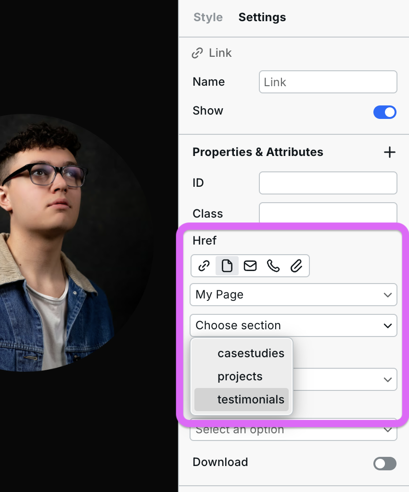

# 🔗 Link



***

## How to use the Link component

The "Link Component" can be found in Components > General, and you can place it on your canvas by dragging and dropping it or clicking it in the Components panel.

You can convert anything into a link by wrapping it inside the Link component, including text and images. These links can direct users to different pages within your site or lead to external resources, including other websites, downloadable files, or email addresses.

***

## How to customize a Link instance's properties

You can customize the properties of a Link instance by selecting it and going to "Settings." Here is an overview of each property:

### Href

<figure><figcaption></figcaption></figure>

The "href" property determines what the Link instance will lead to, such as a URL, page, phone, attachment, or email address.

1. **URL**: In its most common form, the "href" property references a URL, linking to another website or page.
2.  **Page**: You can link to all of your pages within your site here. You can also link to specific sections within those pages. To link to a section on a page, first go to the section and fill out the `ID` field in Settings. Then go back to the link, select the page, and then in the next dropdown select the `ID` you just created. Like this:

    
<figure><figcaption>
First add the ID to the section you want to link to
</figcaption></figure>

    
<figure><figcaption>
Then add a page link and select the section.
</figcaption></figure>

3. **Email**: When you specify an email address as the 'href' value, the link opens the user's default email client (such as Gmail) with the designated email address pre-filled.
4. **Phone**: If you set the "href" property to a phone number, the link becomes a prompt for users to initiate phone calls directly from their devices.
5. **Attachment**: You can also link to downloadable attachments such as PDFs, documents, or media files, allowing users to initiate file downloads with one click.

### Target

<figure><figcaption></figcaption></figure>

You can use the "Target" property to modify a link instance's behavior and define how linked content is displayed.

1. **Self**: When you set "Target" to "Self," the linked content will open in the same window or tab. This is the default behavior for links, and it maintains the browsing context.
2. **Blank**: If you choose "Blank," the linked content will open in a new tab or window, providing a separate browsing context.
3. **Parent and Top**: For web pages involving nested frames, "Parent" will direct the linked content to open in the parent frame or window, maintaining the hierarchy of frames.\
   \
   On the other hand, selecting "Top" will open the link instance in the top-level window, replacing all frames if there are any. This is useful when you want to break out of any frames and provide a full-page experience.

### Prefetch

The "Prefetch" property enables near-instant page transitions by preloading linked pages before the user clicks. This dramatically improves perceived navigation speed.

1. **Intent**: The browser loads the destination page when the user hovers over the link. This is ideal for most links as it balances performance with resource usage.
2. **Render**: The browser loads all destination pages as soon as the current page renders. Best for simple pages or funnels with very few links.
3. **Viewport**: The browser loads the destination page when the link enters the user's viewport. Good for links that appear below the fold.

For most websites, use "Intent" or "Viewport" to provide fast navigation without overloading the browser with pages to preload.

## Wrapping Components in Links

You can add any Webstudio component inside a Link element to make it clickable — images, videos, text, buttons, or even custom HTML embeds. Simply drag the component into the Link or wrap existing content by selecting it and using the Link component.

## How to style the current page state

When using links for navigation and wanting to highlight the current page, the link component has a "Local Link" state in every style source.

<figure><figcaption></figcaption></figure>

## Related

- [Button](button.md) – Clickable action buttons
- [Element](element.md) – Generic HTML elements
- [Navigation Menu](../radix/navigation-menu.md) – Navigation with dropdowns
