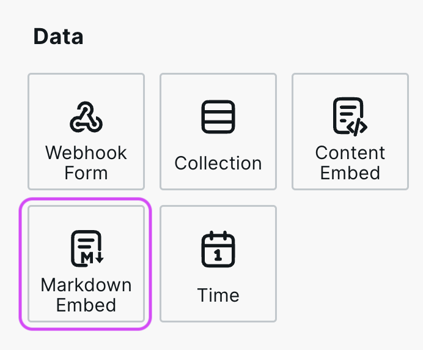
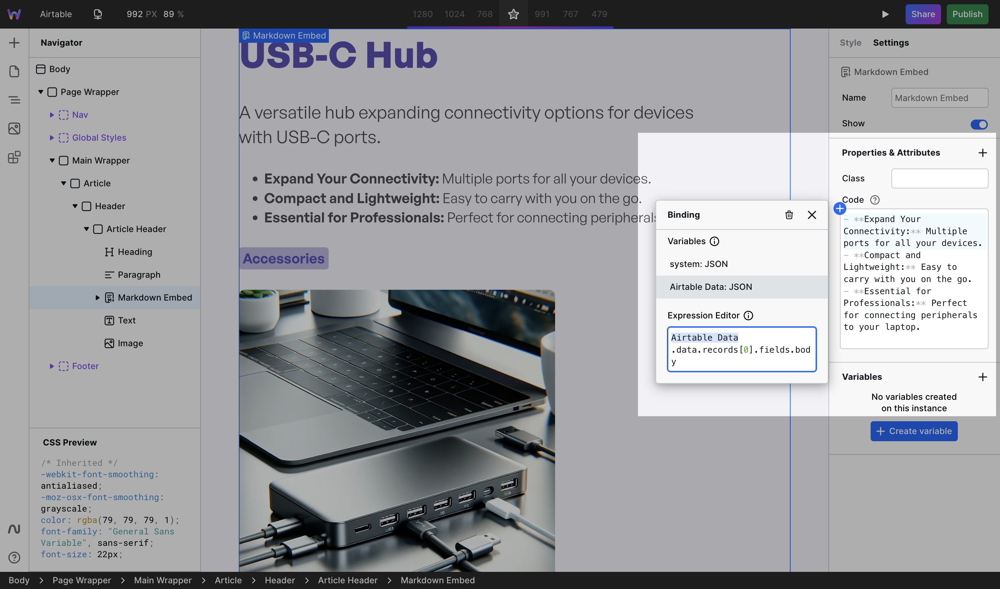
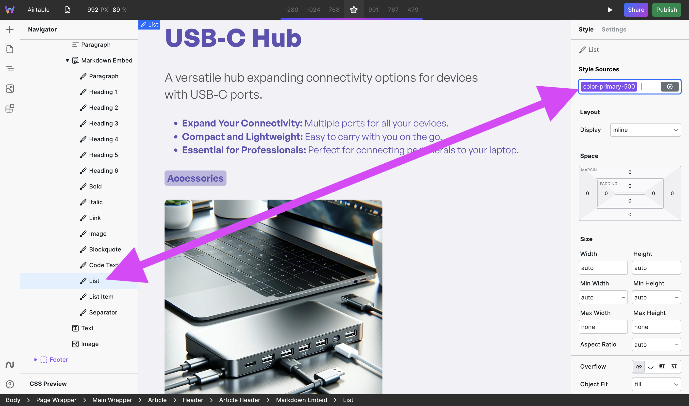

# 🪜 Markdown Embed

<figure><figcaption></figcaption></figure>

## Why Markdown Embed is needed

Some APIs (or users) provide rich text in Markdown format, which can't be rendered in the web browser. Markdown Embed converts Markdown to HTML and enables applying styles to the various tags contained within HTML.

## How to use Markdown Embed

Markdown Embed is located in Components > Data.

### 1. Add Markdown

Once added to the canvas, the right panel will show a Code field. You can either add Markdown directly to it or, more commonly, bind Markdown to it from a Resource.

<figure><figcaption>
CMS data bound to Markdown Embed Code
</figcaption></figure>

### 2. Style

In the Navigator, Markdown Embed has various HTML tags nested. Expand Markdown Embed, and you’ll see tags such as Heading 1, Link, Image, and much more.

<figure><figcaption>
List selected and styled
</figcaption></figure>

Styles applied to each of these tags will apply to all occurrences of that tag within the Markdown Embed. For example, if you apply a border on the Image tag, then all images contained within the HTML will have a border.

### Similar components


[html-embed.md](html-embed.md)



[content-embed.md](content-embed.md)

