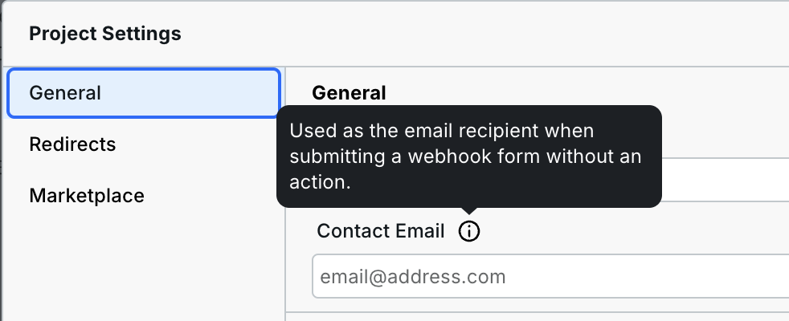

# ✍️ Webhook Form


**Name change:** Webhook Hooks forms used to be called Forms, however, [Forms](form.md) are now a different Component intended for building searches and filters.




***

## Receiving Form Submissions

Webhook Forms are used when the form submission data needs to get sent somewhere else (as opposed to a form that modifies page content like searches and filters).

### Email

By default, submissions are sent to the Project owner.


Pro feature: You can customize the recipient of the email notifications by going to Project Settings > General.



### Webhooks

You can optionally also send the form submission data to a Webhook – a URL provided by a third party that "catches" the data when submitted and performs some action(s), like adding the contact to an email automation platform.

Sending data to a webhook is done in two steps:

1. Obtain a webhook URL from a third-party platform such as [Airtable](../integrations/airtable-1.md).
2. Paste the URL into the `Action` field found in Webhook Form > Settings.

Now, anytime the form is submitted, it will deliver the payload (the form submission fields and values) to the webhook.&#x20;

***

## How to use the Webhook Form Component

You can add a Webhook Form Component to your canvas from the Components Panel > Data section.


Webhook Forms do not submit inside the Builder, including in Preview. They only submit on the published site.


Inside the Webhook Form, you will find three nested instances:

1. Form Content
2. Success Message
3. Error Message&#x20;

While you can always [add new Components](form.md#form-inputs) to further expand and modify your form, these instances make up the default look.

### Form States

The Webhook Form will automatically display a success message or error message.

#### Success Message

If a form is submitted without any errors, the site visitor will be greeted with a success message. Here is how you can see and edit the “Success Message” for your form.

1. Start by selecting the main “Form” Instance and going over to “Settings”.
2. Here you will see that the “State” of your form is set to “Initial” by default. To view and edit your success message, set the state to “Success.”

Now you should see the default “Success Message” on your canvas instead of the “Form Content.” To edit your message, double-click it and type away!

#### Error Message

If a form submission faces any errors, the site visitor will see an error message. The process for viewing and editing the “Error Message” is the same as the one for success messages.

You can see the error message on your canvas by setting the Webhook Form Component’s state to “Error.”

***

## Form inputs

For information about all the inputs you can add to a form, such as checkboxes and radios, refer to [Form Inputs](form.md#form-inputs).
