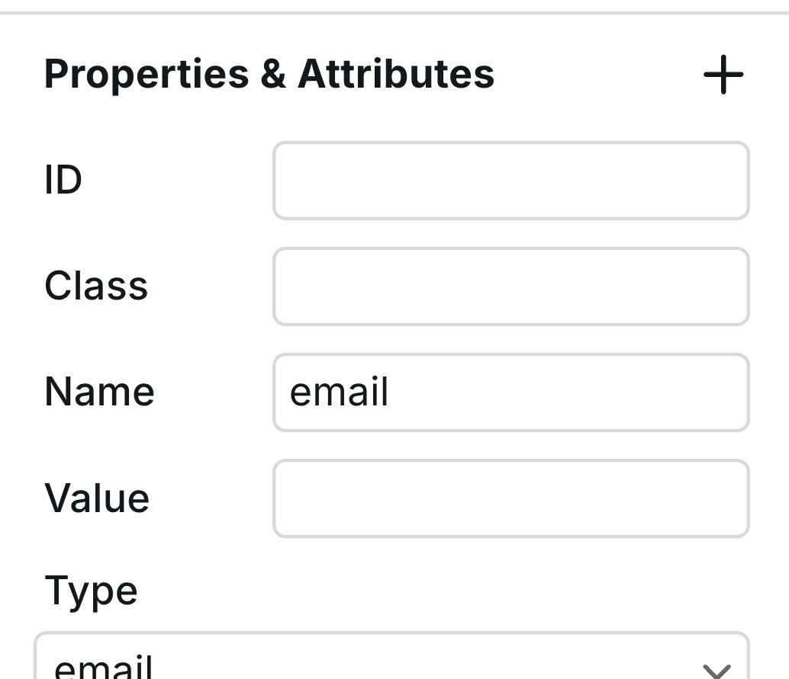

# ✍️ Webhook Form


**Name change:** Webhook Forms used to be called "Forms." However, [Forms](form.md) are now a different component intended for building searches and filters.




## Receiving Form Submissions

Webhook Forms are used when you need to send form submission data to an external service, rather than modifying page content like searches and filters.

### Email Notifications

By default, submissions are sent to the Project owner.


**Pro feature:** You can customize the recipient of email notifications by navigating to **Project Settings > General**.



### Webhooks

You can also send form submission data to a webhook—an external URL that receives the data and triggers an action, such as adding a contact to an email automation platform.

1. Obtain a webhook URL from a third-party platform such as [Airtable](../integrations/airtable-1.md).
2. Paste the URL into the `Action` field in **Webhook Form > Settings**.

Once set up, every form submission will send a payload (form fields and values) to the webhook URL.

## Using the Webhook Form Component

You can add a Webhook Form Component to your canvas from **Components Panel > Data section**.


Webhook Forms do not submit inside the Builder, including in Preview. They only submit on the published site.


### Webhook Form Structure

A Webhook Form consists of three nested instances:

1. **Form Content** – The primary form fields.
2. **Success Message** – Displayed upon successful submission.
3. **Error Message** – Shown when an error occurs.

You can [add new Components](form.md#form-inputs) to further expand and modify your form.

### Form States

Webhook Forms automatically switch between states based on submission results.

#### Success Message

When a submission is successful, users will see a success message. To customize it:

1. Select the main "Form" instance and go to **Settings**.
2. Change the **State** from "Initial" to "Success."
3. Edit the success message directly on the canvas.

#### Error Message

If there’s an error during submission, users will see an error message. To modify it:

1. Select the Webhook Form Component.
2. Set the **State** to "Error" to preview and edit the error message.

## Form Inputs


Each input field must have a `name` attribute for its data to appear in email notifications and webhook payloads.


Ensure every form input has a value for the `name` field to be included in submissions.

<figure><figcaption></figcaption></figure>

For a full list of input types, including checkboxes and radio buttons, refer to [Form Inputs](form.md#form-inputs).

### Input Properties

Each input field has several configurable properties in Settings:

* **Name**: The field identifier used in submissions (required for data to appear)
* **Type**: Define the input type (text, email, tel, etc.). Setting type to "email" enforces email format validation.
* **Placeholder**: Hint text shown inside the input before user enters data (e.g., "john@doe.com")
* **Required**: When enabled, the form cannot be submitted without this field
* **Autofocus**: When enabled, this field is automatically focused when the page loads

### Styling Form States

You can create interactive form styling using states in the Style panel:

* **Hover**: Apply styles when users hover over an input (e.g., wider border, box shadow)
* **Focus**: Apply styles when an input is active/selected (e.g., colored border, glow effect)
* **Placeholder**: Style the placeholder text appearance

To apply state-specific styles, select the input element, open the state dropdown in the Style panel, and choose the state you want to customize.

## Bot Protection

Webstudio forms include built-in bot protection to prevent spam submissions. This protection works automatically without requiring any additional configuration – no CAPTCHAs needed. The system analyzes submission patterns to distinguish between legitimate users and automated bots.

## Related

- [Form](form.md) – Standard HTML forms
- [Input](input.md) – Text input fields
- [Button](button.md) – Submit buttons
- [n8n Integration](../integrations/n8n.md) – Automate form workflows
- [Zapier Integration](../integrations/zapier.md) – Connect to other apps
