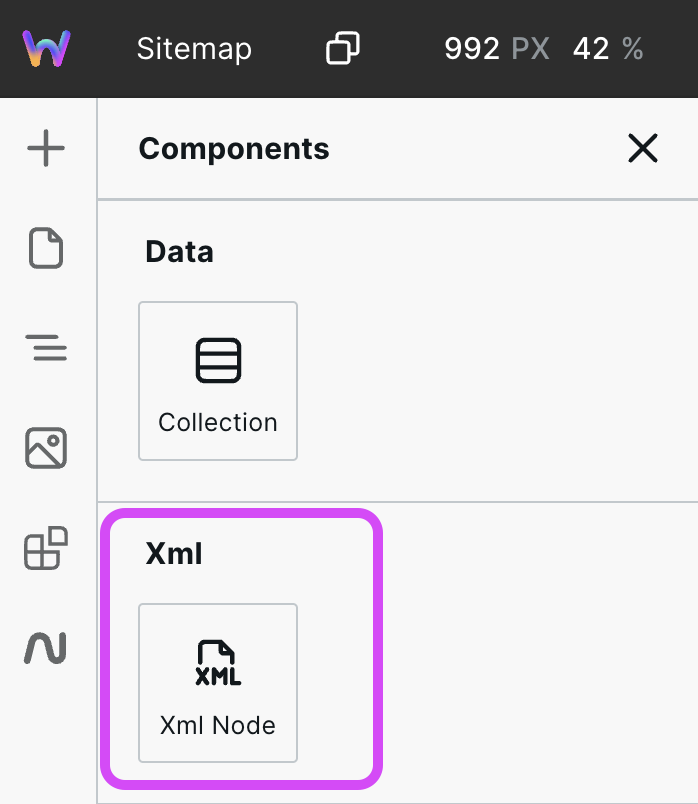
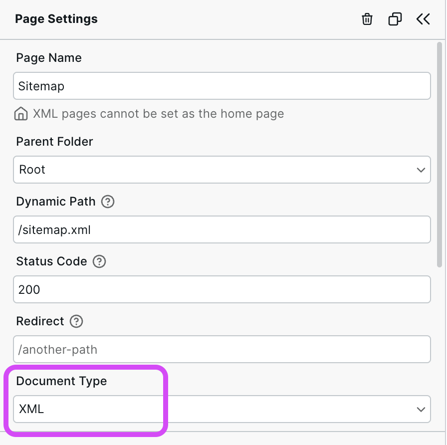
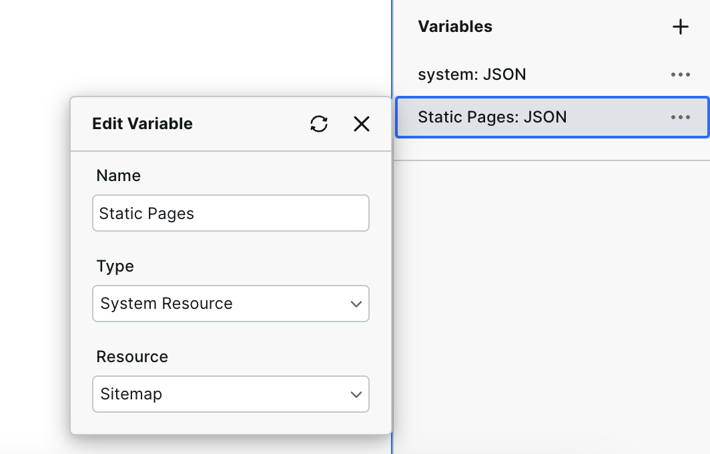

# 📘 XML Node


Webstudio automatically generates a sitemap for static pages such as Home and About. If you are integrating with a CMS, you can use this component to create a sitemap for CMS data.


<figure><figcaption>
Will display when Document Type is set to "XML"
</figcaption></figure>

### How to use the XML Node component

1.  Go to Page Settings > Document Type and select XML from the dropdown&#x20;

    <figure><figcaption></figcaption></figure>
2. Go to Components > XML and add XML Node (this component won’t show until Step 1 is completed)
3. Set the tag and text content (e.g., “loc” and “https://example.com)

### Tips

* XML Nodes can be nested within each other
* Use [Collection](/broken/pages/pauhKZIgEF1NC1u9qwLe) to iterate over a list of data
* A sitemap skeleton is available in the Marketplace

### Including the static sitemap

While you can use the autogenerated sitemap for static pages and create a separate sitemap for dynamic pages, you can also combine the two.

To include the static sitemap data in your custom sitemap, follow these steps:

1. Create a page
2. In the page settings, set the Document Type to XML&#x20;
3. Set the page path to /sitemap.xml. This will override the default sitemap.
4.  Fetch the static data by clicking Create Variable > System Resource (Type) > Sitemap (Resource)&#x20;

    <figure><figcaption></figcaption></figure>
5. Use a [Collection](/broken/pages/pauhKZIgEF1NC1u9qwLe) to iterate over the static sitemap data
