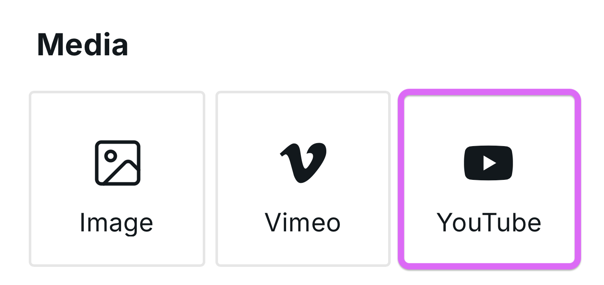

# YouTube

<figure><figcaption></figcaption></figure>

While YouTube offers embed codes, the YouTube component enables a much better experience, which is why it’s the recommended way to add YouTube videos to your site.

**Benefits:**

- Paste a URL instead of code
- Responsive by default
- Faster loading with customizable preview images and lazy loading
- UI inputs for all the settings instead of code
- Customizable play icon and loading icon

## Related

- [Vimeo](vimeo.md) – Vimeo video embeds
- [Video Animation](video-animation.md) – Scroll-controlled video
- [Image](image.md) – Custom preview images
