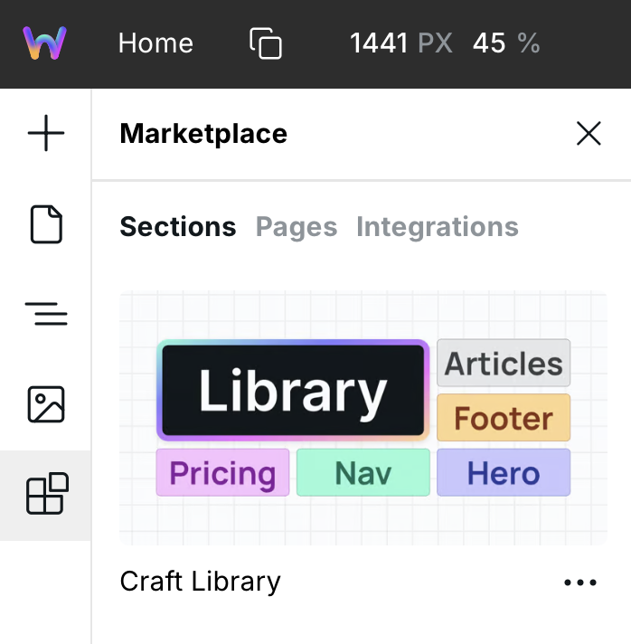

# Craft


Contribute changes to Craft by commenting on this [GitHub Discussion](https://wstd.us/discuss-craft).


When building highly maintainable and scaleable websites, some conventions prove to work well. Plus, when collaborating with team members and other creators, a standardized system results in a smoother learning curve and easier sharing, such as through the [Marketplace](marketplace.md).

**Craft contains a set of standards, CSS variables, and Tokens that make building websites fast, maintainable, and reusable.** It also enables sharing Projects without mixing different naming conventions.

While Craft is not mandatory, it’s the recommended way to build in Webstudio.



Here are the standards and guidelines of Craft.

## Getting Started with Craft

1. Go to **Marketplace → Pages → Craft**
2. Insert the Style Guide page
3. Customize your color palette variables on Global Root
4. Map semantic variables (`--foreground-primary`, `--background-primary`, etc.) to your brand colors
5. Start building pages using the predefined variables

## Switching Between Light and Dark Themes

Because Craft uses semantic variables like `--foreground-primary` and `--background-primary`, you can switch an entire site from light to dark mode by changing just \~6 variable values.

**Example:** Swap `--foreground-primary` from a dark color to light, and `--background-primary` from light to dark.


Webstudio supports pasting CSS, so you can prepare your theme variables in a text editor and paste them into Global Root.


## Page Template Workflow

The Craft style guide includes a page template at the bottom (Nav, Main with Section/Container, Footer structure):

1. When creating a new page, copy this template structure
2. When building sections, duplicate the template section, rename it (e.g., "Hero", "Logos"), design it
3. Duplicate again for the next section
4. This keeps a clean template always available at the bottom

## CSS Variables

Craft uses [Open Props](https://open-props.style/), an MIT-licensed library of CSS variables that helps accelerate adaptive and consistent design.

In addition to the Open Props variables, Craft includes the following CSS variables:

```
--foreground-primary
--foreground-secondary
--foreground-accent
--foreground-muted
--foreground-border

--background-primary
--background-secondary
--background-accent
--background-card

--gap-xs
--gap-s
--gap-m
--gap-l

--focus-color
--focus-width
--focus-offset

--duration-default
--easing-default
```


Insert Craft from the Marketplace, and it will add the CSS variables to your Global Root. To match your branding, you can customize the values, such as colors, gradients, and more. You can also add custom variables.



CSS Props doesn't impose style opinions on your site. This library contains variables like `--size-4` and `--gradient-5`. Then, it's up to you to customize their values or use the defaults.


| Type                    | Rule         | Examples               |
| ----------------------- | ------------ | ---------------------- |
| Size and color palettes | Use numbers. | `--size-4` `--blue-10` |

## Tokens

| Type           | Casing | Examples                                       | Purpose                                                                                                                                                                                                                                                                                   | Help                                                                                                                                                                                                                     |
| -------------- | ------ | ---------------------------------------------- | ----------------------------------------------------------------------------------------------------------------------------------------------------------------------------------------------------------------------------------------------------------------------------------------- | ------------------------------------------------------------------------------------------------------------------------------------------------------------------------------------------------------------------------ |
| Utility        | Kebab  | `margin-auto` `container` `button`             | Used for layout and styling purposes without conveying any inherent meaning about the content it contains.                                                                                                                                                                                |                                                                                                                                                                                                                          |
| Semantic       | Title  | `Card` `Pricing Table`                         | Conveys meaning and context about the content it contains.                                                                                                                                                                                                                                |                                                                                                                                                                                                                          |
| Semantic Child | Title  |                                                | Indicates that the Token is a child of a parent semantic Token.                                                                                                                                                                                                                           | What should we do here? Some examples/options: `Card Header` `Card - Header` `Card / Header`. What happens if it’s multiple levels deep? Maybe we only reference the top-most Token such as `Card` or the most relevant? |
| Variant        | Kebab  | `is-button-secondary` `is-pricing-table-small` | This indicates that the Token is intended to be used with another Token. For example, `button` is the “base” Token that carries the default styles and `is-button-secondary` uses some of the base styles and modifies or adds others. The variant should never be used without the base. |                                                                                                                                                                                                                          |
| Size           | Kebab  | `button-x-small\|small\|medium\|large`         | Appending a size modifier to the end of a Token. “T-shirt” sizing is the accepted naming convention. Abbreviations are allowed here.                                                                                                                                                      |                                                                                                                                                                                                                          |

### When to use Tokens vs Local?

**Use** [**Tokens**](craft.md#tokens) **for the following scenarios:**

* There are multiple styles and at least one of which has many options for the value (e.g., size and colors) as opposed to something like text alignment.
* When there is a common use case that takes more time to select Local and apply manually than using a Token, such as setting the margin left and right to auto.

**Don't use Tokens for the following scenarios:**

* When you can click an item in the Style Panel, such as text alignment or display flex.
* When there is only one style (use [CSS variables](craft.md#css-variables)).

**More info:**

Tokens are great for reusing styles, so you don't have to remember values. They shouldn't be used for simple tasks like centering text since that can be done with a button, and when switching between breakpoints, you may want to adjust the alignment.

However, Tokens can be helpful for flex layouts, for example, when they fall into this rule:

> Common use case that takes more time to select Local and apply manually than using a Token.

For example, it's common to use a flex wrapper to add a gap to the content, which typically requires setting display to flex, direction to vertical, and adding a gap. It's faster to create a utility token like `flex-gap-small` that handles all this in one go.

## Internal Style Guide

The page on the site is used to display and design the various HTML elements like headings, components, brand elements, and more.

| Type                     | Rule                           | Casing | Examples              | Purpose                                                                                                                                      |
| ------------------------ | ------------------------------ | ------ | --------------------- | -------------------------------------------------------------------------------------------------------------------------------------------- |
| Tokens (for style guide) | Prefix with double underscore. | Kebab  | `__badge` `__outline` | A convention for indicating that the Token is merely for the purpose of dressing up the style guide and _not_ to be used on the actual site. |
| Page Name                | Style Guide                    | Title  |                       |                                                                                                                                              |

## Navigator

* **Casing**: Title

| Item                                  | Rule                                                                                                                                                                             | Examples                                                                    | Why                                                                                                        |
| ------------------------------------- | -------------------------------------------------------------------------------------------------------------------------------------------------------------------------------- | --------------------------------------------------------------------------- | ---------------------------------------------------------------------------------------------------------- |
| Labels                                | If using a custom name, use semantic names.                                                                                                                                      | `Page Wrapper` `Cards` `Team Member`                                        | Default components are title case and the navigator is for humans to understand the structure and purpose. |
| Box, Slot, HTML Embed, and Collection | <ul><li>Always create a custom name.</li><li>For Boxes, avoid layout-oriented naming such as 1/2 or left. Instead, use a name based on the content like Image Wrapper.</li></ul> | `Wrapper` `Card` `Animation Script`                                         | The purpose of these components are not clear without a custom name.                                       |
| Parent > Child                        | Use plural for parent and singular for children when they are related.                                                                                                           | <p><code>Cards</code><br>    <code>Card</code><br>    <code>Card</code></p> | Helps indicate the relationship of instances.                                                              |
| Sections                              | Prefix Boxes that have the section tag with "Section ".                                                                                                                          | `Section Hero`                                                              | Indicatees where the section is at without digging into settings.                                          |

### Structure

* Page Wrapper
  * Slot
    * Global Styles
    * Nav
  * Main
    * Section (generally, but not always)
      * Container
  * Slot
    * Footer

## Misc

### Abbreviations

Avoid abbreviations unless otherwise noted. Universal clarity is a priority, and abbreviations may be counterproductive.

### HTML Embed

* 1 instance = 1 purpose
* Start the code with a comment about its purpose

## Changelog

### 1.2

*   Changed `container` token to use flex for proper compatibility with Craft Library. To adopt this change, go to any container token and set display flex, flex-direction column, and gap to `var(--gap-m)` . Any containers that need a horizontal layout will need to be manually set on Local, such as the style guide navigation.

    

### 1.1

* Added `—spacing-default`. Common use cases include left/right padding on containers and card padding. Improves consistency within the site and enables marketplace sections to adapt to our default spacing rather than introducing random spacing that deviates from the preferred.

### 1.0

* Release

## Craft Library

Craft Library is a collection of pre-built section templates built to Craft standards, available in the [Marketplace](marketplace.md).

<figure><figcaption><p>Craft Library in the Marketplace</p></figcaption></figure>

Templates contain no hardcoded values such as colors or sizes. They rely entirely on [Craft CSS variables](craft.md#css-variables), so each section adapts to your site’s design system.

The library speeds up development while keeping your project clean and fully customizable.

This post demonstrates Craft Library getting inserted on two completely different sites:


