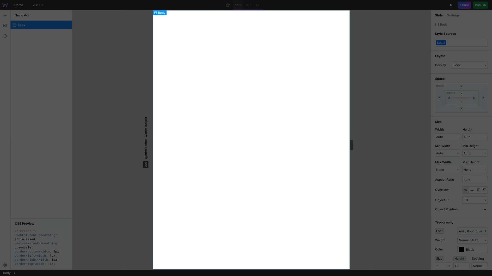
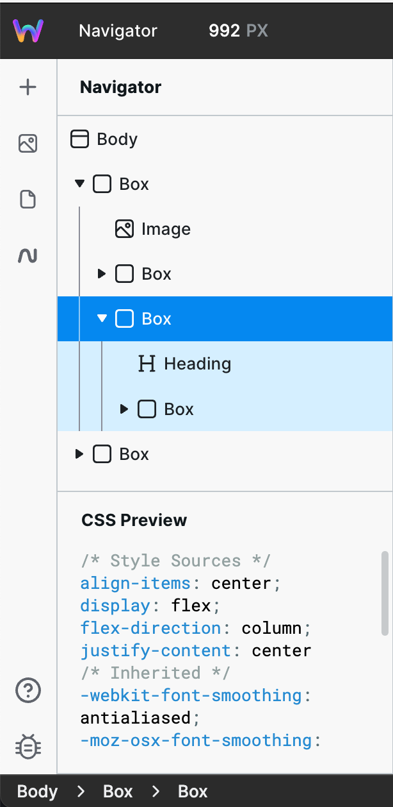
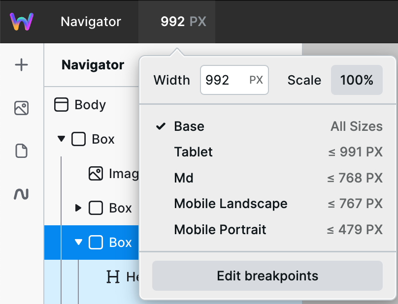
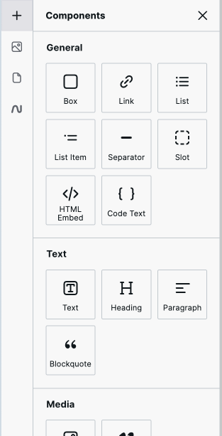

# 🛠 Anatomy of the Webstudio Builder

This guide discusses the anatomy of the Webstudio Builder, an all-in-one visual development platform that allows you to build stunning, responsive websites.

***



***

### The Canvas

As the central workspace of the Webstudio Builder, the canvas provides a visual representation of the website you are creating. After adding components from the Components Panel, you can arrange and style their instances on the canvas.

***

### The Navigator

The Navigator Panel is a hierarchical overview of all component instances in your project. It displays the website’s structure, showing the nesting and relationships between different instances. You can select the instance of any component inside your project by clicking it on the canvas or inside the navigator.

In the bottom half of the Navigator, you will find the CSS Preview section, which is a real-time preview of the CSS styles applied to your selected instance.

***

### Breakpoints

Breakpoints are crucial for creating responsive websites that adapt to different screen sizes and devices. In the Webstudio Builder, breakpoints represent specific screen widths at which the website layout adjusts to optimize the user experience.

By defining how components should behave at different screen sizes, you can ensure your website looks great on various devices, including desktops, tablets, and smartphones. You can select and modify the breakpoints for your Webstudio project in the “Edit breakpoints” menu.

***

### The Components Panel

The Components Panel contains a list of all available components that you can add to your Webstudio project. You can do this by clicking the components in the panel or dragging and dropping them on the canvas.

Components are grouped into sections like General, Text, Media, and Forms. For instance, the Text section has all typography-related components, while the Form section nests the building blocks of a form.

***

### The Assets Panel

The Assets Panel is the second panel to the left of your canvas, and this is where all the static files are stored. You can upload, organize, and manage project assets inside this panel before using them on the canvas.

***

### The Pages Panel

The Pages Panel offers an overview of the website’s page structure and hierarchy, and it is the last panel on the left side of your canvas, under the Components and Asset Panels.

You can use this panel to add new pages to your Webstudio site, set the homepage, rename existing ones, and manage the design and settings of each page individually.

***

### The Style Panel

The Style Panel is located to the right of the canvas, and you can use it to customize the appearance and layout of a selected instance. It offers a comprehensive set of styling options, such as typography, colors, spacing, and positioning.

You can also create and add design tokens to your project in the Style Panel.

***

### The Settings Panel

The Settings Panel is the last panel on the right side of your canvas. You can use this panel to access and edit component-specific properties for a selected instance.

***

### The Preview Mode

The Preview Mode allows you to review and interact with your website before making it live on the web. You can use this mode to test your site’s functionality, responsiveness, and user experience in real-time.

***

### The Share Dialog

The Share Dialog allows you to create a shareable personal link to your project. You can set your link to have “View” or “Build” permissions depending on what level of access you wish to provide.

If you set your shared custom link to “View” mode, anyone with the link can view your site, but any changes they make inside the builder will not be saved.

***

### The Publish Dialog

With the Publish Tab, you can launch your website to a Webstudio subdomain and your custom domain. If you are publishing to a custom domain, you can configure your domain manually by setting up the DNS records in your domain registrar’s UI.

You can also configure your domain using the “Configure automatically” button that will show you a step-by-step guide to connect your domain without leaving the builder UI.

To learn more about [publishing on Webstudio](https://webstudio.is/blog/publishing-your-webstudio-site).
