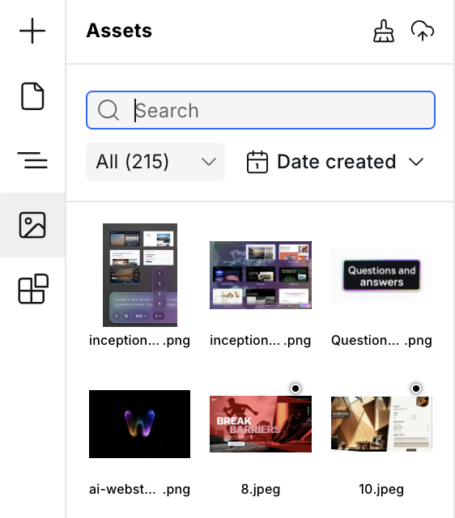
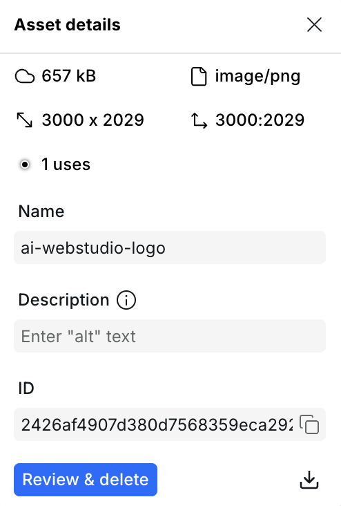

# 🗂️ Assets

The Assets panel is located on the left side of the builder. It stores all static files used in your project — images, fonts, documents, and more. Upload files here and then reference them in instances and styles throughout your site.

<figure><figcaption>
The Assets panel
</figcaption></figure>

## Supported file types

| Category | Formats |
|---|---|
| **Images** | JPEG, PNG, GIF, WebP, SVG, AVIF, ICO, BMP |
| **Fonts** | WOFF, WOFF2, TTF, OTF |
| **Video** | MP4, MOV, AVI, WebM |
| **Audio** | MP3, WAV, OGG, M4A |
| **Documents** | PDF, DOC, DOCX, XLS, XLSX, CSV, PPT, PPTX |
| **Code & text** | TXT, MD, JS, CSS, JSON, HTML, XML |
| **Archives** | ZIP, RAR |


JPEG, PNG, GIF, WebP, SVG, and AVIF images are automatically optimized and resized by Cloudflare. ICO and BMP images are served as-is without optimization.


## Uploading assets

Drag files directly into the Assets panel, drop them anywhere on the panel, or click the upload icon in the panel header. Multiple files can be uploaded at once. For images, you can also drag a URL directly from the browser to upload from an external source.

Open a folder before uploading to add the new assets directly to that folder.

### Add an image directly to the canvas

Drag one image asset from the Assets panel onto the canvas to insert an
**Image** component with that asset already selected as its source. Drop it at
the insertion indicator like a component from the Components panel. Dragging
multiple selected assets does not insert multiple Image components.

### Create and edit text files

Open the add menu in the Assets panel and choose **Create text file**. Enter a
supported filename, such as `notes.md` or `data.json`. Webstudio creates the
blank file in the current folder and opens it in the code editor.

You can open uploaded `txt`, `csv`, `md`, `js`, `css`, `json`, `html`, `xml`,
and `svg` assets in the same editor. Syntax highlighting follows the file type;
unsupported text types use plain text. Markdown files also provide formatting
controls and a preview.

Edits save when the editor loses focus or when you press `Command + S` on
macOS, `Ctrl + S` on Windows, or `Command/Ctrl + Enter`. The file extension is
fixed, but you can rename its basename in Asset settings.

## Organizing assets with folders

Create folders in the Assets panel to organize large asset libraries. Folders
can contain both assets and other folders. Open a folder to view its contents,
and use the breadcrumbs above the asset grid to move back through the folder
hierarchy.

You can:

- Drag assets and folders into another folder.
- Use **Move** to choose a destination without dragging.
- Cut, copy, paste, and duplicate assets or complete folder trees.
- Rename or delete folders.

Duplicating a folder copies its nested folders and assets. Deleting a folder
deletes everything inside it, so review the confirmation before continuing.

### Select and update multiple items

Select multiple assets and folders to move, copy, cut, duplicate, or delete
them together:

- Hold `Command` on macOS or `Ctrl` on Windows and click to add or remove an
  item from the selection.
- Hold `Shift` and click to select a range.
- Drag across empty space in the asset grid to select items with a marquee.

The familiar `Command` or `Ctrl` shortcuts for copy, cut, paste, and duplicate
work while the Assets panel is focused. Press `Backspace` to delete the
selection. The panel scrolls automatically when you drag selected items near
the top or bottom of a long list.

## Search

Type in the search field at the top of the Assets panel to filter assets and
folders by name. Search can surface matching content inside nested folders.

## Filtering and sorting

Use the filter dropdown to show only a specific category: All, Images, Documents, Video, Audio, Code, Archives, or Fonts.

Sort assets by:

- **Alphabetical** — A→Z or Z→A
- **Date created** — newest or oldest first
- **File size** — largest or smallest first

Folders are included in the current search and sort order.

## Asset details

Hover any asset and click the gear icon to open its detail panel:

<figure><figcaption>
Asset detail panel
</figcaption></figure>

- **File size** and **MIME type**
- **Dimensions** and **Aspect ratio** (images only)
- **Uses** — how many places in the project reference this asset
- **Name** — editable; used as the filename in URLs
- **Description** — used as the default `alt` text for images
- **ID** — unique identifier, can be copied to clipboard

## Deleting assets

Delete and download buttons are available inside the asset detail panel (gear icon on hover):

- **Unused assets** can be deleted immediately.
- **Assets in use** show a "Review & delete" button that lists every usage with clickable links to each location, so you can review the impact before confirming.
- **Delete all unused assets** — click the brush icon in the Assets panel header to find and batch-delete all unreferenced assets in one action.

## Downloading assets

You can download any original asset file to your computer. Downloading is available on the Pro plan.

## Using assets

Once uploaded, assets are available in:

- **Image component** — select an asset as the image source
- **Background image** — pick an asset in the Style Panel under Backgrounds
- **Custom fonts** — uploaded font files are automatically available in the Typography section of the Style Panel

## Organizing assets with AI agents

Webstudio MCP exposes the same folder hierarchy to connected agents. An agent
can list, create, rename, move, recursively duplicate, and recursively delete
folders. It can also upload assets into a folder or move existing assets
between folders. This keeps automated asset work visible and editable in the
Builder.

## Related

- [Anatomy of the builder](anatomy-of-the-webstudio-builder.md) – Overview of all builder panels
- [Image](../core-components/image.md) – Display images from assets or external URLs
- [Commands & search](commands-and-search.md) – Quickly find and delete unused assets
- [How to use custom fonts](../how-tos/how-to-use-custom-fonts.md) – Upload and apply font files
