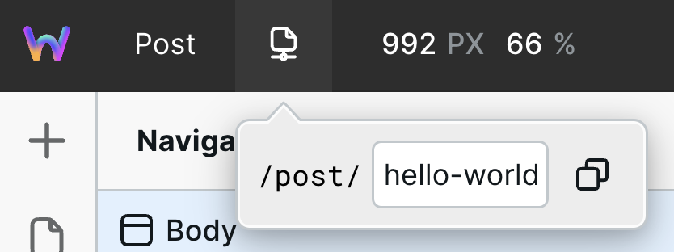
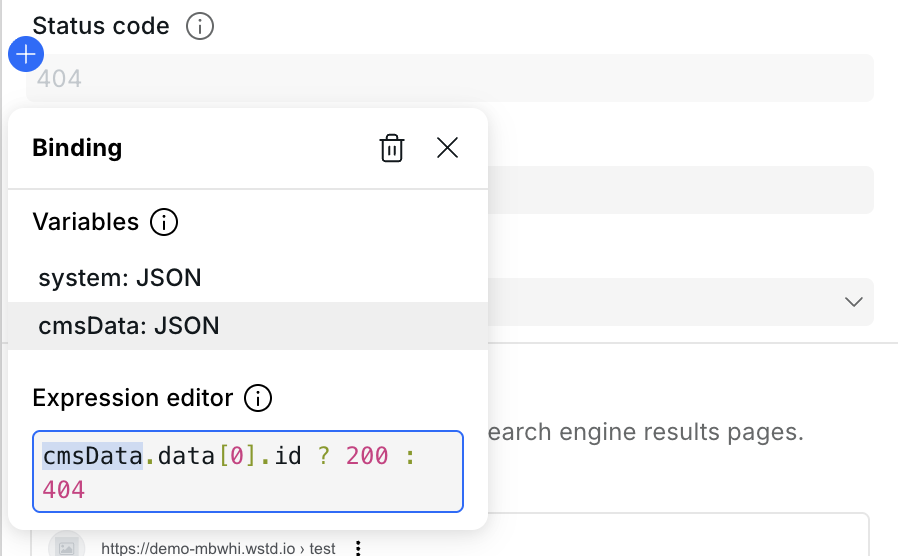
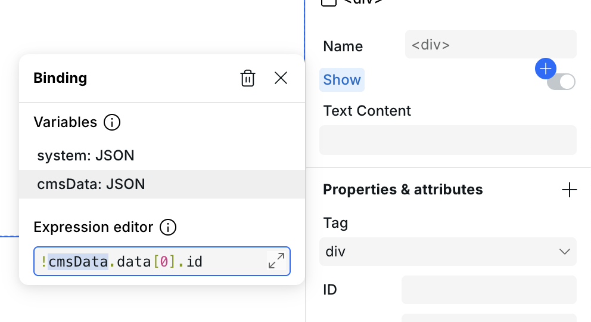
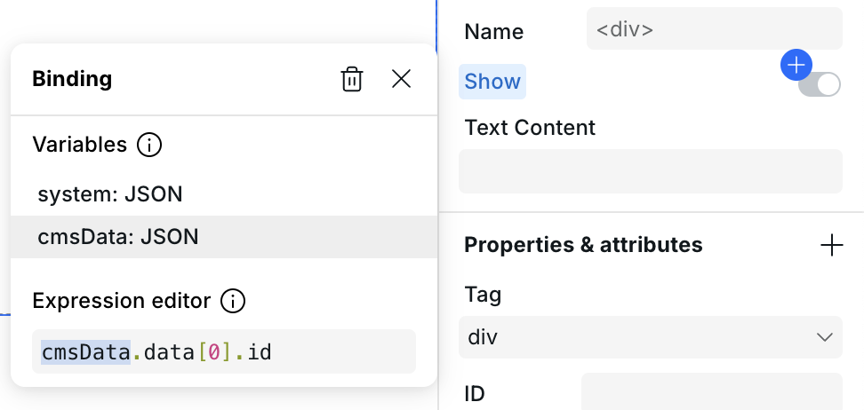

# 💾 CMS

Webstudio is backend-agnostic, meaning it enables you to connect to any backend as long as it provides an HTTP API (see [compatible CMSs and features](cms.md#compatible-cmss) for more info).

While some users may be used to seeing a CMS tab within their platform, Webstudio is different. It’s approached CMS by providing a flexible way to interact with third-party systems such as CMSs, CRMs, and databases.


Need help finding a CMS? Use the [Headless CMS Finder](https://wstd.us/cms-finder).


The building blocks of Webstudio CMS are:

1. [**Dynamic pages**](cms.md#dynamic-pages) – In their simplest form, they are essentially blog templates – one page that dynamically displays data depending on the URL viewed.
2. [**Resources**](variables.md#resource) – A way to fetch data from an API, whether it's a simple blog post or a complex data model.
3. [**Bindings**](expression-editor.md#binding) – Enabling connecting or mapping the CMS data to Webstudio components. You can bind external data to any component and field within Webstudio, from rich text to meta titles.



3 minutes to get you acclimated with how CMS works in Webstudio.





A 20-minute full tutorial on setting up a CMS integration.





A collection of all our CMS content on YouTube.





## Dynamic Pages

Similar to a static page, the path includes dynamic parameters, like a post slug. This enables the page contents to change dynamically based on the requested page.

Adding parameters to a page path will automatically turn the page into a Dynamic Page.

The path can include dynamic parameters like `:name`, which could be made optional using `:name?`, or have a wildcard such as `/*` or `/:name*` to store the whole remaining part at the end of the URL.

The value of the parameter comes from whatever is in the URL. If the path is `/post/:slug` and somebody views `/post/hello-world` then `hello-world` is the value used in your Resource.

### **Address Bar**

The Address Bar enables previewing Dynamic Pages in the editor by entering parameter value(s).

For the Dynamic Path `/post/:slug`, you would enter a slug value that exists in the CMS, such as `hello-world`.

<figure><figcaption><p>Entering "hello-world" as a test value</p></figcaption></figure>


The static part of the URL (in this case, `/post/`) is already in the Address Bar and should not be included when adding the test value.


Address Bar values are saved in the editor by:

- Manually entering values
- Navigating links that lead to the Dynamic Page, such as clicking on `/post/hello-world`

## Resources

A Resource variable gets its value from a fetch request, allowing data from a remote system to be used within Webstudio.

In the context of Dynamic Pages, Resources are used to fetch specific information determined by the URL, or more specifically, the value of the parameter(s) in the URL.

For example, the Resource will dynamically fetch posts from the CMS whose slug value equals the slug being viewed. The query may look something like this `posts(slug: system.params.slug)`, and when `/post/hello-world` is viewed, the query will translate to `posts(slug: "hello-world")` (i.e., “get posts where the slug value is “hello world”).

Dynamic pages may have multiple parameters, enabling the query to become even more dynamic. For example, in addition to `:slug`, you can also add `:lang` to fetch and display localized content.

If interacting with a GraphQL API, use the [GraphQL resource](variables.md#graphql).

## Binding Data

At this point, the Resource Variable has the CMS Data, and now you need to bind or connect that data to the components and fields.

Binding data is done with the [Expression editor](expression-editor.md).

For example, go to a Header component > Settings > Text Content > and the “+” button. Within the Expression editor, add the Resource Variable that contains the CMS data and the title value within it. This may look like `CMS Data.title`.

For more information, see the [Expression editor documentation](expression-editor.md).

## Compatible CMSs

Webstudio CMS supports any content management system (CMS) that provides an HTTP API. This feature enables users to use their existing CMS or the one that works best for them.

Below is a non-comprehensive list of CMSs, whether or not they provide an HTTP API (i.e., compatible with Webstudio), and the compatibility of specific CMS features. You can also use the [Headless CMS Finder](https://wstd.us/cms-finder) to compare and filter headless CMS options based on key features and pricing.

| CMS                                       | Compatible | Rich text                                                                                                                                                                                         | Tutorial                                         | Template                                       | Known issues                                                             |
| ----------------------------------------- | ---------- | ------------------------------------------------------------------------------------------------------------------------------------------------------------------------------------------------- | ------------------------------------------------ | ---------------------------------------------- | ------------------------------------------------------------------------ |
| [Hygraph](https://hygraph.com/)           | ✅         | ✅ Must request HTML                                                                                                                                                                              | [Tutorial](../integrations/hygraph.md)           | [Template](https://wstd.us/hygraph-template)   |                                                                          |
| [Sanity](https://www.sanity.io/)          | ✅         | ❌                                                                                                                                                                                                |                                                  |                                                |                                                                          |
| [Strapi](https://strapi.io/)              | ✅         | ✅ Must use the [CKEditor 5 integration](https://market.strapi.io/plugins/@ckeditor-strapi-plugin-ckeditor) and field as it outputs HTML. Not compatible with the default rich text field.        |                                                  |                                                |                                                                          |
| [Contentful](https://www.contentful.com/) | ✅         | ✅ Using Markdown field                                                                                                                                                                           |                                                  |                                                |                                                                          |
| [WordPress](https://wordpress.org/)       | ✅         | ✅                                                                                                                                                                                                | [Tutorial](../integrations/wordpress.md)         | [Template](https://wstd.us/wordpress-template) |                                                                          |
| [Drupal](https://www.drupal.org/)         | ✅         | ✅                                                                                                                                                                                                |                                                  |                                                |                                                                          |
| [Directus](https://directus.io/)          | ✅         | ✅                                                                                                                                                                                                |                                                  |                                                |                                                                          |
| [Hashnode](https://hashnode.com/headless) | ✅         | ✅                                                                                                                                                                                                |                                                  |                                                |                                                                          |
| [Payload](https://payloadcms.com/)        | ✅         | ✅ Need to create a field and hook that auto converts rich text from field A and saves HTML in field B ([src](https://payloadcms.com/docs/rich-text/lexical#outputting-html-from-the-collection)) |                                                  |                                                |                                                                          |
| [Airtable](https://www.airtable.com/)     | ✅         | ✅                                                                                                                                                                                                | [Tutorial](../integrations/airtable-frontend.md) | [Template](https://wstd.us/airtable-template)  |                                                                          |
| [Baserow](https://baserow.io/)            | ✅         | ✅                                                                                                                                                                                                |                                                  |                                                |                                                                          |
| [Notion](https://www.notion.so/)          | ✅         | ❌                                                                                                                                                                                                | [Tutorial](../integrations/notion.md)            | [Template](https://wstd.us/notion-template)    | [Can't use pages](https://github.com/webstudio-is/webstudio/issues/3709) |
| [Flotiq](https://flotiq.com/)             | ✅         | ✅                                                                                                                                                                                                | [Tutorial](../integrations/flotiq.md)            |                                                |                                                                          |
| [Ghost](https://ghost.org/)               | ✅         | ✅                                                                                                                                                                                                |                                                  | [Template](https://wstd.us/ghost-template)     |                                                                          |
| [Coda](https://coda.io/)                  | ✅         | ✅                                                                                                                                                                                                |                                                  |                                                | [Multiple](https://github.com/webstudio-is/webstudio/issues/3708)        |
| [Hyvor Blogs](https://blogs.hyvor.com/)   | ✅         | ✅                                                                                                                                                                                                |                                                  | [Template](https://wstd.us/template-hyvor)     |                                                                          |


While we do our best to verify the supported features, we may make mistakes in our research.


### Rich text support

While most CMS field types seamlessly map to Webstudio components (e.g., Plain Text → Heading), rich text may not, depending on how the CMS stores/delivers it.

**Currently, Webstudio supports rich text if it's delivered in HTML or Markdown format.** In the future, we will support rich text regardless of the format delivered by adding conversion libraries for each CMS's flavor of rich text. For example, we'll automatically convert AST to HTML. Refer to [this issue](https://github.com/webstudio-is/webstudio/issues/3398) for more information.

In the meantime, advanced users can set up a proxy on Cloudflare Workers to convert rich text to HTML. However, this is outside the scope of Webstudio's support.

Rich text in the form of HTML can be bound to the [Content Embed Component](../core-components/content-embed.md), and Markdown can be bound to the [Markdown Embed Component](../core-components/markdown-embed.md).

## Handling dynamic 404s

On a dynamic page, the URL may technically exist (e.g. `/post/hello-world`) but the Resource query returns no data — for example, because the slug doesn't match any record. In that case the page should return `404` instead of rendering empty content.

There are three steps to handle this correctly.

### 1. Set the status code

Open **Page Settings > Status Code** and bind an expression to it. The goal is to look for some piece of data in the response and if it's not there, output `404`:

```javascript
cmsData.data[0].id ? 200 : 404;
```

This example looks for the ID of a record. If it's there, output `200` (found!) otherwise `404` (not found).

<figure><figcaption><p>Binding an expression to the Status Code field in Page Settings</p></figcaption></figure>


The exact key to look for will depend on your CMS, but think of something that will always be there if the post/record is found (slug, ID, title).


### 2. Show 404 content conditionally

Add a component (e.g. a Box) to the page that contains your 404 message. Set its **Show** condition to the same expression:

```javascript
!cmsData.data[0].id;
```

When this evaluates to `true`, the 404 content is shown.

<figure><figcaption><p>Setting the Show condition on the 404 content Box</p></figcaption></figure>


To reuse an existing custom 404 page design without rebuilding it, [add a Slot](../core-components/slot.md) and select your 404 page's content as the slot source. This keeps the 404 UI in one place and lets you reuse it across any dynamic page.


### 3. Hide regular content conditionally

Select the component (e.g. a Box) that wraps the normal page content and set its **Show** condition to the same expression:

```javascript
cmsData.data[0].id;
```

This hides the regular content when there is no data, avoiding an empty-looking page.

<figure><figcaption><p>Setting the Show condition on the regular content Box</p></figcaption></figure>

## Alternative: redirect instead of showing 404 content

Instead of rendering 404 content on the same page, you can redirect the user to another page entirely — for example your custom `/404` page — using **Page Settings > Redirect** bound to an expression:

```javascript
!cmsData.data[0].id ? "/404" : ""
```

When data is missing, this redirects to `/404`. When data is found, the empty string means no redirect occurs and the page loads normally.

This approach is simpler — no need to conditionally show/hide content — but the user sees a URL change rather than staying on the original URL.

## Related

- [Webstudio CMS](https://webstudio.is/cms) – Learn more about CMS capabilities in Webstudio
- [Headless CMS Finder](https://webstudio.is/tools/headless-cms-finder) – Compare and find the right headless CMS
- [Data variables](variables.md) – Define Resources to fetch CMS data
- [Expression editor](expression-editor.md) – Bind CMS data to components
- [Collection](../core-components/collection.md) – Iterate over CMS data to create lists
- [Content Embed](../core-components/content-embed.md) – Display rich text HTML from your CMS
- [Markdown Embed](../core-components/markdown-embed.md) – Display Markdown content from your CMS
- [Custom 404 page](../how-tos/how-to-make-a-custom-404-page.md) – Create a custom 404 design to reuse on dynamic pages
