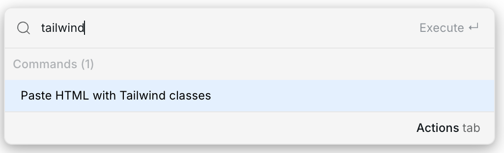

# ↔️ HTML with Tailwind

You can paste HTML with Tailwind CSS classes into Webstudio and convert the utility classes into native Webstudio styles.

For general Tailwind HTML, use the **Paste HTML with Tailwind classes** command:

1. Copy HTML containing Tailwind classes, such as `
`
2. Open [Commands & search](../commands-and-search.md) with `⌘ + K` (`Ctrl + K` on Windows)
3. Search for **Paste HTML with Tailwind classes**
4. Run the command

<figure><figcaption>
Paste HTML with Tailwind classes command
</figcaption></figure>

HTML/Tailwind output copied from [Inception](../../inception.md#copy-htmltailwind) can also be pasted directly into the Builder.

If the pasted HTML references image URLs, Webstudio uploads those images into [Assets](../assets.md) and rewrites the pasted image instances to use the uploaded assets.

## Related

- [HTML with CSS](./html-with-css.md) – Paste HTML containing `<style>` blocks
- [Referenced images](./images.md) – Understand image handling during paste
- [Commands & search](../commands-and-search.md) – Learn how to run commands from the keyboard
- [Inception](../../inception.md#copy-htmltailwind) – Copy HTML/Tailwind output from Inception
