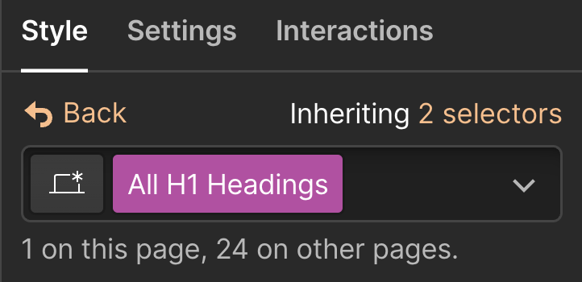
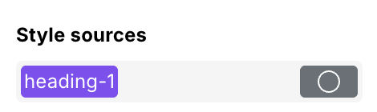

# ↔️ Webflow

It works by copying anything in Webflow format, such as component libraries and projects, and pasting it into Webstudio, transferring the structure and styles.

## What does and doesn’t transfer

### Elements

| Webflow Element  | Transfers? | Notes                                                                                                                                                                                                                  |
| ---------------- | ---------- | ---------------------------------------------------------------------------------------------------------------------------------------------------------------------------------------------------------------------- |
| Section          | ✅          |                                                                                                                                                                                                                        |
| Container        | ✅          |                                                                                                                                                                                                                        |
| Quick Stack      | ✅          |                                                                                                                                                                                                                        |
| V Flex           | ✅          |                                                                                                                                                                                                                        |
| H Flex           | ✅          |                                                                                                                                                                                                                        |
| Div Block        | ✅          |                                                                                                                                                                                                                        |
| List             | ✅          |                                                                                                                                                                                                                        |
| List Item        | ✅          |                                                                                                                                                                                                                        |
| Link Block       | ✅          |                                                                                                                                                                                                                        |
| Button           | ✅          | Maps to “[Link](../../core-components/link.md)”. [Buttons](broken-reference) are for interactions, like submitting a form, not linking.                                                                                |
| Heading          | ✅          |                                                                                                                                                                                                                        |
| Paragraph        | ✅          |                                                                                                                                                                                                                        |
| Text Link        | ✅          |                                                                                                                                                                                                                        |
| Text Block       | ✅          |                                                                                                                                                                                                                        |
| Block Quote      | ✅          |                                                                                                                                                                                                                        |
| Rich Text        | ✅          | There is no Rich Text component in Webstudio, though any children of the copied Rich Text paste in as their respective components. For example, Rich Text with a Heading and Link will transfer as a Heading and Link. |
| Collection List  | ❌          | Though Webstudio does have a “[Collection](broken-reference)” component.                                                                                                                                               |
| Image            | ✅          |                                                                                                                                                                                                                        |
| Video            | ❌          | Can be rebuilt “[Vimeo](../../core-components/vimeo.md)” or “[HTML Embed](../../core-components/html-embed.md)”                                                                                                        |
| YouTube          | ❌          | Can be rebuilt using “[HTML Embed](../../core-components/html-embed.md)”.  [See status](https://github.com/webstudio-is/webstudio/issues/1747) of this component in Webstudio.                                         |
| Lottie Animation | ❌          | Can be rebuilt using “[HTML Embed](../../core-components/html-embed.md)”                                                                                                                                               |
| Spline Scene     | ❌          | Can be rebuilt using “[HTML Embed](../../core-components/html-embed.md)”                                                                                                                                               |
| Form Block       | ✅          |                                                                                                                                                                                                                        |
| Label            | ✅          |                                                                                                                                                                                                                        |
| Input            | ✅          |                                                                                                                                                                                                                        |
| File Upload      | ❌          | [See status](https://github.com/webstudio-is/webstudio/issues/3023) of this component in Webstudio                                                                                                                     |
| Text Area        | ✅          |                                                                                                                                                                                                                        |
| Checkbox         | ✅          |                                                                                                                                                                                                                        |
| Radio Button     | ✅          |                                                                                                                                                                                                                        |
| Select           | ✅          |                                                                                                                                                                                                                        |
| reCAPTCHA        | ❌          | reCAPTCHA doesn’t transfer as Webstudio uses alternative methods of preventing spam.                                                                                                                                   |
| Form Button      | ✅          | Maps to “[Button](broken-reference)”                                                                                                                                                                                   |
| Search           | ❌          |                                                                                                                                                                                                                        |
| Background Video | ❌          |                                                                                                                                                                                                                        |
| Dropdown         | ❌          | Can be rebuilt using Radix “[Select](../../radix/select.md)”                                                                                                                                                           |
| Code Embed       | ✅          |                                                                                                                                                                                                                        |
| Lightbox         | ❌          |                                                                                                                                                                                                                        |
| Locales List     | ❌          |                                                                                                                                                                                                                        |
| Navbar           | ✅          | Generates the corresponding components such as [Boxes](broken-reference) and [Links](../../core-components/link.md) with [Tokens](../design-tokens.md) and styles.                                                     |
| Slider           | ❌          | Can be rebuilt using Swiper.js in the Marketplace                                                                                                                                                                      |
| Tabs             | ❌          | Can be rebuilt using Radix “[Tabs](../../radix/tabs.md)”                                                                                                                                                               |
| Map              | ❌          |                                                                                                                                                                                                                        |
| Facebook         | ❌          |                                                                                                                                                                                                                        |
| X (Twitter)      | ❌          |                                                                                                                                                                                                                        |
| Custom Element   | ❌          | [See status](https://github.com/webstudio-is/webstudio/issues/3632) of this component in Webstudio                                                                                                                     |
| Code Block       | ✅          |                                                                                                                                                                                                                        |
| Grid             | ✅          |                                                                                                                                                                                                                        |
| Columns          | ✅          |                                                                                                                                                                                                                        |

### Styles

✅ Both Webflow and Webstudio support all CSS properties, allowing all styles defined in the style panel to transfer.

✅ Webflow preset styles, which Webflow adds by default to pages and Elements.

❌ Webflow variables and their values do not transfer as those values are not available within the Webflow copy.

❌ User-defined styles on **global tag selectors** as they are not available in the Webflow copy. For example, global styling on an H1 does not transfer, but a Token of h1 is created and available for applying the styles.

    

### Classes

✅ Classes and combo classes will transfer as [Tokens](../design-tokens.md) with their respective styles.


Pasting a class/Token that already exists will not cause duplication or override it.


### Breakpoints

✅ Responsive styles and breakpoints will transfer.

### Interactions

❌ Interactions and animations do not transfer.
