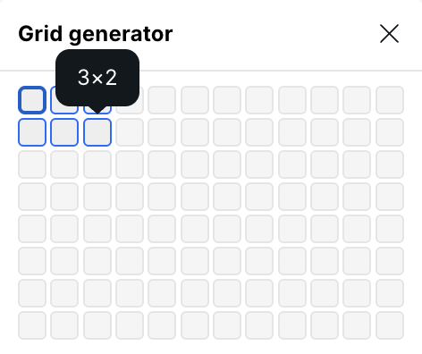
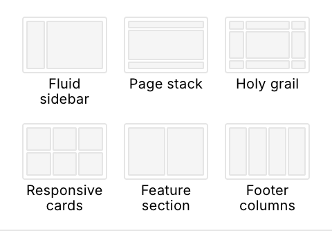
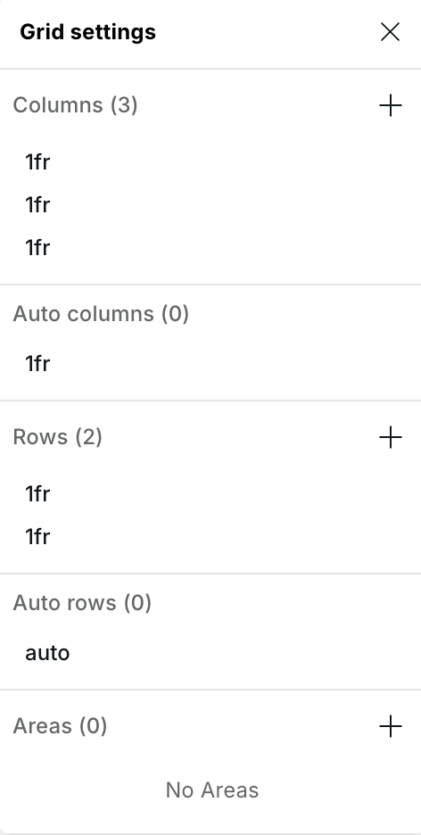
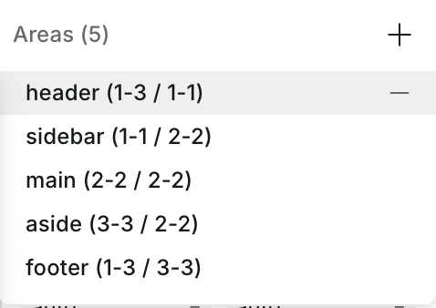
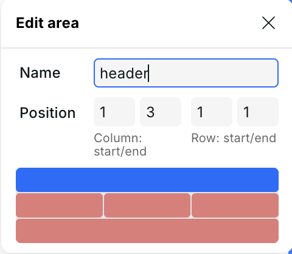
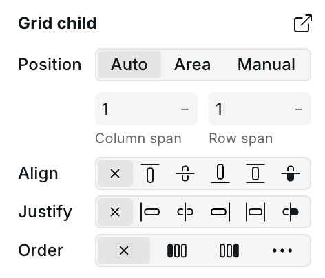
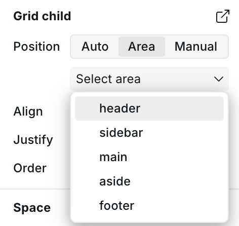
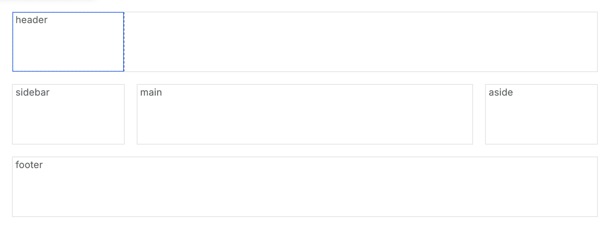

# 📐 CSS Grid

> See [MDN: CSS Grid Layout](https://developer.mozilla.org/en-US/docs/Web/CSS/CSS_grid_layout)

CSS Grid is a two-dimensional layout system that lets you control both columns and rows simultaneously. While [Flexbox](layout-and-flexbox.md) excels at one-directional flows, Grid is ideal for complex page structures like dashboards, magazine layouts, and holy grail patterns.

---

## When to Use Grid vs Flexbox

| Use case                                             | Recommended                                        |
| ---------------------------------------------------- | -------------------------------------------------- |
| Horizontal or vertical list of items                 | Flexbox                                            |
| Card grid that wraps responsively                    | Either (Flexbox with wrap or Grid with `auto-fit`) |
| Page-level structure (header, sidebar, main, footer) | Grid                                               |
| Precise cell placement and overlapping               | Grid                                               |
| Named layout regions                                 | Grid                                               |

---

## Enabling Grid

1. Select the **parent** container
2. Go to **Style Panel** → **Layout** section
3. Change **Display** to `Grid`

---

## Grid Generator

Click the **grid preview button** at the top of the Layout section to open the Grid Generator. It provides three ways to create a grid:

### Size selector

Hover over the interactive cell grid (up to 12 columns × 8 rows) and click to set the number of columns and rows. All tracks are set to `1fr`.

<figure><figcaption>
Grid Generator size selector
</figcaption></figure>

### Presets

Six built-in layout presets with visual thumbnails:

| Preset               | Description                                                                       |
| -------------------- | --------------------------------------------------------------------------------- |
| **Fluid sidebar**    | Sidebar that shrinks to fit its content alongside a flexible main area            |
| **Page stack**       | Single-column layout with auto-sized header, flexible body, and auto-sized footer |
| **Holy grail**       | Classic header/sidebar/main/aside/footer layout using named areas                 |
| **Responsive cards** | Auto-wrapping cards that maintain a minimum size                                  |
| **Feature section**  | Auto-wrapping feature blocks with wider minimum size                              |
| **Footer columns**   | Auto-wrapping narrow columns for footer links                                     |

<figure><figcaption>
Built-in grid presets
</figcaption></figure>

### Fill grid

Click **Fill grid** to automatically insert child div elements into every empty grid cell — useful for quickly populating a layout.

---

## Grid Settings

Click **Configure grid** to open the detailed track editor. It contains four collapsible sections:

<figure><figcaption>
Grid Settings — column and row track editors
</figcaption></figure>

### Columns

Define explicit column tracks. Each track shows its value (e.g., `1fr`, `200px`, `minmax(250px, 1fr)`).

- Click a track to edit its value in a floating panel
- Enable **Use min/max** to set a `minmax()` value with separate Min and Max inputs
- Drag tracks to reorder
- Use **+** to add a track and **−** to remove
- Hover over a track to highlight it on the canvas

### Rows

Same controls as Columns, applied to row tracks.

### Auto columns / Auto rows

Configure implicit track sizes for content placed outside the explicit grid (via `grid-auto-columns` and `grid-auto-rows`). These tracks cannot be reordered or added/removed — they define the size of any automatically created tracks.

### Areas

Manage named grid areas (sets `grid-template-areas` on the container):

- Click **+** to add a new named area — it automatically finds a non-overlapping position
- Click an area to edit its **name** and **position** (column start/end, row start/end)
- Use the **visual area picker** to click and drag across grid cells to define the area's span
- Occupied areas appear in red; the selected area appears in blue
- Hover over an area to highlight it on the canvas

<figure><figcaption>
Named grid areas
</figcaption></figure>

<figure><figcaption>
Visual area picker — blue is the selected area, red indicates occupied cells
</figcaption></figure>


Named areas make it easy to position children by name instead of line numbers. Use the **Holy grail** preset to see named areas in action.


---

## Alignment

The Layout section provides alignment controls for distributing items within the grid:

### Visual alignment widget

A 3×3 clickable grid that sets **Align items** and **Justify items** simultaneously — click a cell to align all children to that position.

### Alignment properties

| Property            | Axis                | Controls                                        |
| ------------------- | ------------------- | ----------------------------------------------- |
| **Justify items**   | Inline (horizontal) | Start, Center, End, Stretch                     |
| **Align items**     | Block (vertical)    | Start, Center, End, Stretch, Baseline           |
| **Justify content** | Inline (horizontal) | Start, Center, End, Space Between, Space Around |
| **Align content**   | Block (vertical)    | Start, Center, End, Space Between, Space Around |
| **Grid auto flow**  | —                   | Row, Column, Row Dense, Column Dense            |

---

## Gap

Two inputs control spacing between grid tracks:

- **Column gap** — horizontal spacing between columns
- **Row gap** — vertical spacing between rows

Click the **link icon** between them to keep both values in sync.

---

## Grid Child

When you select an element whose parent is a grid container, the **Grid child** section appears in the Style Panel. It controls how the child is positioned within the grid.

<figure><figcaption>
Grid Child section
</figcaption></figure>

### Position modes

A toggle at the top switches between three modes:

#### Auto

The child flows into the next available cell. Set **Column span** and **Row span** to make it occupy multiple tracks.

#### Area

Select a **named area** from the dropdown to place the child into that region. All four placement properties are set to the area name automatically.

<figure><figcaption>
Grid Child — Area mode with named area dropdown
</figcaption></figure>


The Area dropdown only lists areas defined in the parent's Grid Settings. If no areas are defined, a message explains how to add them.


#### Manual

Set exact grid line numbers for **Column start**, **Column end**, **Row start**, and **Row end**. A **visual area picker** below the inputs lets you click grid cells to set the position interactively.

### Alignment

- **Align self** — Override the parent's `align-items` for this child (Auto, Start, Center, End, Stretch, Baseline)
- **Justify self** — Override the parent's `justify-items` for this child (Auto, Start, Center, End, Stretch, Baseline)
- **Order** — Change the visual rendering order without changing the DOM

### Select parent grid

Click the button in the section header to navigate to the parent grid container — useful for switching between child and container settings.

---

## Canvas Grid Guides

When working with Grid, Webstudio displays an overlay on the canvas showing:

- Grid track lines and borders
- Track size labels
- Named area labels in the top-left cell of each area
- Highlighted tracks when hovering over items in Grid Settings

<figure><figcaption>
Canvas grid guides showing track lines, sizes, and area names
</figcaption></figure>

---

## Common Patterns

### Responsive card grid

1. Set display to **Grid**
2. Open the Grid Generator and select the **Responsive cards** preset
3. Add card children — they auto-wrap and maintain a minimum width

### Page layout with named areas

1. Set display to **Grid**
2. Select the **Holy grail** preset (creates header, sidebar, main, aside, footer areas)
3. Add children and set each to **Area** mode, selecting the matching area name
4. At smaller breakpoints, redefine the areas or switch to a single-column stack

### Sidebar layout

1. Set display to **Grid**
2. Select the **Fluid sidebar** preset
3. The sidebar column uses `fit-content(300px)` — it shrinks to its content but won't exceed 300px

---

## Related

- [Layout & Flexbox](layout-and-flexbox.md) — One-dimensional layout with Flexbox
- [Responsive Design](responsive-design.md) — Working with breakpoints
- [Design Tokens](design-tokens.md) — Creating reusable styles
- [Anatomy of the Builder](anatomy-of-the-webstudio-builder.md) — Overview of all builder panels
