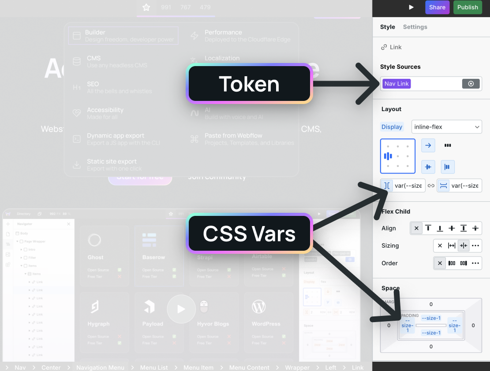
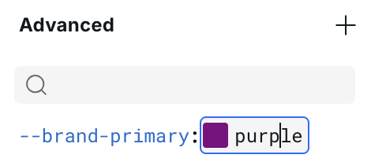
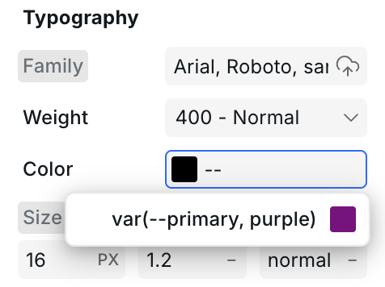
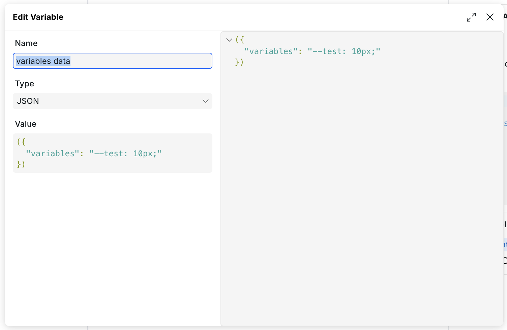
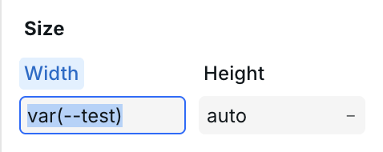
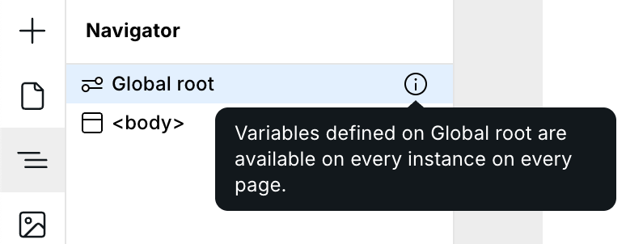

# 🧱 CSS Variables


**Hint:** [Data Variables](variables.md) are different than CSS Variables. They enable the reuse of data in the Settings tab.



Why Use CSS variables?

- **Consistency** – Define a value once, like a color, and access that variable in every style input field.
- **Speed** – Design quickly by selecting predefined variables from autocomplete.
- **Experimentation** – Arrow through autocomplete and get real-time rendering of that variable to see which value looks best in your design.
- **Parent-child interactions** – Have full control over the styles of all child instances when interacting with the parent.

## CSS variables vs. Tokens

The concept of “reusability” is present in both CSS variables and [Tokens](design-tokens.md), but they are different and complement each other exceptionally well.



Let’s think of these two concepts as layers or building blocks.

### Layer 1: CSS Variables

**CSS variables are the bottom layer. They comprise individual variable names and values** often used for sizes, colors, and other styles with many input options.

For example, you can create one variable per color in your design system. Those colors are going to be used throughout your site and in Tokens.

### Layer 2: Tokens

[**Tokens**](design-tokens.md) **are the next layer. They package up&#x20;**_**multiple**_**&#x20;styles.** A `Card` Token may include padding, color, and gap styles, for example.

The values you enter for each style should be defined as variables. This approach ensures consistent designs and allows you to update a value in one place, with the change automatically reflected wherever the variable is used.

With CSS variables, Tokens now often take a more semantic approach, such as calling them `Card`, `Team Member`, or `Testimonial`. Without CSS variables, Tokens were a blend between semantic and utility, such as `padding-medium`, `font-size-small`, and `Card`.


**Tip:** While some utility Tokens will still be present, the majority of Tokens should be semantic.


## Creating variables


Before you create custom variables, be sure to check out [Craft](../craft.md) — the standard guideline for building with Webstudio. It contains a library of expertly crafted CSS variables.


A CSS variable is defined in the Advanced section by using two dashes followed by the variable name, like this:

```css
--gray-5
```


This syntax is not unique to Webstudio. It’s the official [CSS variable](https://developer.mozilla.org/en-US/docs/Web/CSS/Using_CSS_custom_properties) syntax.


Then, the variable's value can be anything such as a color, gradient, duration, size, or number.

<figure><figcaption><p>Creating a variable and assigning a value</p></figcaption></figure>

## Using variables

Once the variable is defined, you can use it on the instance it was defined on and any of its children.

The variables are available in the autocomplete, so you can access variables by typing them in.

<figure><figcaption></figcaption></figure>

The autocomplete search algorithm is very flexible, letting you search by any of the following:

- `--`
- `var`
- `gray` (variable name)

You can search any part of your variable, and autocomplete will show you the proper results.


The syntax for _displaying_ a variable is`var(--my-var)`, though it's much faster to search using `--`. Webstudio automatically handles the conversion to ensure proper output.


### Using data to set CSS variables

The common pattern is to generate a `<style>` tag via an [HTML Embed](../core-components/html-embed.md) expression, populate that tag with CSS variable definitions, and then consume those variables in the Advanced section or any style field. You can learn more about writing the bindings themselves in the [Expression Editor](expression-editor.md) documentation.

The general pattern looks like this:

1. Create the data variable with CSS variables you intend to use (you can do that on HTML Embed instance or any parent). You can use a JSON type or Resource type depending on where your data is coming from.

   <figure><figcaption>Step 1: define your variables in the Settings panel.</figcaption></figure>

2. Add an HTML Embed component somewhere on the page, ideally at the top (head section is a good place but body works too) and create a binding on the code property.

   <figure><figcaption>Step 2: drop an HTML Embed onto the canvas and bind the code property.</figcaption></figure>

3. Write a template literal in Expression editor that produces a `<style>` block. Within the style block, interpolate whatever data you want. A couple of common patterns are shown below:

   ```js
   // key‑value style
   `<style>
     :root {
       --brand-color: ${dataVariables.themeColor};
       --feature-width: ${dataVariables.featureWidth}px;
     }
   </style>`;
   ```

   ```js
   // entire CSS string from a JSON field
   `<style>
     :root {
        ${dataVariables.variables}
     }
   </style>`;
   ```

   The `${}` expressions can reference any value accessible in the Expression Editor, including nested properties and ternary logic. The second form is useful when an API returns a single string containing multiple declarations.

   > _Note:_ you don’t need any special escaping; `dataVariables.variables` uses the standard JavaScript syntax to refer to a nested field. Since the HTML Embed evaluates whenever its dependencies change, the resulting `<style>` tag will update with new values. The variables it defines are now available everywhere on the page.

   
   Variables created via an HTML Embed are not picked up by the style‑panel autocomplete. You must type the variable name manually (or copy/paste it) when referencing it later.
   

4. In Advanced section or any style inputs, refer to the variables with `var(--brand-color)`.

   <figure><figcaption>Step 5: reference the variable in any style value input.</figcaption></figure>

This technique is powerful for theming, A/B testing, or applying dynamic values such as colors or dimensions fetched from an API and managed by an external CMS.

### Scope

CSS variables, by nature, are available in the current instance and any of the children.

#### Global Variables

<figure><figcaption><p>Global Root</p></figcaption></figure>

Most variables should be defined on the Global Root, which is the highest level of the page and the same for every page. That way, you can define `--my-color`, and it's available on every instance on every page.

### Local variables

Some variables are only needed on a specific section or page. You can define these variables on a common ancestor of where they need to be accessed, such as a Box/wrapper.

Here are some use cases for local variables:

- Changing a child's design when interacting with the parent (see [Parent-child interactions](css-variables.md#parent-child-interactions) for more info).
- Doing an A/B test without modifying the entire design system
- Running a seasonal promotion and modifying colors for a section

## Parent-child interactions

With CSS variables, you can interact with the parent and modify the styles of any of the children.

<figure><figcaption><p>Hovering the link and the children change (icon color, icon bg, and arrow appears)</p></figcaption></figure>


Video tutorial


Here are the high-level steps to accomplish this pattern:

1. Take note of the various properties you want to change such as color and background color.
2. Create a variable on the parent for each style property such as `--child-color` and `--child-bg`. Leave the values empty for now.
3. Add the variables to the various children's style inputs, such as setting background to `--child-bg` (no style changes will happen yet because the variables don't have values).
4. Go back to the parent, where the variables are defined, and give them values for the default state.
5. Switch to the other state, such as hover, and change the variables' values.
6. Interact with the parent and see the child change!


For step 2, it's possible to define variables and assign values all at once, but it's better to add the variables to the children first. If the variables aren't added to the children, the assigned values won't render anywhere, which makes it difficult to determine things like which color to use.


### Example Variable Names

For a navigation hover effect:

- `--nav-icon-bg` – Icon background color
- `--nav-icon-color` – Icon fill color
- `--nav-arrow-opacity` – Arrow visibility
- `--nav-arrow-translate` – Arrow position

### Adding Transitions

Add transitions on the **child instances** (not the parent) to smooth out the changes:

- On the icon: add transitions for `background-color` and `color` (\~200ms duration)
- On the arrow: add transitions for `opacity` and `translate` (\~200ms duration)

You can define as many variables as you want and use them on any children where they are defined to create more complex interactions.

## Pseudo Elements

Webstudio supports CSS pseudo elements like `::before` and `::after`, allowing you to add decorative content without additional HTML.

### Adding Pseudo Elements

1. Select an instance
2. Open the Style Sources dropdown (or press `⌘ + Enter`)
3. Type a custom selector like `::before` or `::after`
4. The autocomplete will suggest available pseudo elements
5. Add styles to the pseudo element

### Common Pseudo Elements

- `::before` – Insert content before the element's content
- `::after` – Insert content after the element's content
- `::placeholder` – Style placeholder text in inputs
- `::selection` – Style selected/highlighted text
- `::first-letter` – Style the first letter of text
- `::first-line` – Style the first line of text

### Example: Adding an Icon with ::before

1. Select a Link or Button
2. Add a `::before` state
3. Set `content` to the desired text or leave empty for icon backgrounds
4. Style the pseudo element (width, height, background, etc.)

## Related

- [Design Tokens](design-tokens.md) – Package multiple styles for reuse
- [Modes](modes.md) – Create breakpoints for dark mode and other conditions
- [Animations](animations.md) – Use CSS variables for hover animations
- [Anatomy of the Webstudio Builder](anatomy-of-the-webstudio-builder.md) – Learn about Global Root and the Style Panel
