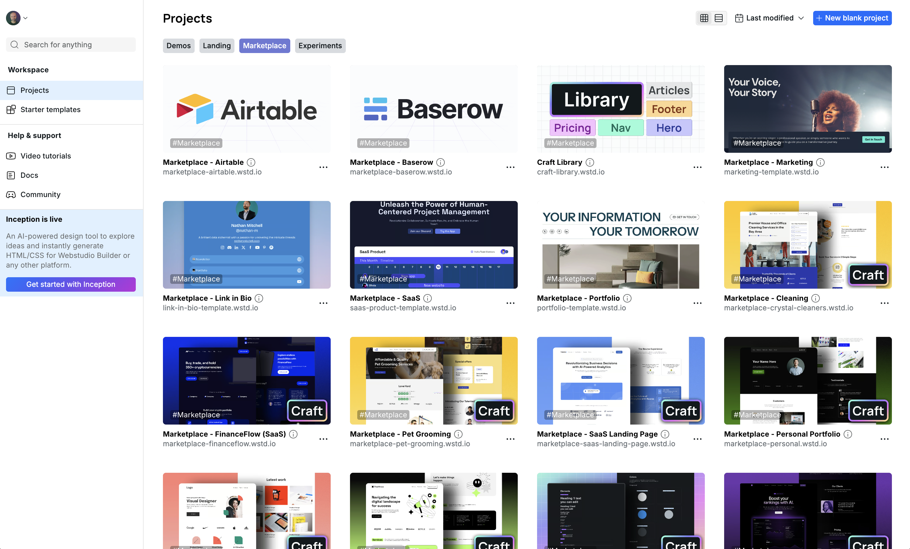
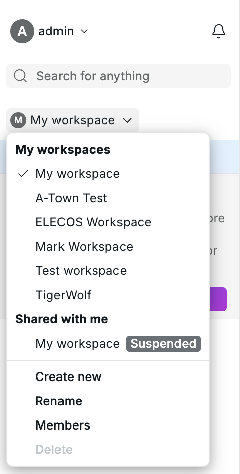
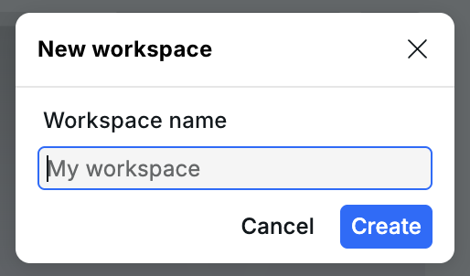
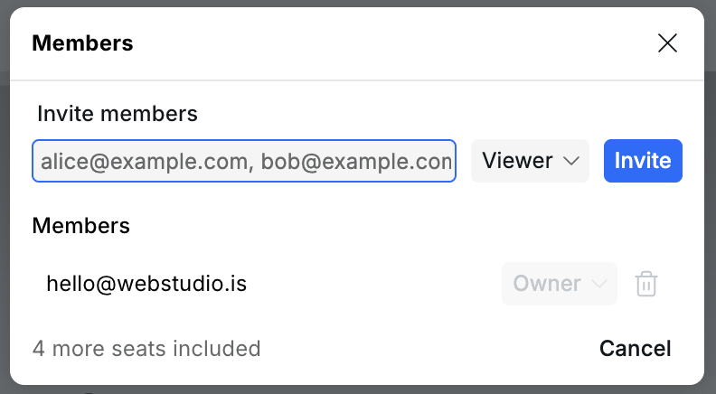
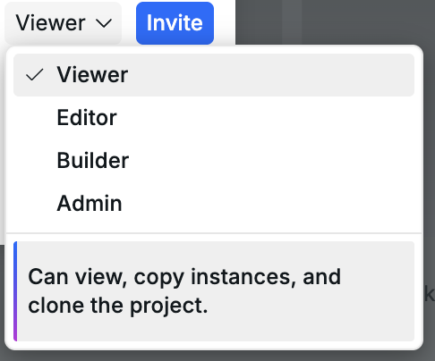
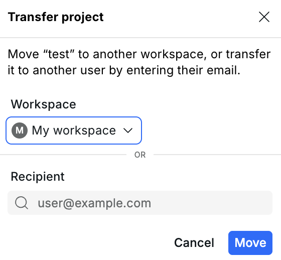

# 🏠 Dashboard

<figure><figcaption>
The Webstudio Dashboard
</figcaption></figure>

The Dashboard is the first screen you see after logging into Webstudio. It provides an overview of your workspaces and projects, with powerful features for organization and quick access.

---

## Workspaces

Workspaces let you organize projects and collaborate with other people. Each workspace has its own projects, members, roles, and seats.

Use workspaces when you want to:

- Keep client, team, or personal projects separate
- Give collaborators access to multiple projects at once
- Control what each person can view, edit, build, or publish
- Move projects between workspaces you can manage

### Creating a workspace

1. Open the workspace selector in the Dashboard sidebar
2. Choose "New workspace"
3. Enter a workspace name
4. Click "Create"

Workspace creation is limited by your plan.

<figure><figcaption>
Workspace selector
</figcaption></figure>

<figure><figcaption>
Creating a new workspace
</figcaption></figure>

### Switching workspaces

Use the workspace selector in the Dashboard sidebar to switch between workspaces. The project list, search results, and tags update to match the selected workspace.

### Members and roles

Workspace owners can manage members from the workspace menu. Add members by entering their email addresses; Webstudio sends them a secure dashboard notification to accept. Multiple emails can be entered at once by separating them with commas.

Unlike share links, workspace membership is tied to a user's Webstudio account. This makes membership invitations safer for ongoing collaboration, especially when access should not depend on whether someone keeps a link private.

<figure><figcaption>
Managing workspace members
</figcaption></figure>

When inviting or updating a member, choose a role:

| Role | What they can do |
| --- | --- |
| Viewer | View, copy instances, and clone projects. |
| Editor | Edit content only, such as text, images, and predefined components. |
| Builder | Make design changes and publish to staging. |
| Admin | Make design changes and publish to custom domains. |

Owners have full control of the workspace, including member management and billing-related actions. Owners cannot be removed from their own workspace.

<figure><figcaption>
Workspace roles
</figcaption></figure>

### Pending invites

Invited members appear as pending until they accept the invitation. Workspace owners can remove pending invites from the Members dialog.

### Seats and billing

Each workspace has an included seat count based on the workspace owner's plan. The Members dialog shows how many seats are still included.

If an invite would exceed the included seats, Webstudio asks you to confirm the extra seats before sending the invite. Extra seats are added to billing for the workspace owner.

If a workspace has more members than the plan covers, non-owner members cannot access the workspace until the owner buys the extra seats or removes members.

### Moving and transferring projects

From a project menu, choose "Transfer" to move or transfer a project:

- Move it to another workspace you can manage
- Transfer it to another user's workspace that you already have access to
- Transfer it to another user by entering their email address

If the recipient has no shared workspace available, Webstudio sends a transfer request. When the recipient accepts it, the project is placed in their default workspace.

<figure><figcaption>
Moving or transferring a project
</figcaption></figure>


Workspaces are best for secure ongoing collaboration. Share links are still useful for one-off access, support, marketplace templates, and transferring cloneable copies, but anyone with the link can use it according to its permissions. See [Share links](share-links.md).


## Search

The Dashboard includes search to help you quickly find projects in the selected workspace.

### How to use search

1. Click the search field in the left sidebar or start typing directly
2. Type your search query to filter projects by name
3. Use arrow keys to navigate through search results
4. Press Enter to open the selected project

Search displays matching projects in a dedicated search view. This allows you to find any project in the selected workspace regardless of which section you're currently viewing.


Search is performed client-side for instant results, making it snappy even with many projects.


---

## Project tags

Tags help you organize and categorize your projects for easier management. This is especially useful when you have many projects and need to group them by client, project type, status, or any other criteria.

### Creating and managing tags

1. Hover over a project card and click the tag icon (or access via the project menu)
2. Click "Create new tag" to add a new tag
3. Enter a tag name and select a color
4. Tags are automatically saved when you select them

### Tag features

- **Color-coded tags** – Each tag can have a distinct color for visual organization
- **Multiple tags per project** – Assign as many tags as needed to a single project
- **Filter by tags** – Click a tag in the sidebar to filter projects by that tag
- **Edit tags** – Rename or change the color of existing tags
- **Delete tags** – Remove tags you no longer need

Tags appear on project cards, making it easy to see project categories at a glance.

---

## View options

The Dashboard supports two different view layouts to suit your preference:

### Grid view (card view)

The default view displays projects as visual cards with:

- Project thumbnail/preview
- Project name
- Custom domain (if configured)
- Assigned tags
- Quick action buttons

### List view

A compact view that displays projects in rows with:

- Project thumbnail (smaller)
- Project name
- Domain information
- Tags
- Last published date
- Created date

Switch between views using the view toggle buttons in the toolbar.

---

## Sorting projects

Projects can be sorted in multiple ways to help you find what you need:

- **Last published** – Projects sorted by most recent publication date
- **Last edited** – Projects sorted by most recent changes (default)
- **Name (A-Z)** – Alphabetically ascending
- **Name (Z-A)** – Alphabetically descending
- **Date created** – Projects sorted by creation date

Click the sort dropdown in the toolbar to change the sorting order. Your preference is remembered across sessions.

---

## Custom domain display

When a project has a custom domain configured, the domain is displayed on the project card. This makes it easy to identify which projects are live and what their public URLs are without opening each project.

The domain display shows:

- Custom domain (e.g., `example.com`) if configured
- Default Webstudio subdomain otherwise

---

## Project settings from Dashboard

You can access project settings directly from the Dashboard without opening the Builder:

1. Click the menu icon (three dots) on a project card
2. Select "Settings" from the dropdown menu
3. Edit project settings in the dialog that appears

This allows you to quickly update project metadata, configure redirects, manage custom code, and adjust other settings without loading the full Builder interface.

---

## Project actions

From the Dashboard, you can perform several actions on your projects:

### Quick actions (hover over card)

- **Open** – Open the project in the Builder
- **Tags** – Manage project tags
- **Menu** – Access more options

### Menu actions

- **Settings** – Open project settings dialog
- **Duplicate** – Create a copy of the project
- **Share** – Create a share link
- **Transfer** – Move the project to another workspace or transfer it to another user
- **Delete** – Remove the project (with confirmation)

Available actions depend on your workspace role. For example, Editors can rename and tag projects, Builders can create and duplicate projects, and Admins can transfer projects.

## Related

- [Project settings](project-settings.md) – Configure project-wide settings
- [Publishing & custom domains](publishing-and-custom-domains.md) – Deploy your site and manage domains
- [Share links](share-links.md) – Create share links and cloneable transfers
- [Anatomy of the Webstudio builder](anatomy-of-the-webstudio-builder.md) – Learn the Builder interface
