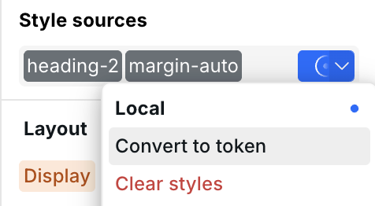
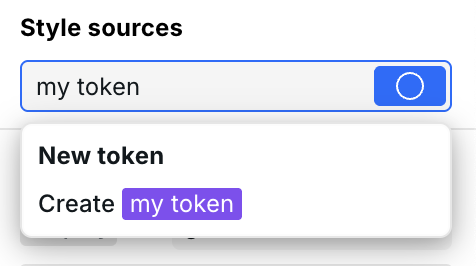
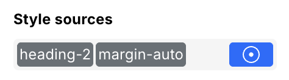
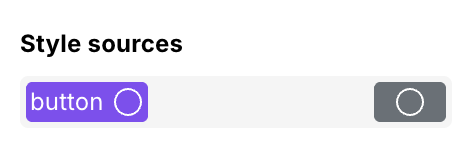

# 🖌️ Design Tokens



## Why Tokens instead of classes? 

If you’ve ever made a website with CSS or with Webflow, you’ve used “classes” to manage your website’s layout and visual styles. Sometimes we love classes. They give us a way to re-use styles which saves us valuable time. However, they have some limitations that make classes very frustrating to use in the context of visual development tools.

Scenario: You’re building a website with Webflow. You have two separate elements, a button, and a card, and you want to give them the same box shadow. Buttons and cards have unique styles so they each already have a unique class. What do you do?

* A: Manually configure the box shadow on the existing Button and Card classes individually. With this option you’re doing the same thing twice. It would save time if we could reuse the box shadow styles.
* B: Apply the Box Shadow class on top of the existing Button and Card classes, making a combo class. Now you can’t edit the styles on Button or Card without first removing the Box Shadow class. Don’t forget to re-apply it! And good luck managing the classes on a different breakpoint. To edit the Button or Card classes you must first remove the Box Shadow combo class, then Webflow will kick you back to the desktop breakpoint, then you select the intended breakpoint again, then make your style changes, then re-apply the combo class. Experienced Webflowers know the pain.

There’s a better way. It’s Design Tokens.

## What are Design Tokens? 

Design Tokens are everything that you wish classes would be - a way to reuse styles without limitations.

* **Mix-and-match Tokens freely**: You can apply as many Tokens as you want to an instance in any order. There is no combo class silliness and no limitations with breakpoints.
* **Universal format:** We didn’t invent Design Tokens. There is an independent spec (by the [Design Tokens Community Group](https://design-tokens.github.io/community-group/format/)) that defines a data format for Tokens, meaning you can potentially import and export tokens between multiple apps. Soon you’ll be able to sync tokens between Webstudio and Figma through the [Tokens Studio for Figma](https://tokens.studio/) plugin!

## How to use Tokens 

The workflow for styling Tokens in Webstudio is nearly the same as styling classes in Webflow, except better.

First, it's recommended to create [CSS variables](css-variables.md) to use within the Tokens.

You can style your site using Local or Tokens like this:

<table data-header-hidden><thead><tr><th></th><th></th><th data-hidden></th></tr></thead><tbody><tr><td></td><td>The top of the Style Panel contains Style Sources. Here is where you can add new Tokens, select existing ones, and switch to Local styling.</td><td>The top section of the Style Panel is our <a href="https://www.reddit.com/r/diablo4/comments/148kfyt/psa_consolescontrollerbeginners_users/">Style Sources Input</a>. This is where you’ll create, style, and arrange your tokens.  When you select a component's instance on the canvas, the tokens you see inside this input are <em>sources</em> of the <em>styles</em> on that instance.</td></tr><tr><td></td><td>Want to style something immediately without making a Token? Use the Local Style Source. Styles applied on Local only impact that instance, but you can easily convert styles from Local to a new Token.</td><td>Want to style something immediately without making a token? Go for it. All component instances in Webstudio have this Local style source by default. Styles applied on Local are unique to an instance and can’t be re-used, but you can easily convert styles from Local to a new token through the token menu.</td></tr><tr><td></td><td>To make a new Token, click inside the Style Sources input, type a name, and hit enter.</td><td>To make a new token, click inside the Style Sources Input, type a name, and hit ENTER/RETURN.</td></tr><tr><td></td><td>The Token you’re currently styling will be blue in the Style Sources input, while others are gray. Simply click on another style source to select it. Any styling you do will be applied to the current Token and reflected across all instances of that Token.</td><td>
The token you’re currently styling will be blue in the Style Sources Input, while others are gray. Simply click on another style source to select it.

Any styling you do will be applied to the current token and reflected across all instances of that token.

When you add a style, the label for that property will turn blue to show that it is applied on the current token.
</td></tr><tr><td></td><td>
Hover the label for a helpful description of where the styles on this property come from.

In this case, we see that the width value that we just applied is coming from the Base breakpoint, the “new token” token on the Body instance. See <a href="anatomy-of-the-webstudio-builder.md#label-colors">Label Colors</a> to understand what the different colors mean.
</td><td>
Hover the label for a helpful description of where the styles on this property come from.

In this case we see that the width value that we just applied is coming from the Base breakpoint, the “new token” token, on the Body instance.
</td></tr><tr><td></td><td>A circle in the Token indicates that there are no styles applied to the Token. This will go away as soon as you apply a style. For Local, a dot is added to the center of the circle when styles are added.</td><td></td></tr></tbody></table>

## Exporting human-readable classes

By default, Tokens are converted to atomic styles, significantly reducing the amount of CSS, ultimately leading to a faster-loading website.

While the majority of users aren't concerned with how the classes are output and should use atomic styles, they can be optionally disabled.

See [Atomic CSS](project-settings.md#atomic-css) for more info.
