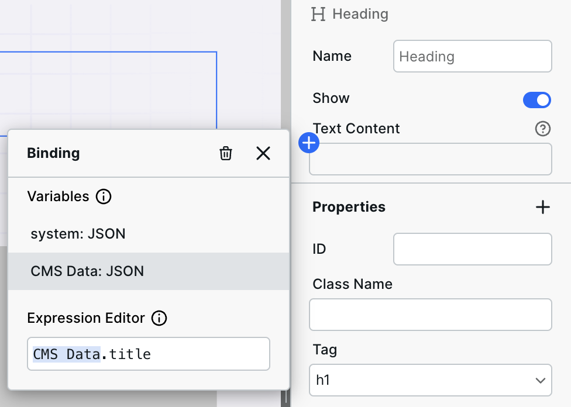

# ➕ Expression Editor

<figure><figcaption></figcaption></figure>

Expression Editor is available on every field when clicking the “+” button.

Most commonly used with [Resources](variables.md#resource), Expression Editor has two primary features:

1. Binding (or “connecting”) external data to Webstudio fields. For example, connecting a blog’s featured image that exists in a headless CMS to the Image component in Webstudio.
2. Running logical expressions such as concatenating two or more values or conditionally displaying a section.


Hint: Expand Expression Editor to work within a larger window.


## Binding

Binding is when you “connect” or “map” various values to fields within Webstudio. For example, when creating a Dynamic Page for a blog, only one page exists in Webstudio, but the values within that page dynamically change based on the URL viewed. The dynamic aspect is enabled by _binding_ the various CMS fields to Webstudio components.

You will see [Variables](variables.md) within the Expression Editor. You can click on the variable or type it in to bind its value to the field. But many times, the value you are looking for is a child within the variable.

Take, for example, the value of a custom Variable called CMS Data:

```json
{
  "title": "Hello World",
  "slug": "hello-world",
  "image": {
    "url": "<https://example.com/image.png>",
    "alt": "I'm an image",
  }
}
```

If you wanted to bind the title of the post to a header component, you need to do more than click on the “CMS Data” Variable. You need to “drill down” or access the children of the variable. This is simply done by typing a `.` after the Variable, which will show the children in the autocomplete (i.e., title, slug, and image). For the title, you would enter `CMS Data.title`, and the value “Hello World” would display. When viewing a different post, that post’s title would display.

For the image URL, you would type `CMS Data.image.url` .

## Expressions

Expression Editor supports a simple subset of JavaScript, giving users a simple syntax without the footguns a complex programming language brings.

The following JavaScript expressions are supported:

* [Ternary operator](https://developer.mozilla.org/en-US/docs/Web/JavaScript/Reference/Operators/Conditional_operator) – Useful for conditions such as “If the image is in my CMS, display it, otherwise hide it.” The actual expression for this would look something like `CMS Data.image ? true : false` and be bound to the “Show” field.
* [Template literals](https://developer.mozilla.org/en-US/docs/Web/JavaScript/Reference/Template_literals) – Useful for inserting dynamic values inside templated text. For example, if you wanted to have “Updated On \<insert dynamic data>”, it would look like `` `Updated On ${CMS Data.updatedOn}` ``. Note the Expression starts and ends with backticks, and the dynamic values are within `${}`.
* [Expressions and operators](https://developer.mozilla.org/en-US/docs/Web/JavaScript/Guide/Expressions_and_Operators) – Useful for concatenating two values (alternative solution to template literals). For example, `"Updated on " + CMS Data.updatedOn`.

## Example expressions

### Schema

You can create a schema and bind your [CMS](cms.md) data to it. The schema can go in the head or body. Add an [HTML Embed](../core-components/html-embed.md), create a binding, and use the following expression. Be sure to change out the schema type and variables with your data.

```javascript
`<script type="application/ld+json">
    {
  "@context": "https://schema.org",
  "@type": "BlogPosting",
  "headline": "${YOUR.CMS.TITLE}",
  "image": [
    "${YOUR.CMS.LOGO_URL}"
  ],
  "datePublished": "${YOUR.CMS.PUBLISHED_DATE}",
  "dateModified": "${YOUR.CMS.MODIFIED_DATE}",
  "author": [
    {
      "@type": "Person",
      "name": "${YOUR.CMS.AUTHOR_NAME}",
      "url": "${YOUR.CMS.AUTHOR_URL}"
    }
  ]
}
</script>`
```

### Conditional collection items

Sometimes we need to conditionally hide some records in a [Collection](../core-components/collection.md.md) based on some context. For example, below a blog post we can have related blog posts, but we wouldn’t want to show the _current_ blog post in there. To do so, create an expression on the Show property in Settings.

We need to turn this statement into code: “If the current page’s slug is the same as the current collection’s slug, then don’t show this post.”

Here is the expression. Be sure to modify it with your variables.

```javascript
system.params.slug === collectionItem.slug ? false : true
```

Again, be sure to change `slug` to your dynamic path parameter and `collectionItem.slug` to your Collection variable and its data.

This expression will now show “false” meaning “turn this off” if the related blog post is actually the same as the current blog post.

### 404 status code

When working with a dynamic page, how do we determine if the page should return `404` (not found) or `200` (found/success)?

After all, the content on the page is dependent on the response from the [Resource](variables.md#resource).

Therefore, we need to tell the page to return `404` when the Resource doesn’t return any data.

To do so, go to the Page Settings > Status Code > and bind an expression to it. The goal is to look for some piece of data in the response and if it’s not there, output `404`.

```javascript
cmsData.data[0].id ? 200 : 404
```

This example looks for the ID of a record. If it’s there, output `200` (we found something!) otherwise nothing was found therefore `404`.


The exact key to look for will depend on your CMS, but think of something that will always be there if the post/record is found (slug, ID, title).

