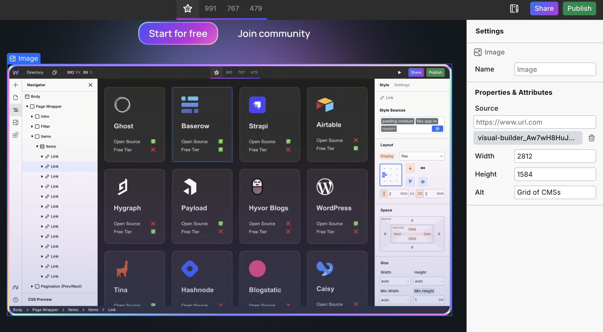
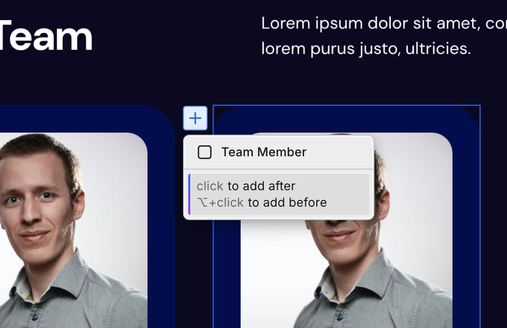

# Modes

There are three modes:

* [Design](modes.md#design)
* [Content](modes.md#content)
* [Preview](modes.md#preview)

You can change modes in the Top Bar or via [keyboard shortcuts](shortcuts.md) if you have sufficient [permissions](share-links.md#types-of-share-links).

<figure><figcaption></figcaption></figure>

## Design

Designer mode provides the full power of the builder. For example, you can add and style components.

## Content

Content mode tailors the builder’s features to editor tasks like updating text and images, and adding templates to designer-specified regions. This mode is ideal for team members and clients.

### Allowed actions

In Content mode, the following actions can be performed:

* Edit text content (e.g., paragraphs, headings, links, etc.)
* Add and edit links within text
* Upload and change images
* Insert instances of templates to designer-specified regions called [Content Blocks](../core-components/content-block.md)
* Publish the site (optional [permission](share-links.md#types-of-share-links))

### For designers/developers

As the website designer/developer, Content mode helps you strike the balance between creating a professional website while also letting your clients/team members edit it without them breaking it or deviating from the design system.



Here’s what you need to know:

* You can try the Content mode by going to the Top Bar and changing modes.
* Users on the Pro tier can create a [Share Link](share-links.md) with “Content” permission
* Editors can perform [these actions](modes.md#allowed-actions)
* You can create templates that editors can insert with [Content Blocks](../core-components/content-block.md)
#### Creating a Content mode share link

1. Go to **Share** in the top bar
2. Create a new share link
3. Check "Content mode" option
4. Optionally enable/disable publish permission for the client

#### Testing Content mode

You can quickly switch to Content mode using the mode dropdown arrow next to Design in the top bar — useful for testing what clients will see before sharing the link.

#### Templates

Templates cannot be deleted by editors. Even if all instances of a template are removed, the template itself remains available for editors to add again. Make sure templates include complete styling since editors don't have access to the Style panel.
### For editors

With Content mode, you can dive right in and edit the website without feeling overwhelmed or risking any changes to the site that could cause issues.



Here’s what you need to know:

*   You can click directly on the canvas to update any text you see. Want to update a title to the latest promotion? Click, type, done.

    <figure><figcaption>
Editing content on the canvas
</figcaption></figure>
*   Some items on the canvas may have settings, like images. Clicking on an image will display the settings on the right. There, you can upload a new image. Just be sure to fill in the field called “Alt” describing the image so visually impaired people can consume your site.

    <figure><figcaption>
The image can be replaced in the Settings Panel
</figcaption></figure>
*   The designer of the site may have included [Content Blocks(s)](../core-components/content-block.md#content-block-in-content-mode). These are regions on the site where you have more capabilities — you can add templates the designer provided you and edit the content. See [Content Block](../core-components/content-block.md) for more information.

    <figure><figcaption></figcaption></figure>
* Changes save in real-time, but you must publish your changes when you are ready for them to go live. To do so, open the publish dialog by clicking “Publish” in the top right, then click “Publish”. It takes around 45 seconds for the site to publish. Note, “Publish” may be disabled if the designer didn’t enable the publishing permission for you.

## Preview

Preview mode hides editing capabilities so you can browse your website. Be sure to test your website on every breakpoint!
