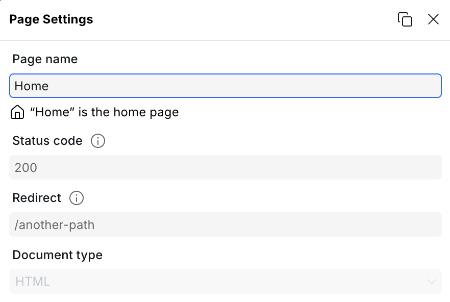
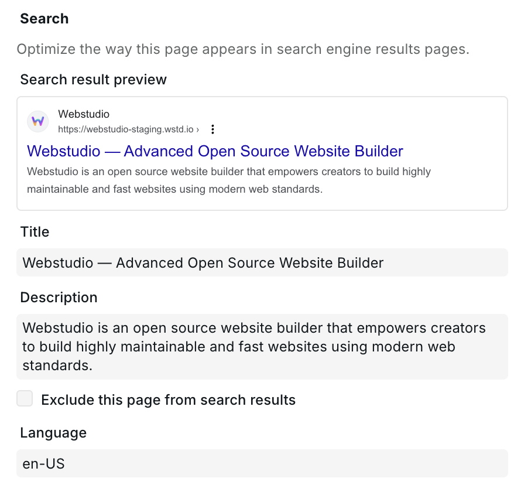
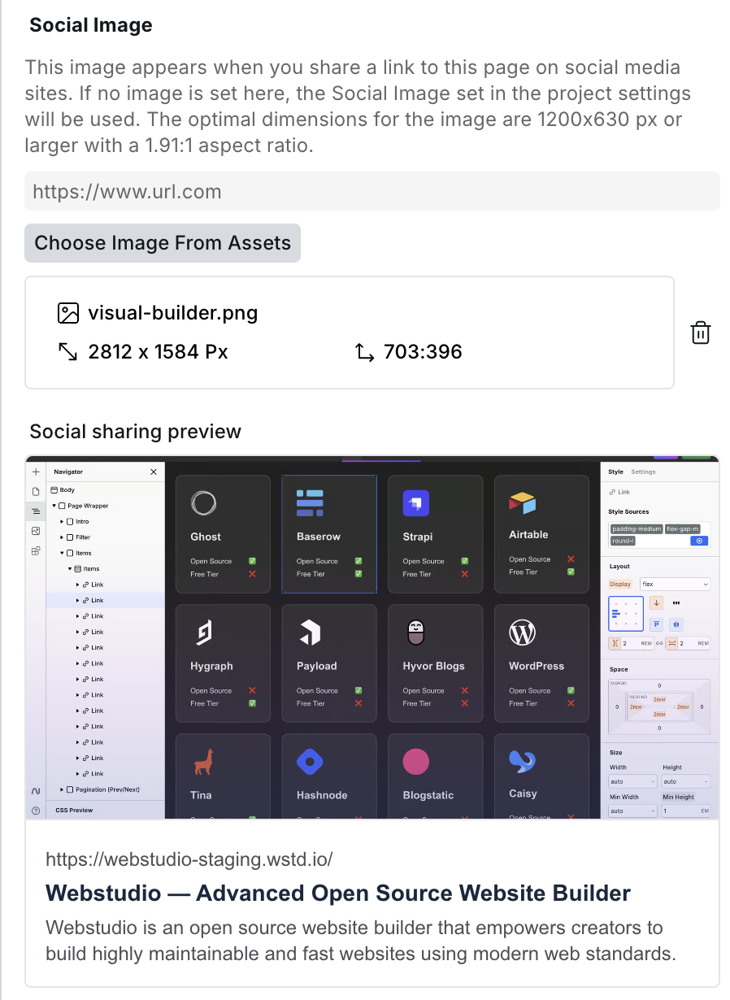
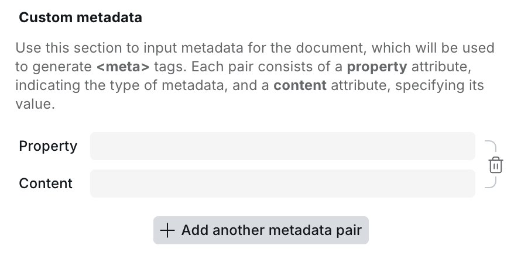

# 📄 Page settings

Page settings control how an individual page behaves — its URL, SEO metadata, status code, redirect, and more. Open Page Settings by clicking the gear icon next to any page in the Pages panel.

## Page name

The name displayed in the Pages panel in the builder. It does not affect the URL or any output — it's purely for organizing pages in the editor.

## Path

The URL path for this page, e.g. `/about` or `/blog/:slug`.

Dynamic segments use a `:` prefix (e.g. `:slug`), making the page a [Dynamic Page](cms.md#dynamic-pages). Optional segments use `?` (e.g. `:slug?`). Wildcards capture the remaining path (e.g. `/*` or `/:slug*`).

## Status code

The HTTP status code returned when this page is requested. Defaults to `200`.

Can be bound to an expression to return a different code conditionally — most commonly `404` when a dynamic page receives a parameter that doesn't match any CMS record. See [Handling dynamic 404s](cms.md#handling-dynamic-404s) for details.

## Redirect

Redirects all requests for this page's path to another path. Useful for retired URLs or reorganized site structure.

Enter a path such as `/new-page`. This performs a `301` permanent redirect. Leave empty if no redirect is needed.

The redirect field supports expressions, making it dynamic. For example, on a dynamic page you can redirect to your 404 page when no CMS data is found. See [Alternative: redirect instead of showing 404 content](cms.md#alternative-redirect-instead-of-showing-404-content) for details.

<figure><figcaption>
General page settings
</figcaption></figure>

## Language

Sets the `lang` attribute on the `<html>` element for this page, e.g. `en`, `fr`, `de`. Used by browsers, screen readers, and search engines to identify the page language.

Can be bound to an expression — for example using a URL parameter — to serve pages in different languages from a single Dynamic Page.

## Document type

Defaults to **HTML**. Switch to **XML** when building XML-based pages such as sitemaps or RSS feeds. See the [XML Node component](../core-components/xml-node.md) for details.

## Search

SEO settings that control how the page appears in search engine results.

### Title

The `<title>` tag and the headline shown in search results. Should clearly describe the page content. Can be bound to a CMS variable on dynamic pages.

### Description

The meta description shown as the snippet in search results. Does not affect rankings directly but influences click-through rate. Can be bound to a CMS variable.

### Exclude from search

Adds a `noindex` directive to the page, preventing search engines from indexing it.

<figure><figcaption>
SEO settings with search result preview
</figcaption></figure>

## Social image

The Open Graph image displayed when the page is shared on social media (Facebook, X, LinkedIn, etc.). You can either upload an image or bind a URL expression to a dynamic image from your CMS.

<figure><figcaption>
Social image with preview
</figcaption></figure>

## Custom metadata

Add arbitrary `<meta>` tags to the page's `<head>`. Each entry has a **property** (the meta tag's `name` or `property` attribute) and a **content** value, both of which support expressions.

Use this for meta tags not covered by the fields above, such as `og:type`, `twitter:card`, or any custom meta needed by third-party integrations.

<figure><figcaption>
Adding a custom meta tag
</figcaption></figure>

## Dynamic data

Variables and Resources defined on the page are scoped to that page and are available to bind to components and Page Settings fields. Define a [Resource variable](variables.md#resource) here to fetch CMS data and then bind it to the Title, Description, Status Code, and other fields above.

## Related

- [CMS](cms.md) – Connect to a CMS and use dynamic data on pages
- [Dynamic 404 handling](cms.md#handling-dynamic-404s) – Return 404 when CMS data is missing
- [Project settings](project-settings.md) – Site-wide settings such as favicon, custom code, and redirects
- [Data variables](variables.md) – Define and use variables on pages
- [Expression editor](expression-editor.md) – Bind expressions to Page Settings fields
- [XML Node](../core-components/xml-node.md) – Build XML pages such as sitemaps
- [Custom 404 page](../how-tos/how-to-make-a-custom-404-page.md) – Create a custom 404 page
