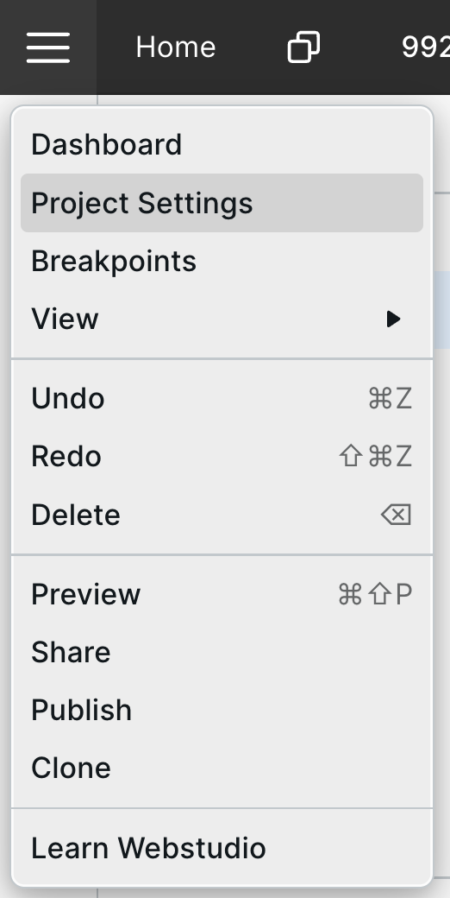
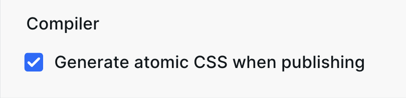

# ⚙️ Project Settings

Project Settings are located in the top left by clicking the Webstudio logo > Project Settings.

<figure><figcaption></figcaption></figure>

## General

* **Site Name** – Used to output [WebSite structured data](https://schema.org/WebSite) to clearly define your website's identity.
* **Favicon** – Output your logo in search engines, browser tabs, and more.
* **Custom Code** – Global field to output scripts in the head. Custom Code is often used to add analytics scripts such as Google Analytics, PostHog, Plausible, and any other scripts/code you want to output on every page. Please note that this code does _not_ output in the Builder, so your scripts aren't tracking Builder page views. For outputting a script in the body on every page, use a [Slot](../core-components/slot.md). For example, add [HTML Embed(s)](../core-components/html-embed.md) to your Footer Slot so that it outputs on every page.
* **Compiler** – Atomic CSS reduces the CSS file size by \~70% in many cases. See more below.

### Atomic CSS

<figure><figcaption></figcaption></figure>

When enabled, the class and CSS structure under the hood contains one style per class. This algorithm allows classes to be reused, significantly reducing the amount of CSS, ultimately leading to a faster-loading website.

For example, in the UI, you may create a Token called “Card” and give it a background color, padding, and a border-radius.

With atomic CSS _enabled_, it will output like this:

```css
  .ceszdr {
    background-color: #fff;
  }
  .c1jykks9 {
    border-top-left-radius: 1rem;
  }
  .c31r7mo {
    border-top-right-radius: 1rem;
  }
  .cywm6f1 {
    border-bottom-left-radius: 1rem;
  }
  .c1q77ydo {
    border-bottom-right-radius: 1rem;
  }
  .cu6yur2 {
    padding: 20px;
  }
```

Even though this seems to take up more space, its benefits become apparent as you style more parts of the website. Now, anytime you add 20px of padding, it’ll automatically reuse the `cu6yur2` class. Generally speaking, there are somewhat of a finite amount of styles you’ll use on your website, so as the website gets bigger, the CSS file does _not_ grow proportionally – in fact, its growth slows down as the site gets bigger as it doesn’t need to continue creating classes for styles you’ve already used. Pretty neat.

#### The data

Let’s quantify the CSS file size savings when using atomic CSS on Webstudio.

* 4-page brochure website
  * With atomic: 21 KB
  * Without atomic: 75 KB
* 23-page SaaS website
  * With atomic: 23 KB
  * Without atomic: 83 KB

**In both cases, enabling atomic CSS reduces the file size by around 72%!**

#### Disabling atomic CSS

Even though atomic CSS improves website performance by reducing the CSS file size, there are use cases to disable it.

When exporting your Project to [self-host](../self-hosting/) it, you _may_ want to modify CSS and classes _outside_ of Webstudio. By disabling atomic CSS, your classes are human-readable, instead of using an optimized algorithm.


If you need classes to target but want to enable atomic CSS, you can add classes in the settings panel. These will always output exactly as they are entered. Watch [this short video](https://www.youtube.com/watch?v=\_1QSWHOtk08) to learn more.


When atomic CSS is disabled, your components will have two classes:

1. A default class, such as `w-box`
2. Your [Tokens](design-tokens.md) and Local Styles merged into another class

The same example from above looks like this when atomic is _disabled_:

```css
.w-box-1 {
    background-color: rgb(255, 255, 255);
    border-radius: 1rem;
    padding: 20px;
}
```

## Redirects

Redirects old URLs to new ones so that you don’t lose any traffic or search engine rankings. 301 and 302 status codes are available.

## Marketplace

Submit your Project, or parts of your Project, to the public Webstudio Marketplace.

Things to note:

* Once submitted, each page in your project will have an option to include/exclude it from the Marketplace, letting you control which pages are public. They also have meta information so you can upload custom images. If no images are provided, the Marketplace will use default placeholders with the name of the page.
* Don't forget to publish your project after every change to make your changes available in the marketplace!
