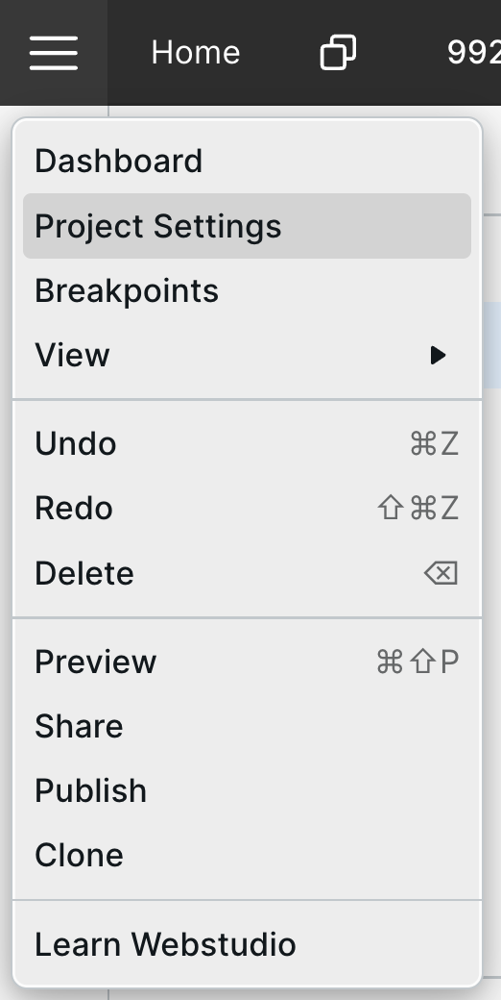
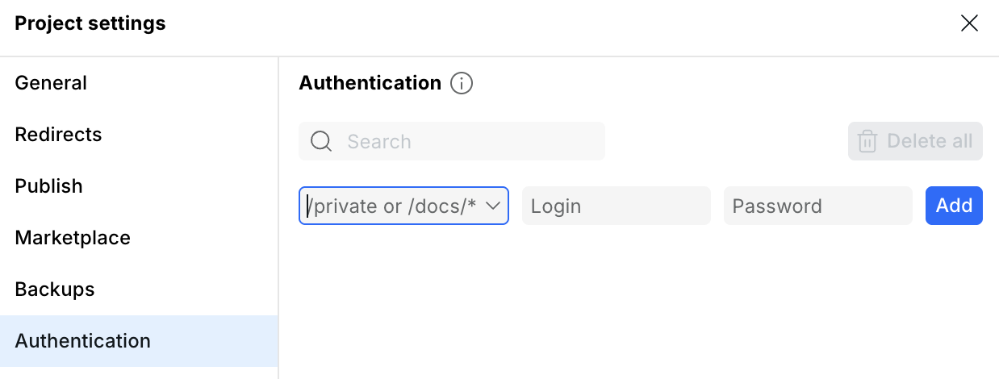

# ⚙️ Project settings

Project settings are located in the top left by clicking the Webstudio logo > Project settings.

<figure><figcaption></figcaption></figure>

## General

* **Site Name** – Used to output [WebSite structured data](https://schema.org/WebSite) to clearly define your website's identity.
* **Favicon** – Output your logo in search engines, browser tabs, and more.
* **Custom Code** – Global field to output scripts in the head. Custom Code is often used to add analytics scripts such as Google Analytics, PostHog, Plausible, and any other scripts/code you want to output on every page. Please note that this code does _not_ output in the Builder, so your scripts aren't tracking Builder page views. For outputting a script in the body on every page, use a [Slot](../core-components/slot.md). For example, add [HTML Embed(s)](../core-components/html-embed.md) to your Footer Slot so that it outputs on every page.
* **Compiler** – Atomic CSS reduces the CSS file size by \~70% in many cases. See more below.

## Publishing

### Atomic CSS

<figure><figcaption></figcaption></figure>

When enabled, the class and CSS structure under the hood contains one style per class. This algorithm allows classes to be reused, significantly reducing the amount of CSS, ultimately leading to a faster-loading website.

For example, in the UI, you may create a Token called “Card” and give it a background color, padding, and a border-radius.

With atomic CSS _enabled_, it will output like this:

```css
  .ceszdr {
    background-color: #fff;
  }
  .c1jykks9 {
    border-top-left-radius: 1rem;
  }
  .c31r7mo {
    border-top-right-radius: 1rem;
  }
  .cywm6f1 {
    border-bottom-left-radius: 1rem;
  }
  .c1q77ydo {
    border-bottom-right-radius: 1rem;
  }
  .cu6yur2 {
    padding: 20px;
  }
```

Even though this seems to take up more space, its benefits become apparent as you style more parts of the website. Now, anytime you add 20px of padding, it’ll automatically reuse the `cu6yur2` class. Generally speaking, there are somewhat of a finite amount of styles you’ll use on your website, so as the website gets bigger, the CSS file does _not_ grow proportionally – in fact, its growth slows down as the site gets bigger as it doesn’t need to continue creating classes for styles you’ve already used. Pretty neat.

#### The data

Let’s quantify the CSS file size savings when using atomic CSS on Webstudio.

* 4-page brochure website
  * With atomic: 21 KB
  * Without atomic: 75 KB
* 23-page SaaS website
  * With atomic: 23 KB
  * Without atomic: 83 KB

**In both cases, enabling atomic CSS reduces the file size by around 72%!**

#### Disabling atomic CSS

Even though atomic CSS improves website performance by reducing the CSS file size, there are use cases to disable it.

When exporting your Project to [self-host](../self-hosting/) it, you _may_ want to modify CSS and classes _outside_ of Webstudio. By disabling atomic CSS, your classes are human-readable, instead of using an optimized algorithm.


If you need classes to target but want to enable atomic CSS, you can add classes in the settings panel. These will always output exactly as they are entered. Watch [this short video](https://www.youtube.com/watch?v=\_1QSWHOtk08) to learn more.


When atomic CSS is disabled, your components will have two classes:

1. A default class, such as `w-box`
2. Your [Tokens](design-tokens.md) and Local Styles merged into another class

The same example from above looks like this when atomic is _disabled_:

```css
.w-box-1 {
    background-color: rgb(255, 255, 255);
    border-radius: 1rem;
    padding: 20px;
}
```

## Redirects

Redirects old URLs to new ones so that you don’t lose any traffic or search engine rankings. 301 and 302 status codes are available.

## Authentication

Use Authentication to require HTTP Basic Auth credentials for one or more routes on custom domains.

This is useful when you want to protect:

- A group of pages, such as `/private/*`
- Dynamic routes, such as `/blog/:slug`
- The home page, using `/`
- A route that does not map cleanly to one page setting

To add a protected route:

1. Open **Project settings**
2. Go to **Authentication**
3. Enter a route, such as `/private` or `/docs/*`, plus a login and password
4. Click **Add**
5. Publish the site

Routes use the same syntax as page paths. See [Path syntax](page-settings.md#path-syntax) for supported static routes, dynamic segments, optional segments, and wildcards.

<figure><figcaption><p>Project route authentication</p></figcaption></figure>

Login and password rules:

- Login is required
- Password is required
- Login cannot contain `:`
- Login and password cannot contain whitespace
- Password can contain `:`

If a page has authentication in Page Settings and the same route is also protected in Project Settings, the page setting takes priority for that route.


Authentication applies to protected routes on custom domains. Staging domains have their own built-in password protection, described in [Publishing & custom domains](publishing-and-custom-domains.md#staging-domain-password-protection).



Authentication is a Pro feature for custom domains. You can publish to staging for free, but publishing authentication to custom domains requires a plan that includes it.


For a single page, you can also configure authentication directly in [Page settings](page-settings.md#authentication).

## Marketplace

You can contribute free or paid templates by creating a Project and submitting it for review. Approved templates will appear in the [Marketplace](../marketplace.md).

For more information, see [Contributing to the Marketplace](../../contributing/marketplace.md).

## Related

- [SEO settings](seo-settings.md) – Configure meta tags and social sharing
- [Publishing & custom domains](publishing-and-custom-domains.md) – Deploy your site and manage domains
- [Page settings](page-settings.md) – Configure authentication for a single page
- [Design tokens](design-tokens.md) – Understand atomic CSS output options
- [Head Slot](../core-components/head-slot.md) – Add custom code per page
- [HTML Embed](../core-components/html-embed.md) – Embed analytics and custom scripts
