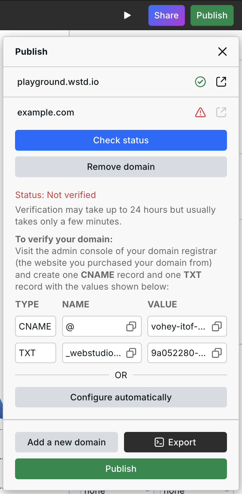
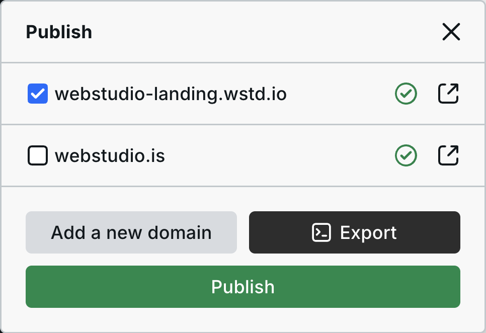
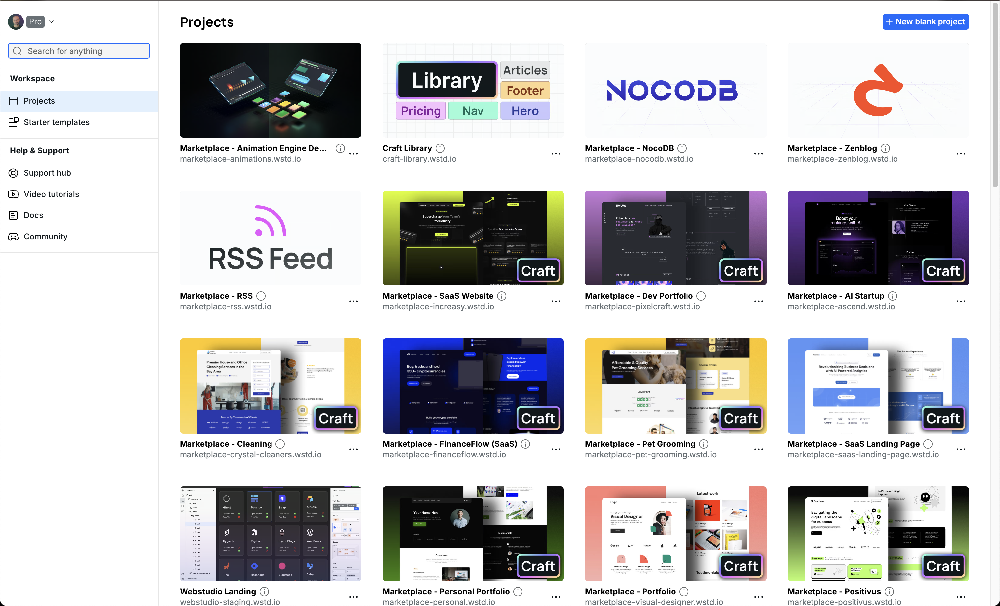

# 🌐 Publishing & Custom Domains


If your DNS provider doesn’t allow you to add a CNAME at the apex, jump to [this section](publishing-and-custom-domains.md#dns-provider-doesnt-allow-cname-flattening).


## Adding a custom domain

These steps will show you how to add a custom domain to your Project.

### 1. Add a new domain to your Project

Click "Publish" in the top bar, then “Add a new domain”.

Enter the domain or subdomain you want the site to be available at, for example, `www.example.com` or `example.com`.

After entering your domain, you will be provided with DNS records, which can be manually added to your DNS or automatically through Entri.

<figure><figcaption></figcaption></figure>

### 2. Add the DNS records

Next, you need to add the DNS records to your DNS provider either manually or automatically.

#### Option 1: Manually add DNS records

You can configure your custom domain manually by adding the provided `CNAME` and `TXT` records to your DNS.

1. **Open your DNS provider**
2. **Create a `CNAME` record**
   1. Add a new record.
   2. Set the type to `CNAME`.
   3. Copy the Name and Value from Webstudio.
   4. Paste them into the corresponding fields in your DNS provider. Note that the DNS provider might label the Value as "Target" or "Content."
3. **Create a `TXT` record**
   1. Add a new record.
   2. Set the type to `TXT`.
   3. Copy the Name and Value from Webstudio.
   4. Paste them into the corresponding fields in your DNS provider. Note that the DNS provider might label the Value as "Content".

#### Option 2: Automatically add DNS records with Entri

The Entri option makes configuring your domain extremely simple — no puzzling registrar UIs. You can do it without leaving Webstudio Builder in just a couple of clicks.

1. Click “Configure automatically”.
2. Click “Continue” on the Entri configurator. This process will analyze your root domain and detect your DNS settings.
3. Click on the Authorize button to redirect you to your DNS provider site. Log in, if required, and approve the configuration.
4. Return to Webstudio and complete the setup.

### 3. Verify and publish

Click "Check status" and once it's verified, republish your site.


Verification may take up to 24 hours but usually takes only a few minutes.



You must publish your site _after_ the domain is verified, or else "[Worker not found](publishing-and-custom-domains.md#domain-issues)" will show on the site.



Publishing currently takes around 45 seconds. During publishing, your Project is built into a JavaScript app and deployed to 300+ servers around the world.


Once your site is live, you can visit it by clicking the open icon next to the green checkmark.

***

## Publish to Staging

<figure><figcaption></figcaption></figure>

You can publish your Project to a separate domain for testing before going live by only checking your staging domain, which can be the default Project subdomain or a custom domain.


Every Project comes with a subdomain ending in "wstd.io". You can use this subdomain as your site’s staging environment. The domain is automatically no-indexed if you add a custom domain.


When publishing the site, optionally select the domain(s) you want to publish to. The workflow for testing/approval would be:

1. Make changes in the Builder
2. Open the publish dialog
3. Ensure only your subdomain is checked
4. Publish and share with your team/client
5. Upon approval, reopen the publish dialog and check your live/production domain.
6. Publish

***

## Standardizing on root or `www` using Cloudflare

This will show you how to standardize on either `www` or your root domain using Cloudflare.


Root domain is synonymous with apex, bare, and naked. An example is `example.com`.


1. Choose whether you want to use `www` or your root domain
2. Add your choice to Webstudio (e.g., `www.example.com` or `example.com`)
3. Add the provided records to your DNS
4. Redirect the domain you did _not_ add to the domain you added by following one of the next sections.

### Redirect root to `www`

If you are using `www` then it's important to redirect the root domain to it. For example, redirect `example.com` to `www.example.com`.

Follow [Cloudflare's guide](https://developers.cloudflare.com/rules/url-forwarding/examples/redirect-root-to-www/) to redirect your root domain to `www`.

### Redirect `www` to root

While `www` is merely a subdomain and not technically different than `xyz.example.com`, old habits die hard, and some users may still type in `www` to get to your site. Therefore, it's good practice to redirect it to your root so they can reach your site.

Follow [Cloudflare's guide](https://developers.cloudflare.com/rules/url-forwarding/examples/redirect-www-to-root/) to redirect `www` to your root domain.

***

## Exporting Projects

Webstudio can be self-hosted, putting you in control of your hosting, pricing, security, and compliance.

For more information about exporting and self-hosting, view [Self-Hosting](../self-hosting/).

***

## Removing a domain

To remove a domain from Webstudio:

1. Click “Publish”  in the top bar.
2. Click your domain.
3. Click “Remove domain”.

***

## Domain issues

Below are common issues when adding custom domains and how to resolve them.

### DNS provider doesn't allow CNAME flattening

While modern DNS providers like [Cloudflare](https://www.cloudflare.com/) support using CNAME at the apex, such as `example.com` (aka CNAME flattening), others only allow using CNAME with a subdomain, such as `www.example.com`.

#### Providers that don't support CNAME flattening


This list is _not_ comprehensive.


* GoDaddy
* Hostinger
* Squarespace
* DigitalOcean
* Namecheap
* IONOS

#### Option 1: Change your DNS provider

The easiest way to work around the CNAME limitation is to switch your DNS control over to a provider like [Cloudflare](https://developers.cloudflare.com/fundamentals/get-started/setup/add-site/). This process takes about 10 minutes and once you have migrated, you can use the original process to configure it..


You can move the DNS (where the DNS records are managed) _without_ moving the registration (where the domain is purchased), though it may make sense to move both.


#### Option 2: Publish your website on a `www` subdomain

Go back to [Step 1](publishing-and-custom-domains.md#id-1.-add-a-new-domain-to-your-project), but this time, prefix your domain with `www`.

#### Video Tutorial

The above options are shown in the following video.



### Worker not found

You may see "Worker not Found" message when opening the site, like this:

<figure><figcaption></figcaption></figure>

Worker not found is due to one of the following reasons:

1. You haven't published your Project after adding a custom domain.
2. You clicked on publish, but it is still in the process of deployment. It usually takes 1 minute to distribute your Project across the globe. Webstudio is utilizing [Cloudflare's](https://workers.cloudflare.com/) advanced Edge network.
3. Your domain was not properly connected or you need to republish.

### **Adding a domain with a country code like `.co.uk`**

Using a second-level domain (SLD) within a country code top-level domain (ccTLD) such as `.co.uk` is fully supported. However, the DNS records provided when adding a domain in the Builder are incorrect.

Here are the provided records and correct records when adding `example.co.uk`:

| Record Type | Provided Value          | Correct Value   |
| ----------- | ----------------------- | --------------- |
| `CNAME`     | `example`               | `@`             |
| `TXT`       | `_webstudio_is.example` | `_webstudio_is` |
