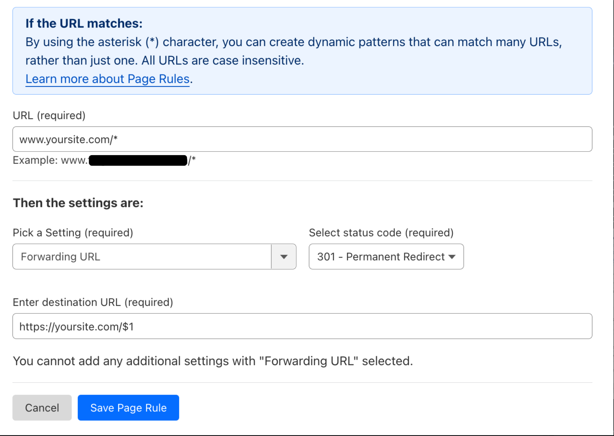

# 🌐 Publishing & Custom Domains


If you're having trouble connecting your domain with registrars like that do not support Cname flattening (like GoDaddy) please visit [this page](../../errors/domain-connection-issues-godaddy.md).


This guide discusses the methods to connect a custom domain to your Webstudio site. You can configure a custom domain automatically without leaving the Webstudio Builder or manually by via your domain registrar/DNS host.\
\
You can also publish your site on the default Webstudio subdomain, as a staging environment.



***

## How to connect a custom domain to your Webstudio site

<figure><figcaption></figcaption></figure>

You can also publish your Webstudio site to a custom domain by going to the “Publish” tab and clicking “Add a new domain”.

After entering your root domain in the resulting input field, you need to configure your domain manually or automatically with Entri.

### Configure your domain manually

You can configure your custom domain manually by adding the CNAME and TXT records from Webstudio into your domain providers DNS settings.

1. Generate the CNAME and TXT records by adding your root domain in the Publish tab.
2. Copy the CNAME value from the Webstudio.
3. Open your DNS settings page from your domain provider and add a new record.
4. Copy the Type, Name and Target (VALUE) from Webstudio's Publish tab.
5. Save the record you created and repeat the process to create a new DNS record for TXT.
6. On Webstudio, recheck the status and publish your site.

It is important to note that DNS propagation can take up to 48 hours to complete.

### Configure your domain automatically with Entri

Using the "Entri" option makes configuring your domain extremely simple — no puzzling registrar UIs. You can do it without leaving Webstudio Builder in just a couple of clicks.

1. After you have added your root domain to the publish tab, click “Configure automatically with entri”.
2. Click “Continue” on the Entri configurator. This process will analyze your root domain and detect your DNS settings.
3. Click on the Authorize button to redirect you to your DNS Provider site. Log in, if required, and approve the configuration.
4. Return to Webstudio and complete the setup.
5. Wait 10 minutes for the DNS change to apply. Then check if everything is setup correctly by clicking the “Check status” button inside the “Publish” tab.

Once your site is live, you can visit it by clicking the Preview icon next to the green checkmark.

***

## How to add a custom domain on registrars that don’t allow root CNAMES records

While the domain configuration process works perfectly for modern DNS providers like [Cloudflare](https://www.cloudflare.com/), it is slightly different for older platforms who only allows for CNAME records to be added to a subdomain.

There are two workarounds to this:

### 1. Change your DNS provider

The easiest way to work around the CNAME limitation is to switch your DNS control over to a provider like [Cloudflare](https://developers.cloudflare.com/fundamentals/get-started/setup/add-site/). This process takes about 10 minutes and once you have migrated, you can use the original process to configure it manually or via Entri.

### 2. Publishing your website on a "www." subdomain

To publish your site on a “www.” subdomain and continue using the original DNS controls provided by your domain registrar, follow this process:

1. Add your “www.MySite.com” domain in the Publish tab (replace "MySite.com" with your domain name).
2. Add the CNAME and TXT records provided by Webstudio to your DNS settings.
3. Create a redirect from the primary domain to the “www” subdomain.

***

## How to publish your site on the Webstudio subdomain

<figure><figcaption></figcaption></figure>

Every Webstudio project comes with a subdomain ending in "wstd.io". You can use this subdomain as your site’s staging environment. To publish your page on the Webstudio subdomain:

1. Go to the “Publish” tab at the top right of your canvas.
2. Click the “Publish” button to launch your site.

***

## How to remove a domain

To remove a domain from Webstudio:

1. Go to the “Publish” tab on the right.
2. Click your domain to select it.
3. Click on “Remove domain”.

This will remove the domain from the Publish tab.

***

## Redirect www to naked domain in Cloudflare

### In Webstudio
1. Make sure your project URL is to the naked domain (with no www)

### In Cloudflare
1. Setup a CNAME record with @
2. Setup a CNAME record with www
3. Confirm the TXT record is to naked domain, *not __webstudio_is_www*
4. Setup page rule to 301 redirect:

  - *URL* www.yoursite.com/*
  - *Pick a setting* Forwarding URL
  - *Status code* 301 - Permanent Redirect
  - *Destination URL* https://yoursite.com/$1
  - Save Page rule

***

## How to export your site in Webstudio

You can export your published site to your local machine and continually sync it with the cloud, using the Webstudio CLI.

The Webstudio CLI helps you to sync and build projects from Webstudio Cloud. You can also use the CLI to publish your site on [Vercel](https://vercel.com/). We plan to add more deployment targets in the future.

To learn more about the Webstudio CLI and how you can set it up in your computer, read the documentation [here](https://github.com/webstudio-is/webstudio/tree/main/packages/cli).

You can also watch the video about the Webstudio CLI [here](https://wstd.us/cli-vid).
