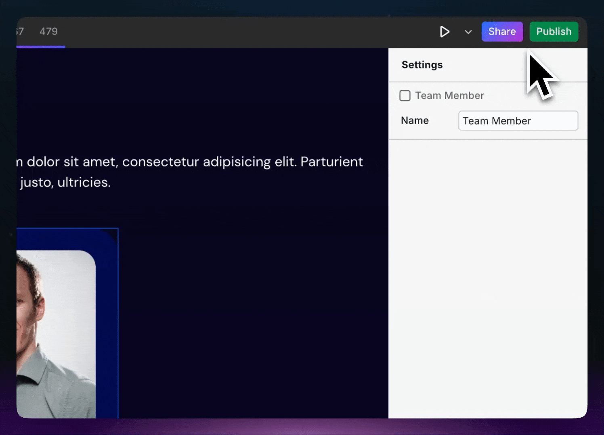

# Share Links & Transferring Projects

**Use cases:**

* Providing team members or clients the ability to modify a site
* Cloning the Project to another Webstudio account
* Sharing your Project to get support
* [Selling templates](../../contributing/marketplace.md#selling-templates) (i.e., using Share Links to deliver the template upon payment)
* Creating your own marketplace of templates

## Cloning Projects

When you share a project with **View** permission (or higher), recipients can clone the project to their own Webstudio account:

1. Create a Share Link with at least **View** permission
2. Send the link to the recipient
3. They open the link and click the **Clone** button in the Builder
4. The project is copied to their account


**Pro tip:** Use this feature to build a template marketplace. Create templates, share View links, and let users clone them into their accounts.


## Adding Share Links

Share Links are created in the Top Bar in the Share dialog.

<figure><figcaption></figcaption></figure>


There is no limit to how many Share Links you can add.


## Types of Share Links

| Type    | Is paid feature | Permissions                                                                                                                               |
| ------- | --------------- | ----------------------------------------------------------------------------------------------------------------------------------------- |
| View    | No              | <ul><li>View</li><li>Copy instances (Pro users can disable copying)</li><li>Clone the Project (Pro users can disable cloning)</li></ul>   |
| Content | Yes             | <ul><li>Edit content only, such as text, images, and predefined components</li><li>Clone the Project</li><li>Publish (optional)</li></ul> |
| Build   | No              | <ul><li>Make any changes</li><li>Clone the Project</li><li>Can't publish</li></ul>                                                        |
| Admin   | Yes             | <ul><li>Make any changes</li><li>Clone the Project</li><li>Publish</li></ul>                                                              |

## Working with clients

When building a site for someone else, you may want to either transfer the site to them altogether, or provide them the ability to edit the content without providing the full power of the website builder.

### Option 1: Transfer entire Project

Create a new Share Link to transfer the Project to your client. Ensure the link has cloning permissions (see [Types of Share Links](share-links.md#types-of-share-links)). Then, send the link to your client so they can clone the Project into their Webstudio account.


If you are on a paid tier, it’s tied to your account, not the site. Therefore, if you transfer the site to another account, that account would need to purchase a plan if the site requires paid features/limits.


If you plan to continue working on the website, they’ll need to create a Share Link and send it to you once it’s in their account.

### Option 2: Content mode

The Pro tier lets you create Share Links with the Content permission, allowing recipients to edit content without designer-oriented features like the Style Panel.

To provide this, create a Share Link, toggle “Content”, and send this link to your client.

See [Modes](modes.md) to learn more about this.
