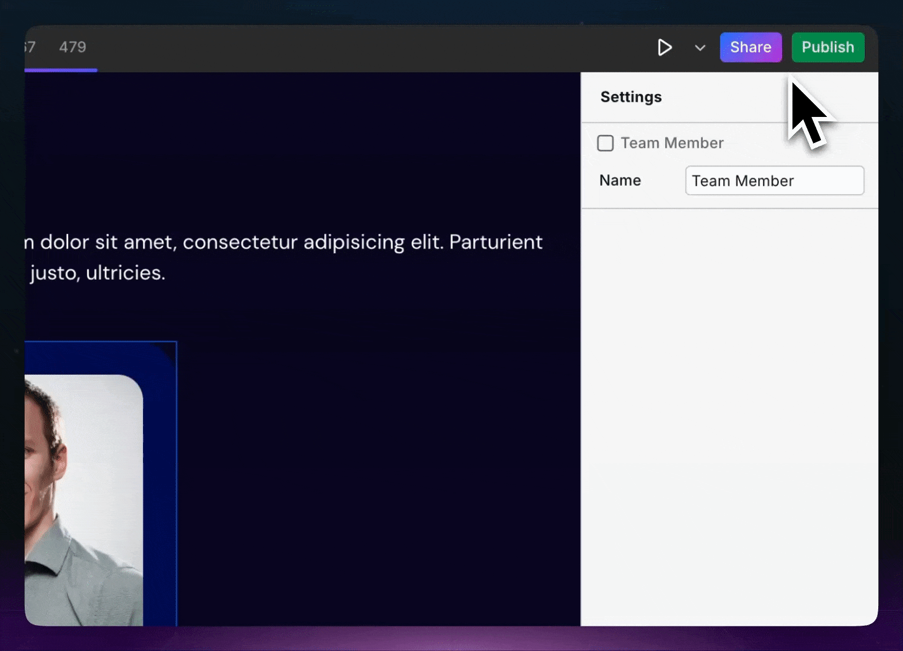

# Share links

**Use cases:**

- Providing one-off access to a site
- Cloning the Project to another Webstudio account
- Sharing your Project to get support
- [Selling templates](../../contributing/marketplace.md#selling-templates) (i.e., using share links to deliver the template upon payment)
- Creating your own marketplace of templates


For ongoing collaboration, invite people to a workspace from the [Dashboard](dashboard.md#workspaces). For moving a project to another workspace or transferring it to another user, use the project menu in the Dashboard.



Share links should be treated like access keys. Anyone who gets the link can use it according to the permissions you set, so avoid sending share links through unsecured channels. Workspace membership invites are more secure for ongoing collaboration because access is tied to the recipient's Webstudio account and accepted from their Dashboard notifications.


## Cloning projects

When you share a project with **View** permission (or higher), recipients can clone the project to their own Webstudio account:

1. Create a Share link with at least **View** permission
2. Send the link to the recipient
3. They open the link and click the **Clone** button in the Builder
4. The project is copied to their account


**Pro tip:** Use this feature to build a template marketplace. Create templates, share View links, and let users clone them into their accounts.


## Adding share links

Share links are created in the Top Bar in the Share dialog.

<figure><figcaption></figcaption></figure>


There is no limit to how many share links you can add.


## Types of share links

| Type    | Is paid feature | Permissions                                                                                                                               |
| ------- | --------------- | ----------------------------------------------------------------------------------------------------------------------------------------- |
| View    | No              | <ul><li>View</li><li>Copy instances (Pro users can disable copying)</li><li>Clone the Project (Pro users can disable cloning)</li></ul>   |
| Content | Yes             | <ul><li>Edit content only, such as text, images, and predefined components</li><li>Clone the Project</li><li>Publish (optional)</li></ul> |
| Build   | No              | <ul><li>Make any changes</li><li>Clone the Project</li><li>Can't publish</li></ul>                                                        |
| Admin   | Yes             | <ul><li>Make any changes</li><li>Clone the Project</li><li>Publish</li></ul>                                                              |

## Working with clients

When building a site for someone else, you may want to give them a cloneable copy, transfer the original project from the Dashboard, or provide limited editing access.

### Option 1: Share a cloneable copy

Create a new share link with cloning permissions (see [Types of share links](share-links.md#types-of-share-links)). Then, send the link to your client so they can clone the Project into their Webstudio account.


If you are on a paid tier, it is tied to your account or workspace, not to the cloned project. The recipient needs a plan that covers any paid features or limits used by their copy.


If you plan to continue working on the website after they clone it, they can invite you to their workspace or create a Share link and send it to you.

### Option 2: Content mode

The Pro tier lets you create share links with the Content permission, allowing recipients to edit content without designer-oriented features like the Style Panel.

To provide this, create a Share link, toggle “Content”, and send this link to your client.

See [Modes](modes.md) to learn more about this.
## Related

- [Publishing & custom domains](publishing-and-custom-domains.md) – Deploy your site and connect custom domains
- [Modes](modes.md) – Switch between Design, Content, and Preview modes
- [Project settings](project-settings.md) – Configure project-wide settings
- [Content Block](../core-components/content-block.md) – Create editable regions for Content mode users
