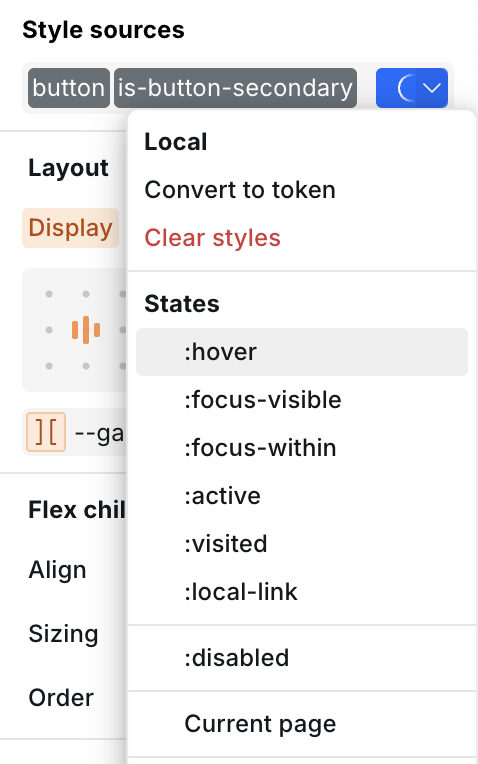
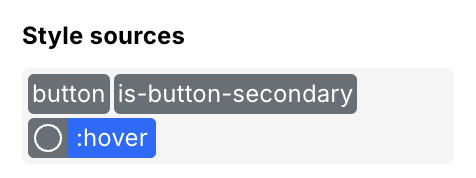
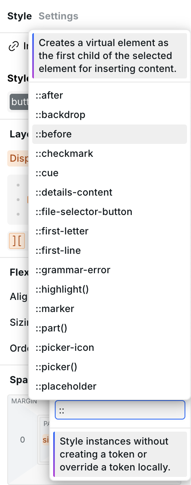
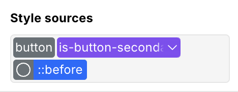

# 🎯 States and selectors

States and selectors let you apply styles conditionally — for example, change a button's color on hover, or add decorative content with `::before`.

They live in the **Style Sources** dropdown alongside your [Tokens](design-tokens.md). Open it by clicking the Style Sources area above the Style Panel or pressing `⌘ + Enter` (Mac) / `Ctrl + Enter` (Windows).

<!-- Screenshot 1: states-dropdown.png — The Style Sources dropdown open on a Button, showing the list of available states (:hover, :focus-visible, etc.) at the bottom. -->

<figure><figcaption>
Available states appear at the bottom of the Style Sources dropdown
</figcaption></figure>

## States (pseudo-classes)

States are CSS pseudo-classes that apply styles when a condition is true, such as the user hovering over an element.

### Adding a state

1. Select an instance on the canvas.
2. Open the Style Sources dropdown (`⌘ + Enter`).
3. Choose a state from the list at the bottom, or type one in.
4. The state appears as a tag in the style sources area. While it's active, every style you set applies only to that state.
5. Click the state tag again to deselect it and return to the base (default) styles.

<!-- Screenshot 2: state-active.png — A Button with :hover state selected, showing the state tag highlighted in the Style Sources area and different styles applied. -->

<figure><figcaption>
The :hover state is selected — styles set now only apply on hover
</figcaption></figure>

### Custom states

You can type any valid CSS pseudo-class into the Style Sources dropdown. If it's not in the predefined list, Webstudio will accept it as a custom selector.


Custom selectors are useful for advanced cases, but stick to the predefined states when possible — they are validated and shown in autocomplete.


## Pseudo-elements

Pseudo-elements target virtual parts of an element, such as inserting content before or after it, or styling the first letter.

### Adding a pseudo-element

1. Select an instance.
2. Open the Style Sources dropdown (`⌘ + Enter`).
3. Type `::before`, `::after`, or another pseudo-element — autocomplete will suggest matches.
4. The pseudo-element appears as a tag. While selected, styles apply to that virtual element.

<!-- Screenshot 3: pseudo-element-autocomplete.png — Typing "::before" in the Style Sources dropdown, showing autocomplete suggestions. -->

<figure><figcaption>
Type :: to see available pseudo-elements
</figcaption></figure>

### Common pseudo-elements

| Pseudo-element      | What it targets                                    |
| ------------------- | -------------------------------------------------- |
| `::before`          | Virtual element inserted before the content        |
| `::after`           | Virtual element inserted after the content         |
| `::placeholder`     | Placeholder text in inputs and textareas           |
| `::selection`       | Text selected/highlighted by the user              |
| `::first-letter`    | First letter of a block element                    |
| `::first-line`      | First line of a block element                      |
| `::marker`          | Bullet or number of a list item                    |
| `::backdrop`        | Box behind a fullscreen or modal element           |


`::before` and `::after` require a `content` value to be visible. Set it in the **Advanced** section — even an empty string (`""`) works.


### Example: decorative element with ::before

1. Select a Box, Link, or Button.
2. Add `::before` via the Style Sources dropdown.
3. In the **Advanced** section, set `content` to `""`.
4. Set `display` to `block` and give it a width, height, and background.
5. Deselect the `::before` tag to go back to the base styles.

<!-- Screenshot 4: before-example.png — A Box with a ::before pseudo-element styled as a colored bar or icon. -->

<figure><figcaption>
A ::before element styled as a decorative bar
</figcaption></figure>

## Combining states and tokens

States work together with [Tokens](design-tokens.md). When you have a Token selected, adding a state applies styles for that state _within that Token_. This keeps hover styles, focus styles, and base styles neatly organized.

You can also use [CSS variables](css-variables.md) to create parent-child interactions — define variables on the parent, then change their values on the `:hover` state so all children update at once. See [Parent-child interactions](css-variables.md#parent-child-interactions) for details.

## Related

- [CSS variables](css-variables.md) – Define reusable values and create parent-child hover interactions
- [Design tokens](design-tokens.md) – Package multiple styles for reuse
- [Anatomy of the Webstudio builder](anatomy-of-the-webstudio-builder.md) – Learn about the Style Panel and Style Sources
- [Shortcuts](shortcuts.md) – Keyboard shortcuts including `⌘ + Enter` for Style Sources
