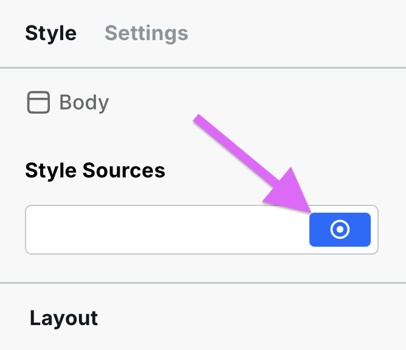

# 🎨 Style panel

The Style Panel is on the right side of the builder. It exposes every CSS property visually and applies styles to the currently selected instance. All style changes are scoped by the active [breakpoint](responsive-design.md) and [style source](#style-sources).

<figure><figcaption>
The Style Panel
</figcaption></figure>

## Style sources

At the top of the Style Panel is the **style source bar**. It determines where the styles you apply are saved and how reusable they are. There are three types of style sources:

### Local

The default source. Styles are saved to this specific instance and apply nowhere else. A filled dot on the Local icon indicates the instance has local styles applied.

<figure><figcaption>
Local style source — dot indicates styles are applied
</figcaption></figure>

Use Local when a style is unique to one instance and won't be reused.

### Tokens

[Design tokens](design-tokens.md) are reusable groups of styles you can apply to multiple instances. When a token is selected, any style you change is saved to that token and immediately updates every instance that uses it.

You can:
- Create a new token and start styling it
- Apply an existing token to an instance
- Convert Local styles into a token

### CSS variables

[CSS variables](css-variables.md) let you define a named value (e.g. `--color-brand`) and reference it in any style input. They are not a style source themselves but are used within Local and Token styles to keep values consistent and easy to update globally.

## Label colors

Style input labels change color to indicate where the active value comes from:

| Color | Meaning |
|---|---|
| **Blue** | Set on the currently selected style source (Local or Token) at the current breakpoint |
| **Orange** | Coming from another source — a different token, a different state (e.g. hover), an inherited parent value, or a cascaded breakpoint |
| **Gray** | A browser or Webstudio default value |

Hover any label to see a tooltip showing the exact source — breakpoint, token, or instance.

## Sections

The Style Panel is organized into collapsible sections:

| Section | What it controls |
|---|---|
| **Layout** | `display`, flexbox, and grid container properties |
| **Flex child / Grid child** | Child-specific alignment and sizing within flex/grid parents |
| **Size** | `width`, `height`, `min/max` dimensions |
| **Space** | `margin` and `padding` |
| **Position** | `position`, `top`, `right`, `bottom`, `left`, `z-index` |
| **Typography** | Font, size, weight, line height, letter spacing, text alignment |
| **Backgrounds** | `background-color`, gradient, and image backgrounds |
| **Borders** | Border width, style, color, and radius |
| **Outline** | `outline` property (separate from border) |
| **Box shadows** | Single and multiple `box-shadow` values |
| **Text shadows** | `text-shadow` values |
| **Filter** | CSS `filter` effects (blur, brightness, contrast, etc.) |
| **Backdrop filter** | `backdrop-filter` effects |
| **Transitions** | CSS `transition` for animating style changes |
| **Transforms** | `transform` — translate, rotate, scale, skew |
| **Advanced** | Raw CSS input for any property not covered above |

## Related

- [Design tokens](design-tokens.md) – Create and manage reusable style groups
- [CSS variables](css-variables.md) – Define and use named values across styles
- [States and selectors](states-and-selectors.md) – Style hover, focus, and other states
- [Responsive design](responsive-design.md) – Style at different breakpoints
- [Transforms](transforms.md) – Translate, rotate, and scale instances
- [Navigator](navigator.md) – Select instances to style
