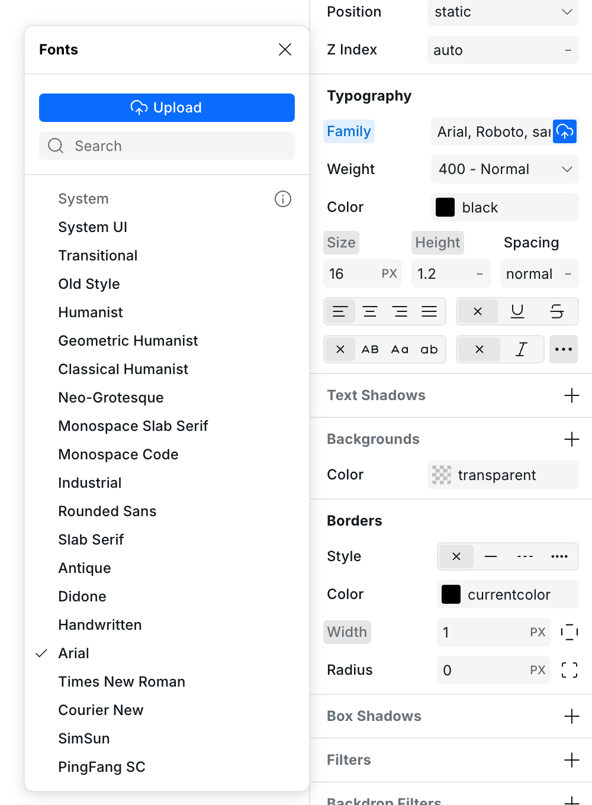

# Using Custom Fonts in Webstudio

Webstudio lets you use custom fonts without relying on third-party services like Google Fonts. You can either choose from built-in font stacks or upload your own font files.


Modern Font Stacks - Zero Millisecond Font Loading


## Can I use custom font files?

**Yes** — you can upload your own fonts directly inside the Webstudio interface, no external hosting required.

## How to add custom fonts

1. Select any text element on your canvas.
2. In the **Typography** section of the **Style Panel**, click the **cloud upload icon** next to the font family dropdown.
3. The **Fonts menu** will open. From here you can:
   - Choose from **Modern Font Stacks**
   - Pick a **system font**
   - Click **Upload** to add your own font files (e.g. `.woff`, `.woff2`, `.ttf`)

## What are "Modern Font Stacks"?

Webstudio includes built-in support for [Modern Font Stacks](https://modernfontstacks.com/), which are fast, system-based font combinations designed to look good across platforms. They’re a great alternative to web-hosted fonts and help improve page load speed and privacy.

### Why Use Modern Font Stacks?

When you add custom fonts to your website, visitors must **download** those font files. Each font variation (bold, italic, bold 900, etc.) is a separate file that adds to load time. This can cause:

- Slower page loads
- Flash of Unstyled Text (FOUT)
- Flash of Invisible Text (FOIT)

Modern Font Stacks solve this by using fonts that are **pre-installed on different operating systems**. The browser automatically selects a font that's already on the user's device.

### Benefits

- **Zero millisecond load time** — fonts are already on the device
- **No flashes** — instant rendering
- **Better performance scores** — no external font requests
- **Privacy** — no third-party font services tracking users

### How They Work

Each font stack contains fonts for:

- macOS/iOS (San Francisco, New York, etc.)
- Windows (Segoe UI, Cambria, etc.)
- Linux (various system fonts)
- Android (Roboto, etc.)

The browser reads the list and uses the first font it finds installed. Webstudio automatically outputs all the font variations for cross-platform compatibility.

📝 Learn more in the [Webstudio December Update](https://docs.webstudio.is/news/december-update#id-6.-modern-font-stacks).

---

## Supported Font Formats

When uploading custom fonts, these formats are supported:

- `.woff2` (recommended - best compression)
- `.woff`
- `.ttf`
- `.otf`

### Best Practices

- **Use WOFF2 format** when possible for smallest file size
- **Limit font variations** — only upload weights you actually use
- **Consider variable fonts** — one file contains multiple weights

---

## Related

- [Design Tokens](../foundations/design-tokens.md) – Create reusable styles including typography tokens
- [Project Settings](../foundations/project-settings.md) – Configure project-wide settings and custom code
- [Variables](../foundations/variables.md) – Use variables for dynamic styling
