# Inception

Inception is Webstudio's standalone AI design exploration app. Use it to generate design directions from prompts, compare variants, refine existing results, edit selected elements, and reuse the generated HTML and Tailwind output.

Inception is separate from the Webstudio Builder. It is not a replacement for the Builder's AI, and it is not included in existing Webstudio plans. Inception has its own credits because each generation can use different AI models and external tools depending on the task.


Inception is best for exploring and iterating on visual ideas. When you are ready to build a production site with Webstudio's visual editor, use the generated result as a reference or copy the HTML/Tailwind output.




<figure><figcaption>
Inception workspace
</figcaption></figure>

## Core concepts

### Projects

Projects contain your Inception work. Open the main menu to switch projects, create a new project, rename a project, or delete a project.

Each project has its own boards, frames, generated results, and history.

### Boards

Boards help you organize different directions inside a project. Use boards for separate concepts, clients, pages, campaigns, or exploration phases.

From the boards panel you can:

- Create a board
- Switch between boards
- Rename a board
- Delete a board

<figure>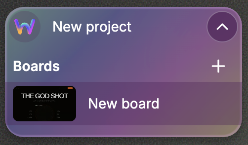<figcaption>
Boards panel
</figcaption></figure>

### Frames

A frame is one generated design result on the canvas. Frames can be moved, resized, renamed, cloned, previewed, edited, shared, and deleted.

Frames are useful because you can keep multiple directions visible at the same time and compare them side by side.

### Prompt panel

The prompt panel is where you tell Inception what to create or change. It contains:

- The prompt field
- Style picker
- Variant count
- Model selector
- Submit button

Press `Enter` to submit a prompt. Press `Shift + Enter` to add a line break.

<figure>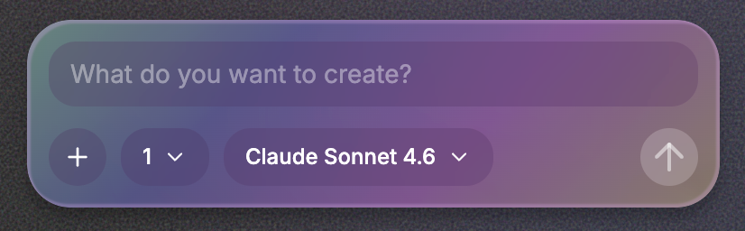<figcaption>
Prompt panel
</figcaption></figure>

## Generating designs

To generate a design:

1. Select an existing frame, or start on an empty board
2. Write what you want to create in the prompt field
3. Optionally choose style options
4. Choose how many variants to generate
5. Choose a model, or keep the default
6. Submit the prompt

If the selected board has no frame yet, Inception creates one. If you choose multiple variants, Inception creates additional frames so you can compare different directions.

### Prompt history

Inception keeps recent prompt history in your browser. When the prompt field is empty, press the up arrow to recall previous prompts and their style settings.

### Variants

Variants create multiple frames from the same prompt. Choose between 1 and 4 variants.

Use variants when you want to compare different layouts, visual styles, or interpretations without writing the same prompt repeatedly.

### Model selector

The model selector chooses which AI model should generate the design. Inception gives you access to dozens of models, so you can choose the one that best fits the task, budget, and quality bar.

<figure>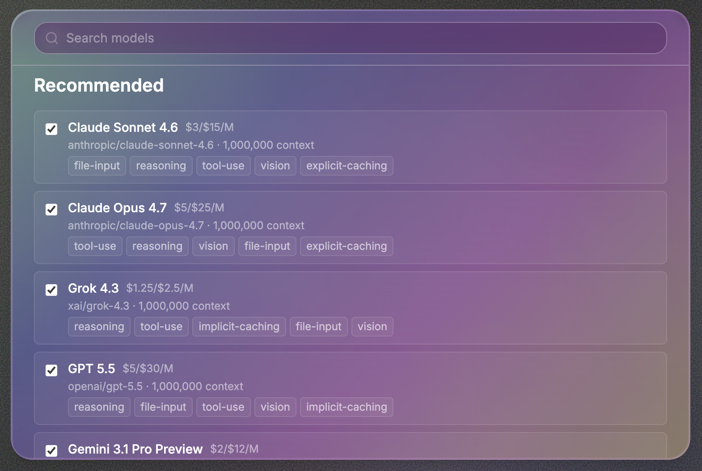<figcaption>
Model selector
</figcaption></figure>

The available models can change depending on what you are doing.

For example:

- Regular page generation uses creative design/code models
- Selected element edits use the selected-edit model
- Image edits can show image-specific models or an Auto option

## Style picker

The style picker gives Inception extra creative direction before generation.

You can combine:

- **Presets** - ready-made visual directions
- **Layouts** - structural direction for the composition
- **Colors** - palette direction
- **Emotions** - mood and tone
- **Custom styles** - your own style references

Style choices are applied to new generations and broad frame edits. They are disabled while a frame is streaming or when you are editing a selected element.

<figure>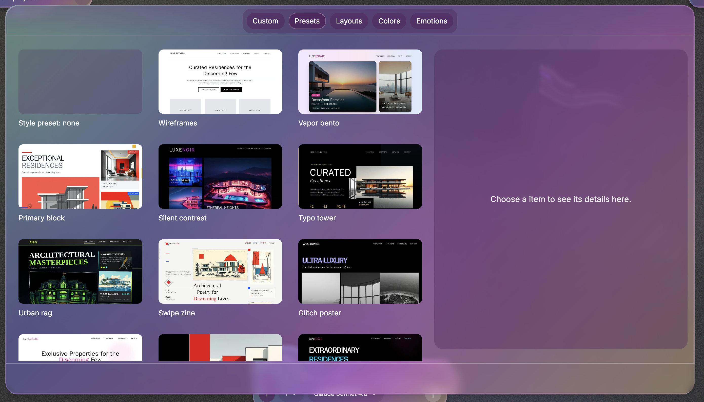<figcaption>
Style picker presets
</figcaption></figure>

### Custom styles

Custom styles let you create a reusable style direction from text or a reference image.

To create one:

1. Open Style picker
2. Open **Custom**
3. Choose **Create**
4. Add a label
5. Add text instructions or upload a reference image
6. Save the custom style

When you upload a reference image, Inception analyzes it and turns it into a style brief. You can save the result and reuse it in later prompts.

<figure>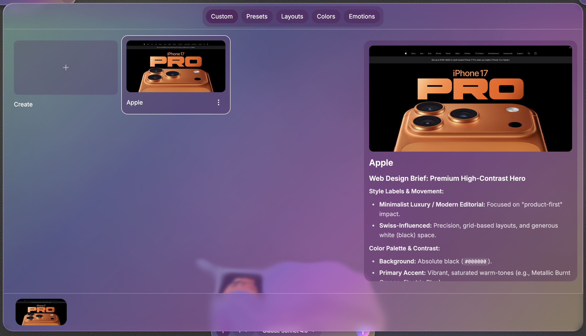<figcaption>
Custom style
</figcaption></figure>

## Working with frames

<figure>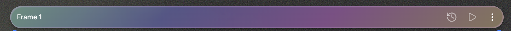<figcaption>
Frame toolbar
</figcaption></figure>

### Select and move frames

Click a frame to select it. Drag a frame to move it around the board. Selected frames can also be moved from the toolbar area.

### Resize frames

Use the resize handles around a frame to change its viewport size. Resizing helps you inspect how a design behaves at different dimensions.

### Rename frames

Use the frame name in the toolbar to rename a frame. Clear names make it easier to compare directions and review history.

### Create a new frame

Create a blank frame when you want to start a new direction manually or paste existing HTML/Tailwind into it.

Shortcut: `Ctrl + Shift + F`

### Clone or remix a frame

Clone a frame when you want to branch from an existing result without losing the current version.

Shortcut: `Alt + R`

### Delete a frame

Use the frame menu to delete a frame. If no element is selected, `Backspace` can delete the selected frame.

<figure>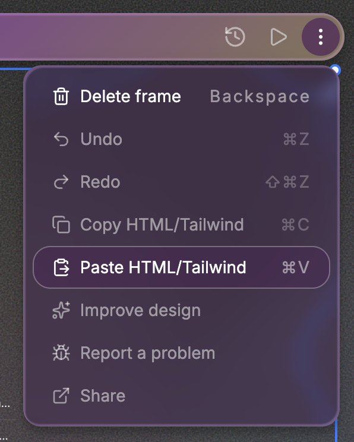<figcaption>
Frame menu
</figcaption></figure>

## Editing existing results

Inception can edit a whole frame or a selected part of a frame.

### Edit the selected element

Click an element inside a frame to select it, then write a prompt describing the change. The prompt panel shows a selection summary so you know which part will be edited.

Selected edits are useful for changes like:

- Rewriting a heading
- Changing a section layout
- Adjusting a button or card
- Adding or removing detail inside one area
- Restyling a specific component

Selected edits generate one update at a time.

<figure>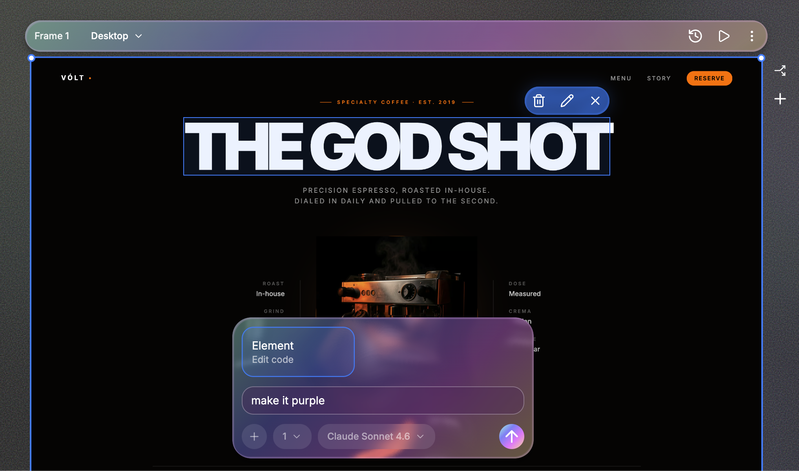<figcaption>
Selected element edit
</figcaption></figure>

### Edit text directly

Some text can be edited directly in the frame. Select the text and press `Enter` to edit it when direct editing is available.

### Delete a selected element

Select an element and press `Backspace` to remove it.

### Image edits

When an image is selected, Inception can offer image-specific editing options. Depending on the target, you can:

- Regenerate the image
- Edit the whole image
- Edit a selected region
- Replace the image

The model selector changes for image edits and can include image models plus an Auto option.

<figure>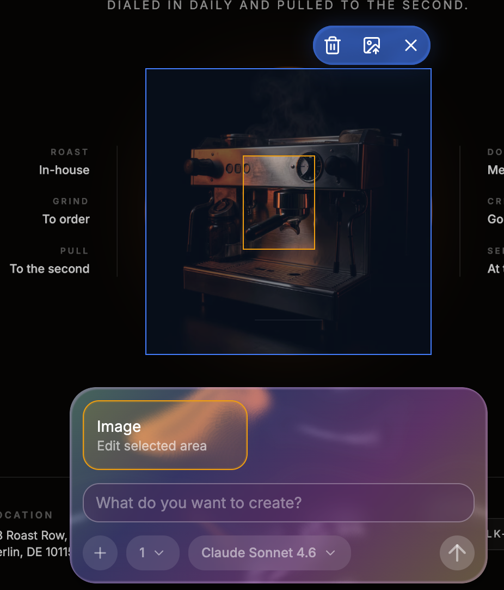<figcaption>
Image edit
</figcaption></figure>

### Improve design

Use **Improve design** from the frame menu when you want Inception to refine a generated result without writing a detailed prompt from scratch.

Improve design uses a stronger model for design critique and refinement.

<figure>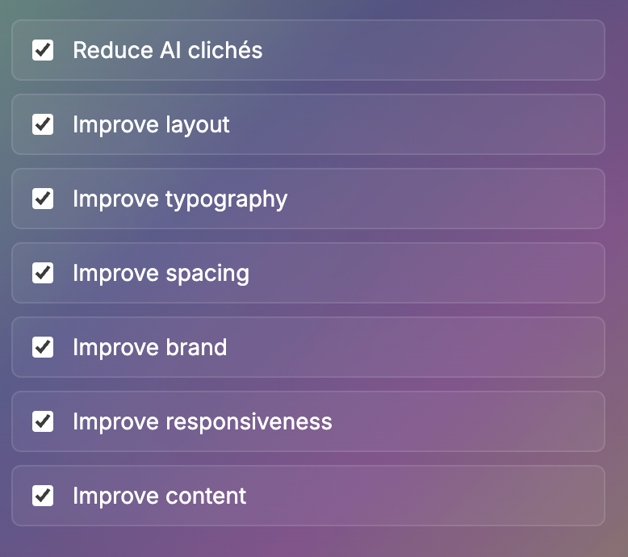<figcaption>
Improve design
</figcaption></figure>

## Previewing and reviewing

### Preview mode

Preview opens the selected frame without canvas editing controls so you can inspect the result more like a visitor would.

Shortcut: `Ctrl + Shift + P`

Press `Escape` to exit preview mode.

### Responsive preview

Use the preview controls to inspect a frame at different device sizes. You can also resize the frame directly on the canvas to test other viewport dimensions.

### Frame history

Frame history records previous generated versions. Open history from the frame toolbar to review earlier results and jump back to a previous version.

Use history when you want to compare how a design evolved or recover a previous direction.

<figure>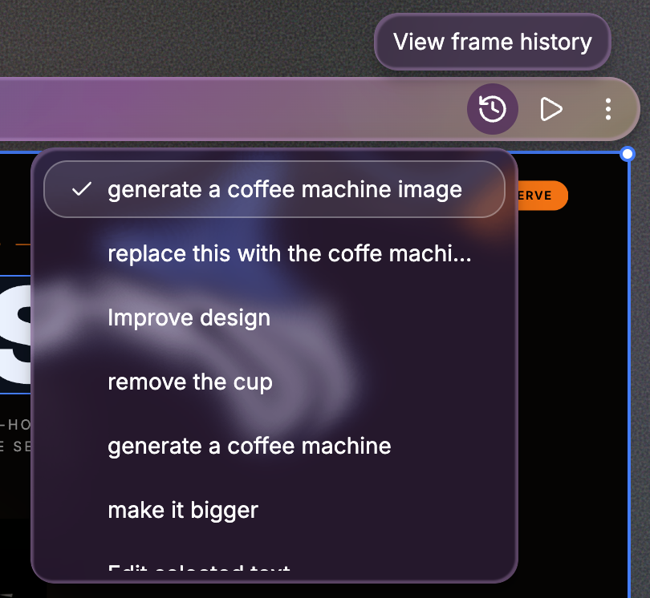<figcaption>
Frame history
</figcaption></figure>

### Undo and redo

Undo and redo move through frame versions.

- Undo frame version: `Ctrl + Z`
- Redo frame version: `Ctrl + Shift + Z`

## Sharing and reuse

### Share a frame

Use **Share** from the frame menu to share a generated frame.

### Copy HTML/Tailwind

Use **Copy HTML/Tailwind** to copy the selected frame's generated code.

Shortcut: `Ctrl + C`

### Paste HTML/Tailwind

Use **Paste HTML/Tailwind** to paste compatible code into a frame.

Shortcut: `Ctrl + V`

This is useful when you want to bring an external design into Inception for editing or create a new frame from copied output.

### Explore designs

Use **Explore designs** from the main menu to browse public examples and inspiration.

### Go to Webstudio Builder

Use **Go to Webstudio Builder** from the main menu when you want to move from exploration into Webstudio's production builder.

## Credits and billing

Inception uses credits. Open the main menu to view your balance, buy credits, or inspect generation history.

### Buy credits

The **Buy credits** dialog shows available credit packages. Credits are one-time purchases and can be bought again when needed.

<figure>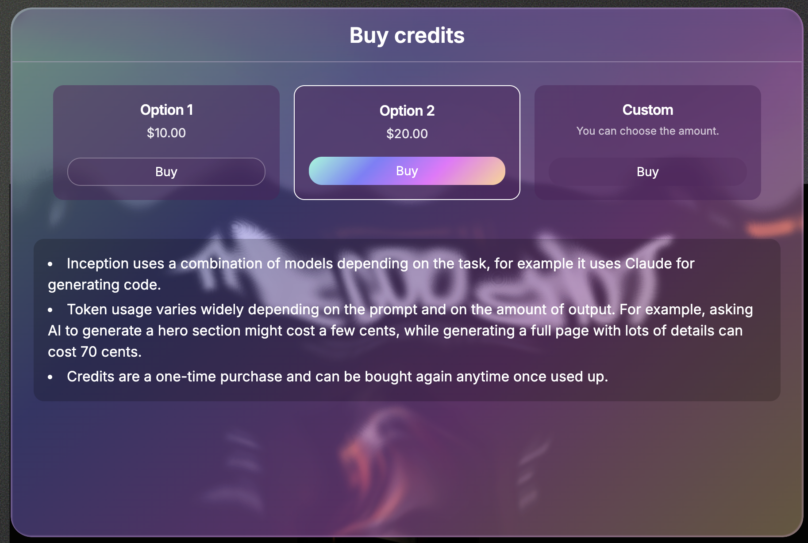<figcaption>
Buy credits
</figcaption></figure>

### Balance

The **Balance** dialog shows your current balance and recent generation ledger. Each ledger entry includes:

- Amount
- Start time
- Duration or pending status

Generation cost varies by prompt, model, output size, and tools used. A small design can cost only a few cents, while a detailed full-page generation can cost more.

If a generation cannot start because of insufficient funds, Inception opens the Buy credits dialog.

<figure>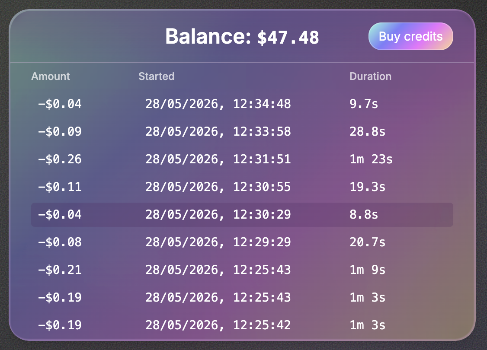<figcaption>
Balance and generation ledger
</figcaption></figure>

## Main menu

The main menu is where you can:

- Go to Webstudio Builder
- Explore designs
- Open projects
- Open or close boards
- Open account settings
- Zoom the canvas
- Hide UI
- Undo and redo frame versions
- Copy or paste HTML/Tailwind
- Improve design
- Report a problem
- Share a frame
- Remix a frame
- Create a new frame
- View balance
- Buy credits
- Restart the guided tour
- Open keyboard shortcuts
- Log out

<figure>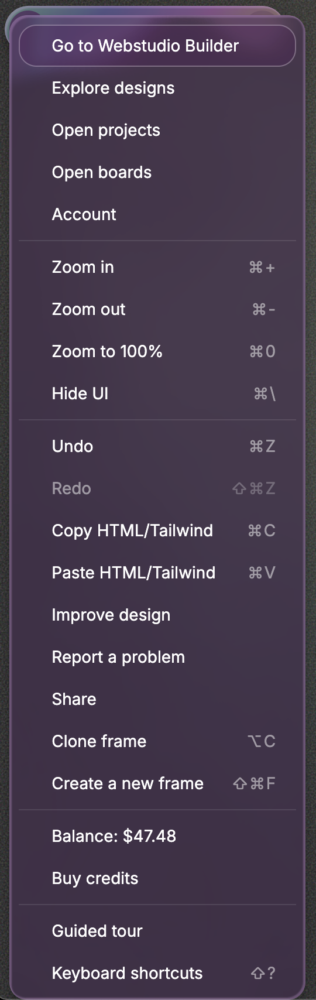<figcaption>
Main menu
</figcaption></figure>

## Hide UI

Hide UI gives the canvas more space by hiding the surrounding interface.

Shortcut: `Ctrl + \`

Use the same shortcut again to show the UI.

## Guided tour

The guided tour introduces the main controls for generating, previewing, and managing frames. Open it from the main menu whenever you want to review the workflow.

## Keyboard shortcuts

Open the keyboard shortcuts dialog with `Shift + ?`.

Common shortcuts:

| Action | Shortcut |
| --- | --- |
| Open keyboard shortcuts | `Shift + ?` |
| Toggle preview mode | `Ctrl + Shift + P` |
| Hide UI | `Ctrl + \` |
| Exit preview mode | `Escape` |
| Zoom in | `Ctrl + =` |
| Zoom out | `Ctrl + -` |
| Zoom to 100% | `Ctrl + 0` |
| Create a new frame | `Ctrl + Shift + F` |
| Remix frame | `Alt + R` |
| Undo frame version | `Ctrl + Z` |
| Redo frame version | `Ctrl + Shift + Z` |
| Copy HTML/Tailwind | `Ctrl + C` |
| Paste HTML/Tailwind | `Ctrl + V` |
| Edit selected text | `Enter` |
| Delete selected element or frame | `Backspace` |


On Mac, shortcuts are displayed with the Mac-specific modifier keys in the app.


## Troubleshooting

### The prompt field is disabled

Select a frame to start writing a message. The prompt field can also be disabled while the selected frame is streaming.

### Actions are disabled

Some frame actions require generated HTML. Preview, history, copy, share, improve design, and selected edits are unavailable on empty frames.

Actions are also disabled while a frame is streaming.

### A generation failed because of insufficient funds

Buy more credits from the Buy credits dialog, then run the prompt again.

### The result has a problem

Use **Report a problem** from the frame menu or main menu. Reporting helps the team investigate generation failures and quality issues.

## Inception and Webstudio AI

Inception is not the discontinued Webstudio AI assistant and is not a replacement for the Builder's future AI features. See [Webstudio AI](webstudio-ai.md) for the full clarification.

## Related

- [Webstudio AI](webstudio-ai.md) - Clarification about the discontinued Builder AI
- [Anatomy of the Webstudio builder](foundations/anatomy-of-the-webstudio-builder.md) - Learn the production Builder interface
- [Copy-Paste](foundations/copy-paste/README.md) - Paste HTML/Tailwind output into Webstudio
- [Page settings](foundations/page-settings.md) - Configure production pages in Webstudio
- [Marketplace](marketplace.md) - Use reusable Webstudio marketplace resources
