# How to integrate Inbind with Webstudio

## What is Inbind?

[Inbind](https://inbind.app/) is a CMS built specifically for content managers. It gives you collections to organize your content, a clean rich text editor with table support, and generated fields for adding dynamic data to your items. If you have used Webflow CMS, the way content is structured in Inbind will feel familiar.

When used with Webstudio, Inbind handles the content layer, allowing you to build blogs, glossaries, FAQs, and many more, while Webstudio handles the frontend.

## Prerequisites

Before you begin, make sure you have:

* A Webstudio account with a Pro tier plan or self-hosted instance (required to use the Resource feature)
* An Inbind account ([sign up for free](https://manage.inbind.app/))
* An object storage bucket (AWS S3, Cloudflare R2, or any S3-compatible service)
  * Inbind publishes your content to S3-compatible storage so Webstudio can fetch it with high availability, and you maintain full ownership of your content. See [Inbind's object storage documentation](https://docs.inbind.app/object-storages) for setup instructions.

## Setting Up Inbind

### Create a Content type

Before connecting Inbind to Webstudio, you need created collections to store your content.

On the **Get Started** screen, select the **Blog** template. This automatically sets up a Blog Posts collection with all the necessary fields, plus a few example items to help you get started. You can experiment with other content types, but this guide focuses on blogs.

Once the template is applied, open the **Blog Posts** collection and review the example items. Click **Edit Fields** to see the fields that were created in the collection.

<figure>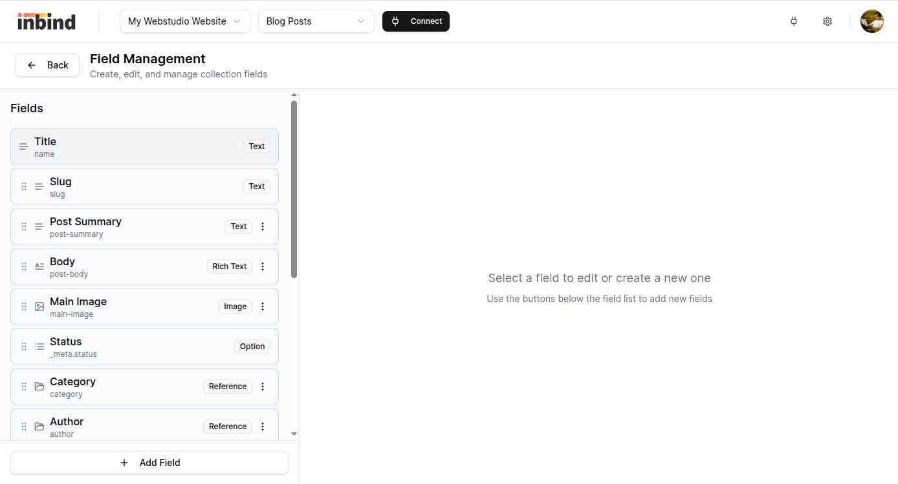<figcaption></figcaption></figure>

### Create a Connection

1. In the **Blog Posts** collection, click **Connect**
2. Select **Webstudio** as your destination
3. Enter your object storage credentials (for example, S3 or Cloudflare R2). Read more on how to set one up: [Object storage setup guides](https://docs.inbind.app/object-storages.html#setup-guides)
4. Click **Create Connection**

<figure>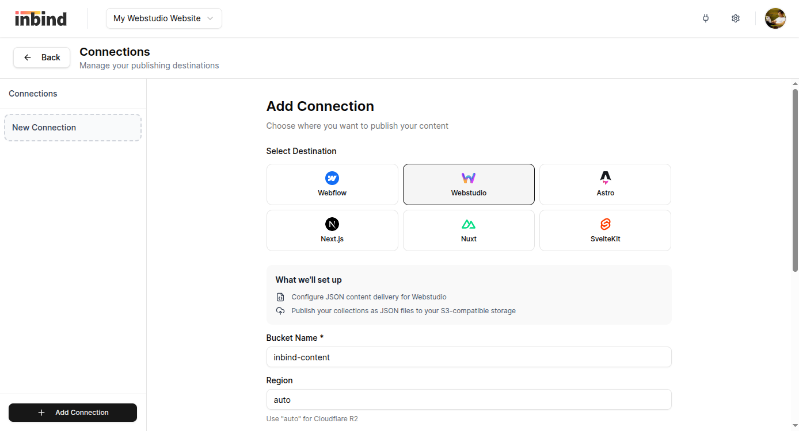<figcaption></figcaption></figure>

### Connect a Collection

1. Select your newly created Webstudio connection
2. Click **Connect Collection**
3. Choose the collection you want to use in Webstudio (e.g., "Blog Posts")
4. Select the **published fields**: these fields will be included in each item's JSON file (e.g., name, slug, body, main image, dates)
5. Select the **index fields**: these fields will be included in the collection index file used for listing pages (e.g., name, slug, summary, main image, dates).
6. Click **Connect Collection**

<figure>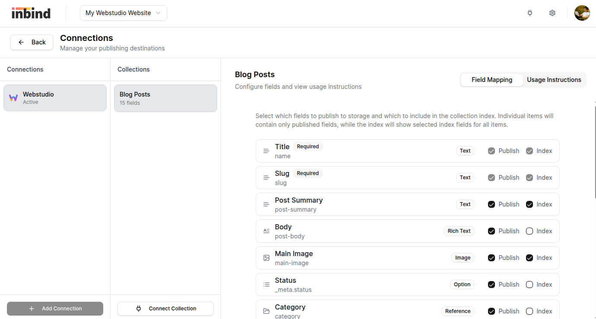<figcaption></figcaption></figure>

### Get Your Content URLs

After connecting your collection, Inbind generates two types of URLs:

* **Index URL**: Returns all published items with index fields (for listing pages)

```
https://your-storage-url/content/org-id/collection-slug/_index.json
```

* **Item URL**: Returns a single item with all published fields (for detail pages)

```
https://your-storage-url/content/org-id/collection-slug/{item-slug}.json
```

To find your exact URLs:

1. Go to your Webstudio connection in Inbind
2. Select your connected collection
3. Open the **Usage Instructions** tab
4. Copy the URLs provided

Keep these URLs handy. You'll need them when configuring Resources in Webstudio.

### Publish your item

Go to the content table view, select one of the items and press **Publish**.

<figure>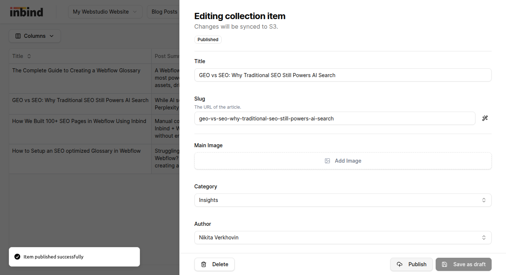<figcaption></figcaption></figure>

## Setting Up Webstudio

This section shows how to display content from Inbind on your Webstudio site.

You will also find collection-specific instructions in Inbind by going to **Connections** and checking the Usage Instructions tab.

### Create a Dynamic Detail Page

Let's start by creating a page that displays individual blog posts based on the URL slug.

In your Webstudio project, create a new page. Set the page **Path** to `/blog/:slug`.

<figure>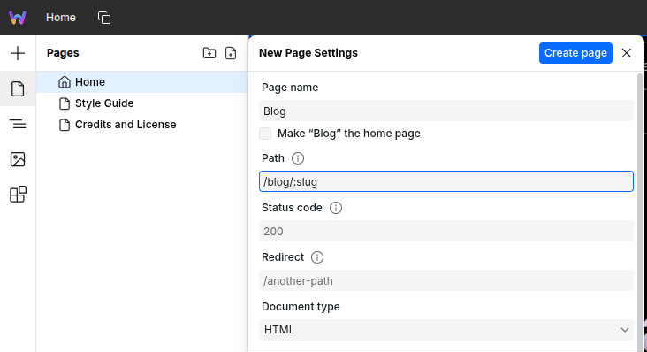<figcaption></figcaption></figure>

In the top panel, set the **dynamic page address** to easily preview the item's content. Use the slug of an item you published in Inbind from the collection you just connected. In our example it is `geo-vs-seo-why-traditional-seo-still-powers-ai-search`.

<figure>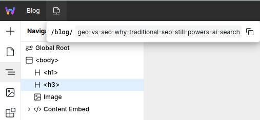<figcaption></figcaption></figure>

Select the **Body** element in the Navigator panel. In the **Data variables** panel, click **+** and select **Resource** type. Name the variable `post`.

Configure the Resource by setting the **URL**. Click the **+** button in the corner of the field to open the Expression Editor, then build the URL using your Item URL and the slug parameter:

```
"https://your-storage-url/content/{org-id}/posts/" + system.params.slug + ".json"
```


You can copy the expression from the Collection Connection usage instructions in Inbind.


Set the **Method** to `GET`.

Set **Cache Max Age** to `300` (optional, caches the response for 5 minutes).

<figure>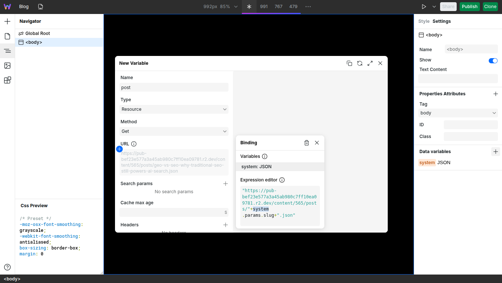<figcaption></figcaption></figure>

### Bind Data to Components

Now that your Resource is fetching data, let's display it on the page.

1. Add a **Heading** component to your page
2. Select the Heading element
3. In the **Settings** panel, find the **Text Content** property
4. Click the **+** button to open the Expression Editor
5. Type `post.data.name` to bind it to the title field from your Inbind content
6. Do the same with Summary: `post.data["post-summary"]`
7. Add a **Content Embed** component for your rich text content
8. Bind its **Code** property to `post.data["post-body"]`
9. Add an **Image** component
10. Bind the **src** property to `post.data["main-image"].url` and **alt** property to `post.data["main-image"].alt`

<figure>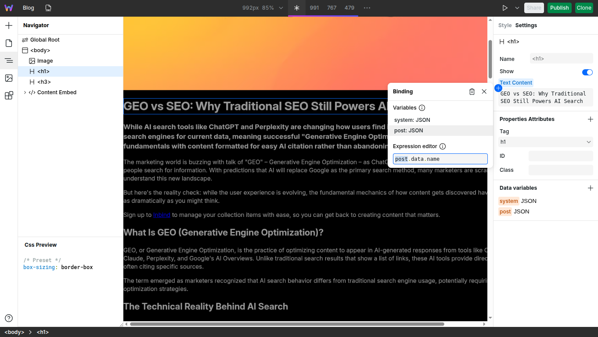<figcaption></figcaption></figure>

You can continue adding components and binding them to any of the published fields you configured in Inbind.

### Configure SEO Metadata

Since your Resource is defined on the Body element, you can use it in Page Settings:

1. Open **Page Settings** for your dynamic page
2. Bind **Meta Title** to `post.data.name`
3. Bind **Meta Description** to `post.data["post-summary"]` or another suitable field
4. Bind **Social Image** to `post.data["main-image"].url`

This ensures each blog post has proper SEO metadata when shared on social media or indexed by search engines.

<figure>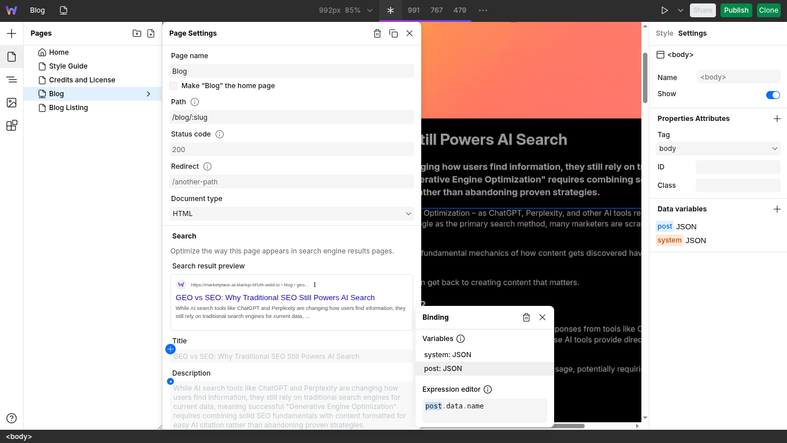<figcaption></figcaption></figure>

### Create a Listing Page

To display all your blog posts on an index page, create a new page with path `/blog`.

Select the **Body** element. Add a new data variable named `allPosts`, select **Resource** as a type.

Configure the Resource — set the **URL** to your Index URL from Inbind:

```
https://your-storage-url/content/{org-id}/blog-posts/_index.json
```


You can copy the exact URL to your collection index file from the Collection Connection usage instructions in Inbind.


Set the **Method** to `GET`. Set **Cache Max Age** to `300` (optional).

<figure>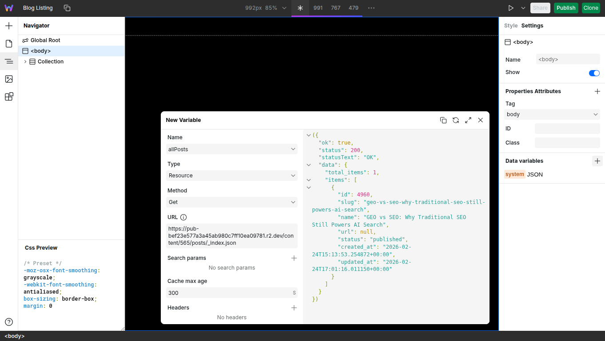<figcaption></figcaption></figure>

Add a **Collection** component to your page. Bind its **Data** property to `allPosts.data.items`.

<figure>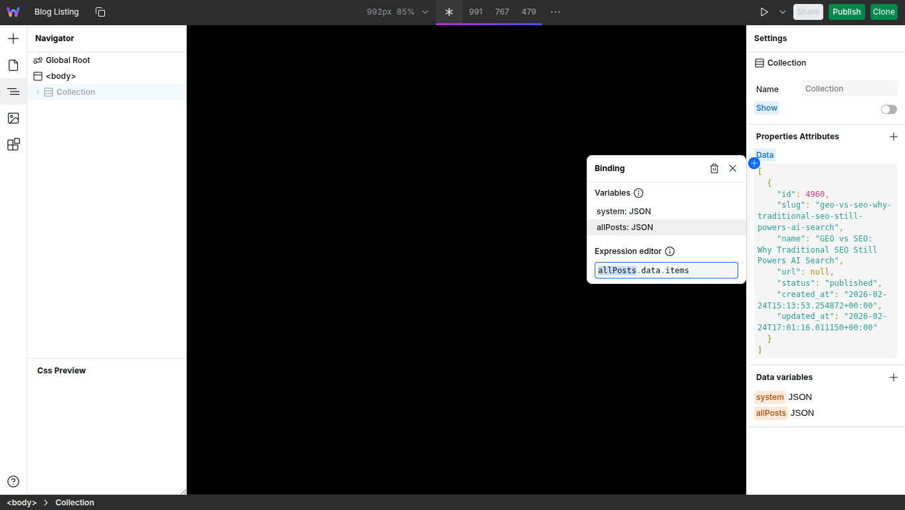<figcaption></figcaption></figure>

Inside the Collection, add components to display each post:

* **Link** component — Set href to `"/blog/" + collectionItem.slug` expression
* **Heading** component — Bind **Text content** to `collectionItem.name`
* **Paragraph** component — Bind **Text content** to `collectionItem["post-summary"]`

<figure>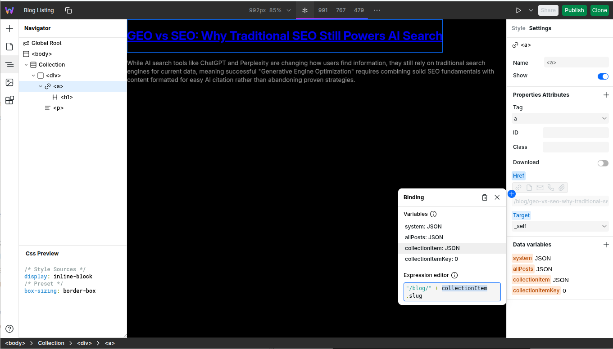<figcaption></figcaption></figure>

The Collection component will automatically repeat for each item in your Inbind collection, creating a complete blog index.

### Test Your Integration

1. Publish your Webstudio site
2. Visit your blog listing page (e.g., `yoursite.com/blog`)
3. Click on a blog post to view the detail page

When you publish or update content in Inbind, it automatically publishes the updated JSON files to your object storage, and Webstudio will fetch the latest content on the next request (or after the cache expires).

## Conclusion

You've successfully connected Inbind to Webstudio! You now have a powerful content management workflow where your team can manage content in Inbind while you design beautiful pages in Webstudio.

## Related

* [CMS](../foundations/cms.md) – Learn about dynamic pages and Resources in Webstudio
* [Variables](../foundations/variables.md) – Understand how to create and use Resource variables
* [Collection](../core-components/collection.md) – Display multiple records from your data source
* [Notion Integration](./notion.md) – Another popular CMS option for Webstudio
* [Airtable Integration](./airtable.md) – Spreadsheet-based CMS integration for Webstudio
