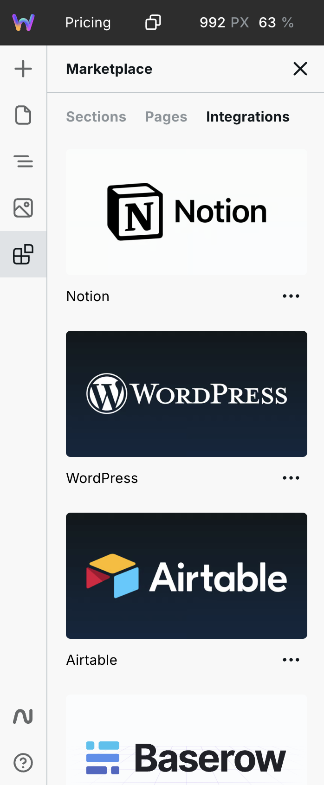

# Marketplace

See [Webstudio Templates](https://webstudio.is/marketplace/templates) or head over to the Builder to view all templates.


The Marketplace in the Builder contains more templates than what's shown in the Dashboard. The Dashboard shows starter Projects, while the Builder shows everything in the Dashboard, plus pages and sections.


<figure><figcaption></figcaption></figure>

## Types of templates

### **Pages**

Page templates are pre-designed single or multi-page layouts for entire pages. Upon selection, a new page will be inserted into your Project.

### **Integrations**

Integration templates are [pages](marketplace.md#pages) with preconfigured [Resources](foundations/variables.md#resource), such as Airtable, Notion, Ghost, Baserow, and more.

Blog templates, for example, typically include pages like:

* Posts
* Post
* Author
* Tag
* Sitemap

Integration templates are typically unstyled or minimally styled, allowing you to apply your own design while providing the backend API connections.

### **Sections**

Section templates are pre-designed layouts for quickly creating pages from sections. Upon selection, the section is inserted into the current page.

## Webflow Ecosystem Compatibility

Webstudio supports templates, component libraries, and projects from the Webflow ecosystem, allowing you to copy from Webflow and paste into Webstudio. Learn more about [Copy Paste](foundations/copy-paste/webflow.md).

## Contributing to the Marketplace

You can contribute free or paid templates by creating a project and submitting it for review.

Learn about about [contributing to the Marketplace](../contributing/marketplace.md).

## Token Conflict Resolution

When inserting marketplace templates that use design tokens, Webstudio automatically detects if any token names conflict with tokens already used in your project. 

For example, if a template defines a token called `--primary-color` with value `#FF0000`, but your project already has a `--primary-color` token with value `#0000FF`, Webstudio will display a conflict resolution dialog.

### Resolving Conflicts

When conflicts are detected, you can choose how to handle them:

- **Rename template tokens** - Template tokens are automatically renamed (e.g., `--primary-color-2`) to avoid conflicts
- **Overwrite existing tokens** - Replace your existing tokens with the template's values (use with caution)
- **Keep existing tokens** - The template will use your existing token values instead

This ensures marketplace templates integrate smoothly into your projects without breaking existing designs.

## Related

- [Webstudio Templates](https://webstudio.is/marketplace/templates) – Browse all available templates
- [Contributing to the Marketplace](../contributing/marketplace.md) – Submit your own templates
- [Craft](craft.md) – The standard for building marketplace templates
- [Copy-Paste from Webflow](foundations/copy-paste/webflow.md) – Import templates from Webflow
- [Dashboard](foundations/dashboard.md) – Manage your projects and access templates
