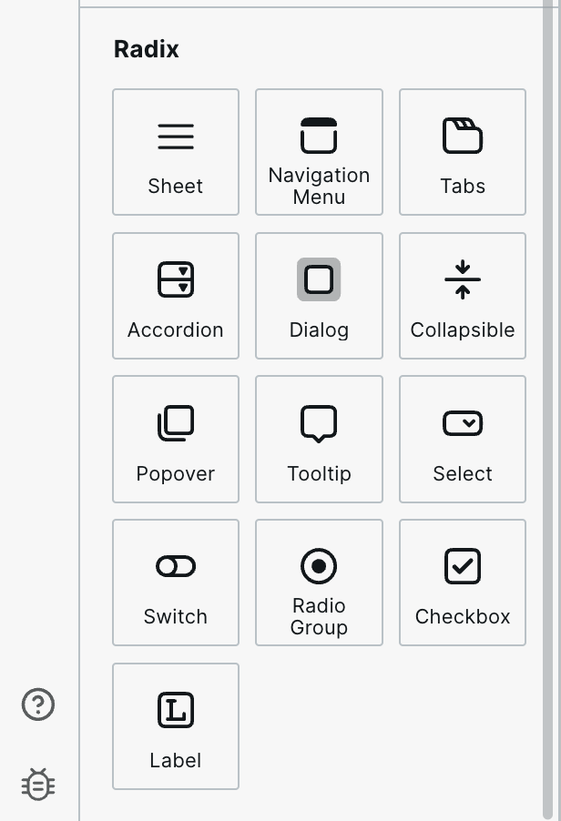
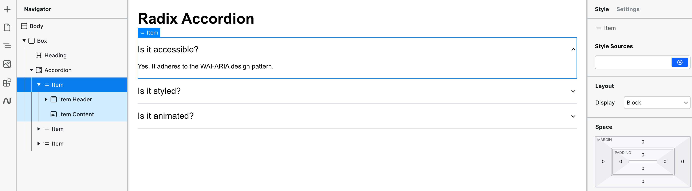
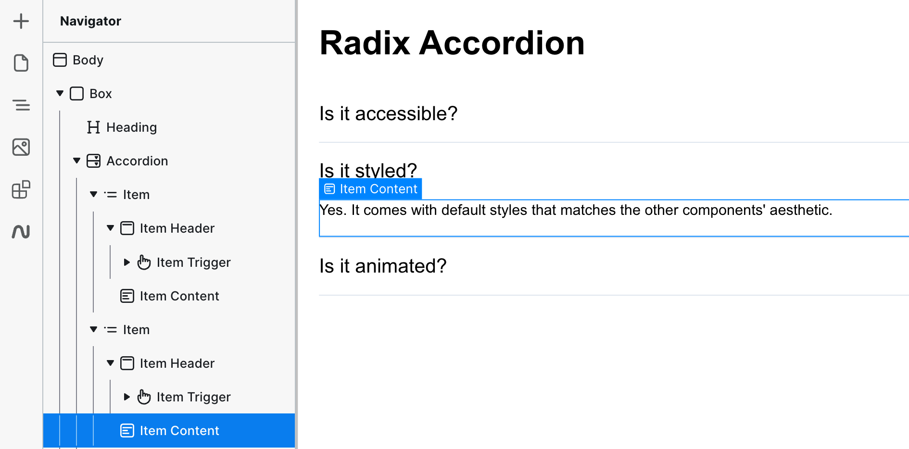

# Accordion

## Features

* Full keyboard navigation.
* Supports horizontal/vertical orientation.
* Supports Right to Left direction.
* Can expand one or multiple items.
* Can be controlled or uncontrolled.

## How to use the Radix UI Accordion

The Accordion Component is in the "Components Panel" under the "Radix" section. Click on it or drag it onto the canvas. The Accordion will populate a template that's easy to adjust for your needs.

<figure><figcaption>
Radix UI components within Webstudio
</figcaption></figure>

You can edit, delete or add more Accordions with ease by copying/pasting any of the "item" components within the Accordion.

<figure><figcaption></figcaption></figure>

## Changing an Accordion's content

To change the content of an Accordion that isn't currently displayed in the canvas, click on the "item content" instance that you want to change and it will be displayed.

<figure><figcaption></figcaption></figure>

## Using Collections within Accordions

To create an accordion with a [Collection](../core-components/collection.md) that iterates over data and outputs an accordion item for each entry, ensure each item has a unique value set, like this:

<figure><figcaption></figcaption></figure>

## Related Videos



## Related

- [Collapsible](./collapsible.md) – Single expandable/collapsible panel
- [Tabs](./tabs.md) – Organize content into switchable panels
- [Dialog](./dialog.md) – Modal window for focused content
- [Collection](../core-components/collection.md) – Generate accordion items dynamically from data
