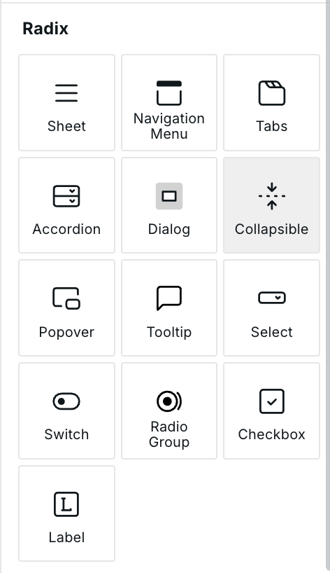

# Collapsible

## Features

* Full keyboard navigation.
* Adheres to the [Disclosure WAI-ARIA design pattern](https://www.w3.org/WAI/ARIA/apg/patterns/disclosure/).

## How to use the Radix UI Collapsible

The Collapsible Component is in the "Components Panel" under the "Radix" section. Click on it or drag it onto the canvas. The Collapsible will populate a template that's easy to adjust for your needs.

<figure><figcaption>
Radix UI Collapsible component within Webstudio
</figcaption></figure>

The Collapsible component consists of three main parts:

1. **Collapsible**: The root component that controls the collapsible behavior.
2. **Collapsible Trigger**: The button that toggles the collapsible.
3. **Collapsible Content**: The component that contains the collapsible content.

## Customizing the Collapsible

To customize the Collapsible component:

1. **Collapsible Trigger**: Modify the trigger element to change what users click to expand/collapse the content. This can be text, an icon, or any combination of elements.
2. **Collapsible Content**: Edit the content section to add whatever elements you want to show/hide when the collapsible is toggled.
3. **Styling**: Any of the three components can be styled to match your design requirements.

## Using Collapsible for UI Patterns

The Collapsible component is useful for various UI patterns:

* FAQ sections
* "Show more" content sections
* Settings or preferences panels
* Mobile navigation menus
* Detail views that can be expanded/collapsed

## Related

- [Accordion](./accordion.md) – Multiple collapsible sections in a group
- [Tabs](./tabs.md) – Organize content into switchable panels
- [Dialog](./dialog.md) – Modal window for focused content
- [Sheet](./sheet.md) – Sliding panel from screen edge

