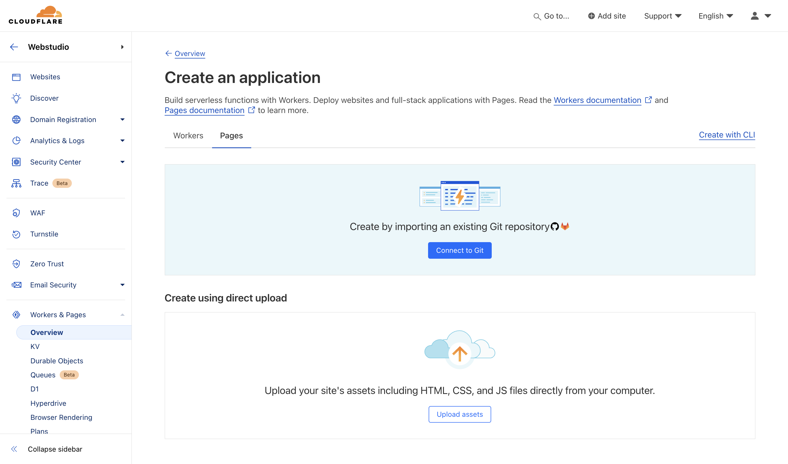

# ▶️ Cloudflare Pages

[Cloudflare Pages](https://pages.cloudflare.com/) is a powerful platform for deploying your projects. It’s simple to use, has a generous free tier, and leverages the Cloudflare Network, offering speed, security, and reliability.

While Cloudflare Pages supports static sites and dynamic apps, only the Webstudio static export is currently compatible.


See [export types](./#export-types) for more information about JavaScript applications vs. static sites.


## Static

Learn how to upload your static site to Cloudflare Pages.

<figure><figcaption></figcaption></figure>

### Prerequisites

Export your project using one of the [export methods](./#exporting).

**How to upload your project to Cloudflare Pages:**

* Go to your Cloudflare Account > Workers and Pages
* Click “Create” then select the “Pages” tab
* Upload your site manually or add your code to a repository and connect to it
* Name your project and deploy it

See [Cloudflare’s getting started docs](https://developers.cloudflare.com/pages/get-started/) for a comprehensive tutorial.
## Related

- [Download](./download.md) – Export a static site directly from the Builder
- [CLI](./cli.md) – Export and build your project using the command line
- [GitHub Pages](./github-pages.md) – Another platform for static site hosting
- [Netlify](./netlify.md) – Deploy static sites or JavaScript apps to Netlify
- [Publishing and Custom Domains](../foundations/publishing-and-custom-domains.md) – Set up custom domains for your site