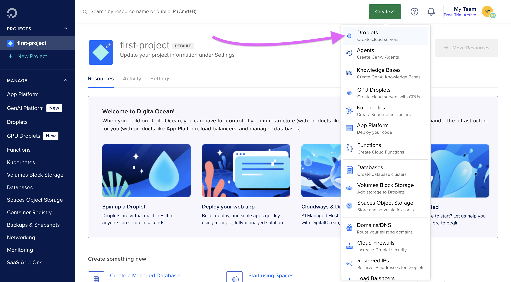
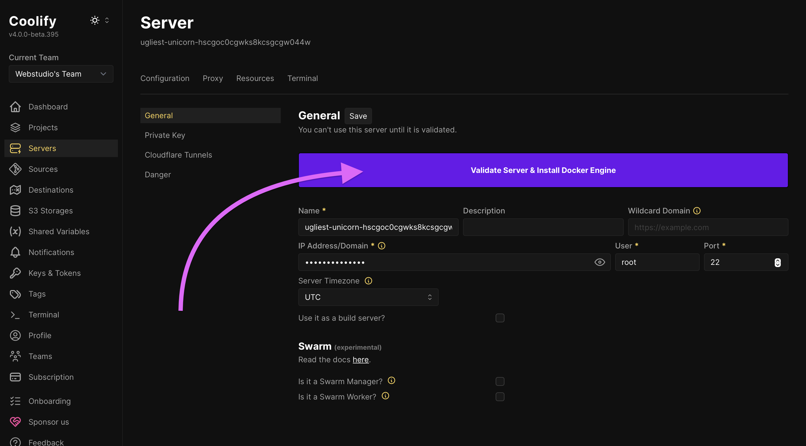

# ▶️ Digital Ocean with Coolify (Docker)

In this tutorial, you will learn how to export your Webstudio Project and use [Coolify](https://coolify.io) to deploy it to [Digital Ocean](https://www.digitalocean.com).


Coolify is a PaaS that makes it easy to deploy and manage applications on your own server, giving you control over your infrastructure without the complexity. You can self-host Coolify or use their Cloud.




## Prerequisites

* [GitHub account](https://github.com)
* [Digital Ocean account](https://www.digitalocean.com)
* [Webstudio CLI](cli.md)

## 1. Create a GitHub repository

Create a repository where you will add the Webstudio Project code in the following steps.

Be sure to clone the repository to your local machine.

## 2. Export Webstudio Project

Use the CLI to export your Project and select the "Docker" option.

## 3. Push to GitHub

Now that the site code is local, push it to GitHub.


You do not need to install dependencies.


## 4. Setup Digital Ocean Droplet

1.  Log in to your Digital Ocean account and click on "Create" > "Droplets".

    
2. Select your preferred region.
3. Select the Ubuntu image with [version that is supported by Docker](https://docs.docker.com/engine/install/ubuntu/#os-requirements).
   1. Note: In following steps, the automatic Docker install failed on Ubuntu versions higher than 22 during our setup. If yours fails, you can manually install Docker on the Droplet or use a different Ubuntu version and rerun the process.
4. Choose a plan with sufficient RAM (minimum 1GB but we recommend more for optimal performance).
5. Choose an authentication method (SSH keys are recommended for security).
6. Click "Create Droplet". Wait for your Droplet to be provisioned. Once completed, you’ll be provided an IP address; copy it.

## 5. Configure Coolify to use your Droplet

1. Create a Coolify account or log in to your existing account.
2. Navigate to the "Servers" section in the Coolify dashboard.
3. Add a new server and provide your Droplet's IP address then click “Continue”.
4.  Click “Validate Server & Install Docker Engine“ and Coolify will install all necessary components on your server automatically. Once completed, you should see a green “Proxy Running” status.

    

## 6. Setup a Project on Coolify

1. Go to Projects and create a new one.
2. Add a Resource to the project.
3.  Select the source of your code, likely a private repository.

    
4. Add a GitHub app and provide it access to your repository with the site.
5.  Change the Build Pack to "Dockerfile".

    
6.  Click Deploy and wait several minutes while it deploys. You can click “Show debug logs” to see more info.

    
7. If all goes well, you should see “Deployment is Finished.”
   1. If the deployment fails, one possibility is that the server does not have enough resources.
8. (Optional) If you are loading images from third-party domains, add them to your environment variables with the key `DOMAINS` and a comma-separated list of the third-party domains.
9.  At the top, there is a "links" button which will take you to the live site.

    

## 7. Sync, Build, and push new changes

When you are ready to publish your latest changes again, follow these steps:

1. Click “Publish” in the builder (even though you aren’t publishing to the cloud, it’s necessary to generate the latest build data).
2. Run `webstudio sync`
3. Run `webstudio build --template docker`
4. Push the changes to GitHub

<figure><figcaption></figcaption></figure>

***

Now, you should have a website built on Webstudio that is hosted on Digital Ocean using Coolify, giving you full control over your infrastructure.

## Related

- [CLI](./cli.md) – Export and build your project using the command line
- [Hetzner with Coolify](./hetzner-coolify.md) – Similar deployment using Hetzner
- [VPS with Docker](./vps-with-docker.md) – Manual Docker deployment on any VPS
- [AWS with Flightcontrol](./flightcontrol.md) – Deploy to AWS using Flightcontrol
- [Publishing and Custom Domains](../foundations/publishing-and-custom-domains.md) – Set up custom domains for your site
