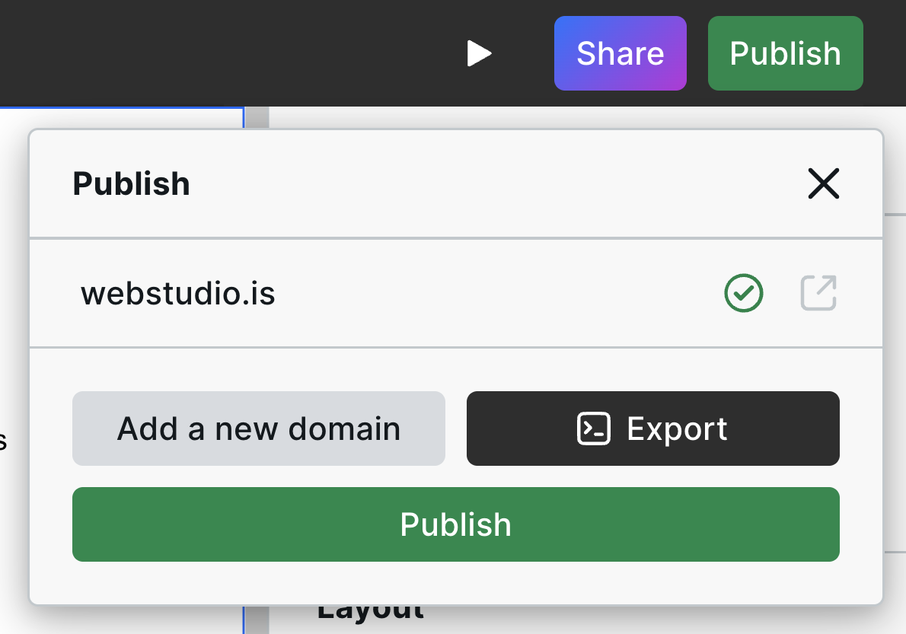
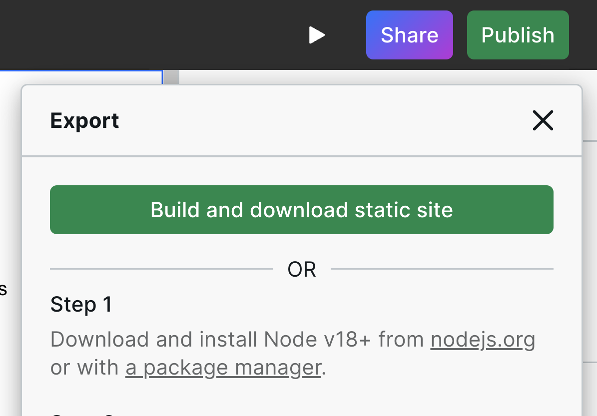

# ▶️ Download

The Webstudio Builder has a button that lets you download a static version of your site.


See [export types](./#export-types) for more information about JavaScript applications vs. static sites.


## Downloading your project

1. Click “Publish”
2.  Click “Export”

    
3.  Click “Build and download static site”

    
4. Wait up to a minute while the project is built then downloaded

The export contains a static site consisting of HTML, CSS, JS, and images ready to be uploaded to another platform.

See [static site hosting platforms](./#platforms-1) we have documented.
