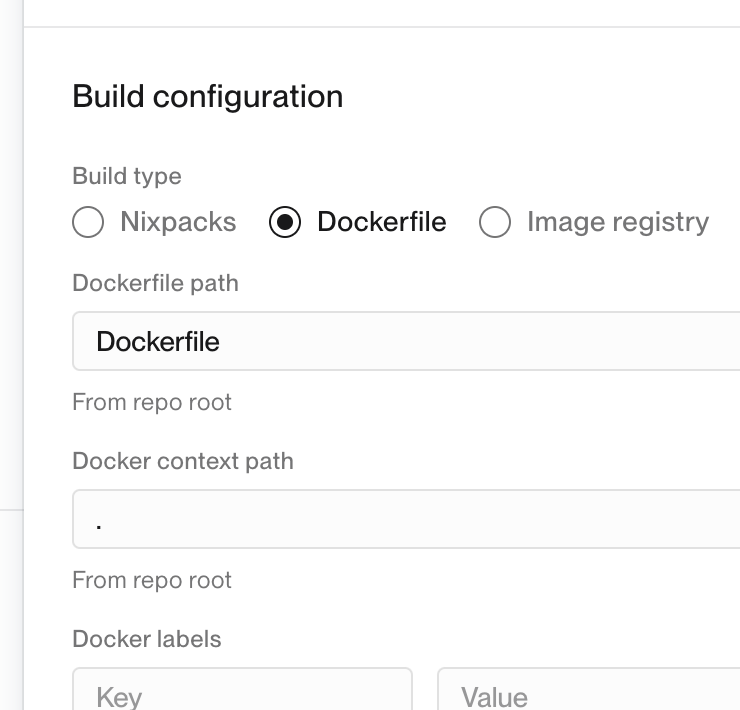
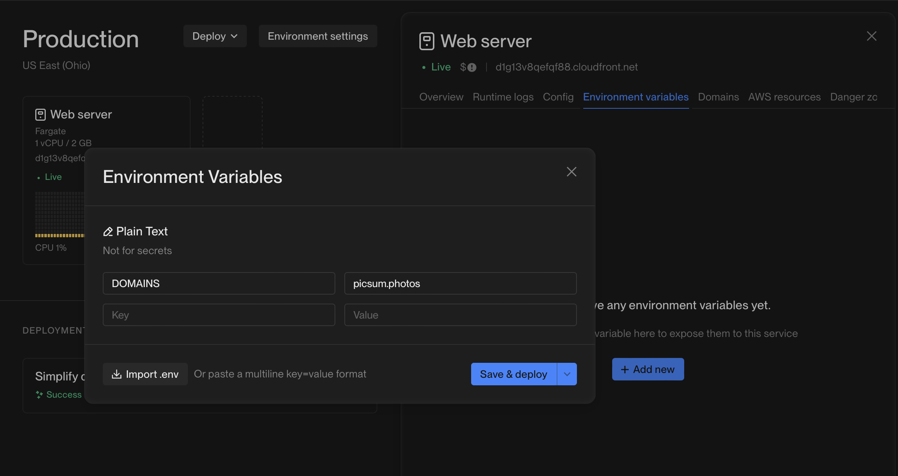

# ▶️ AWS with Flightcontrol (Docker)

In this tutorial, you will learn how to export your Webstudio Project and use [Flightcontrol](https://www.flightcontrol.dev) to deploy it to [AWS](https://aws.amazon.com).


Flightcontrol is a PaaS that deploys to your AWS account, enabling you to leverage the power and cost of AWS without the complexity.




## Prerequisites

* [GitHub account](https://github.com)
* [AWS account](https://aws.amazon.com)
* [Flightcontrol account](https://www.flightcontrol.dev)
* [Webstudio CLI](cli.md)

## 1. Create a GitHub repository

Create a repository where you will add the Webstudio Project code in the following steps.

Be sure to clone the repository to your local machine.

## 2. Export Webstudio Project

Use the [CLI](cli.md) to export your Project and select the “Docker” option.

<figure><figcaption></figcaption></figure>

## 3. Push to GitHub

Now that the site code is local, push it to GitHub.


You do not need to install dependencies.


## 4. Setup Flightcontrol

1.  Follow the prompt to connect AWS, which will direct you to AWS. Then click “Create stack”. It may take a couple of minutes, but once it is done, Flightcontrol will take you to the next step.

    
2.  Connect your GitHub account and select the repository you want to give it permission to.

    
3.  Follow the prompts: Select "Build your own" > Select "Web server" > and select "Dockerfile" in "Build Configuration".

    
4.  Deploy and wait. The initial deployment takes some time. Please allow up to  \~15 minutes for the deployment to finish.

    
5.  (Optional) If you are loading images from third-party domains, usually in the case of [CMS integrations](../foundations/cms.md), you must specify those asset domains in the Environment Variables tab with the key `DOMAINS` and a comma-separated list of the third-party domains. It’s best to inspect your HTML/API response to see the exact domain the platform is using.

    

## 5. Sync, Build, and push new changes

When you are ready to publish your latest changes again, follow these steps:

1. Click “Publish” in the builder (even though you aren’t publishing to the cloud, it’s necessary to generate the latest build data).
2. Run `webstudio sync`
3. Run `webstudio build --template docker`
4. Push the changes to GitHub

<figure><figcaption></figcaption></figure>

***

Now, you should have a website built on Webstudio that is hosted on AWS using Flightcontrol.
