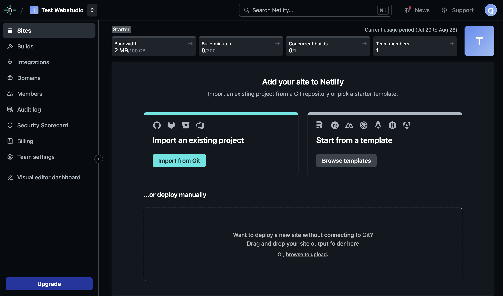
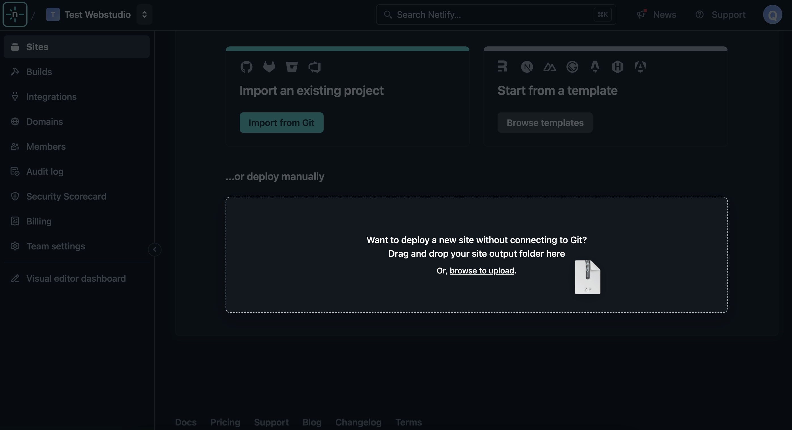

# ▶️ Netlify

[Netlify](https://www.netlify.com/), a popular choice for deploying modern websites and apps, offers features like continuous deployment from Git across a global application delivery network, serverless form handling, and more. It provides an ideal environment for deploying your Webstudio Projects.

**Netlify supports deploying both dynamic apps and static sites.**


See [export types](./#export-types) for more information about JavaScript applications vs. static sites.


## JavaScript application

Learn how to deploy your dynamic JavaScript application to Netlify.



### Prerequisites

* Install the [Webstudio CLI](cli.md)

Use the [Netlify CLI](https://docs.netlify.com/cli/get-started/) to deploy your app directly to [Netlify](https://netlify.com/):

```bash
netlify deploy
```

You can configure the project to support Netlify serverless/edge-functions respectively, as deployment target at the time of initially setting up your project. Please check the [initiating-a-webstudio-project](https://github.com/webstudio-is/webstudio/tree/main/packages/cli#initiating-a-webstudio-project) section.

You can manually change it using the `build` command. For serverless functions:

```bash
webstudio build --template netlify-functions
```

and for edge functions:

```bash
webstudio build --template netlify-edge-functions
```

## Static site

Learn how to upload your static site to Netlify.

<figure><figcaption></figcaption></figure>

### Prerequisites

* Export your project using one of the [export methods](./#exporting).

**How to upload your project to Netlify:**

* Go to Sites
*   Add a new site

    * **Manually** – upload the export zip from Webstudio

    

    * **Git** – Unzip the export and add it to a repository such as GitHub
    * **CLI** – Follow the steps to build and deploy a JavaScript application but select the ssg-netlify template during project initiation/building. During the deploy phase, the Netlify CLI will ask for a publish directory. Enter "dist/client" as this is the location of the front-end files. 
* Click “Open production deploy”

\
