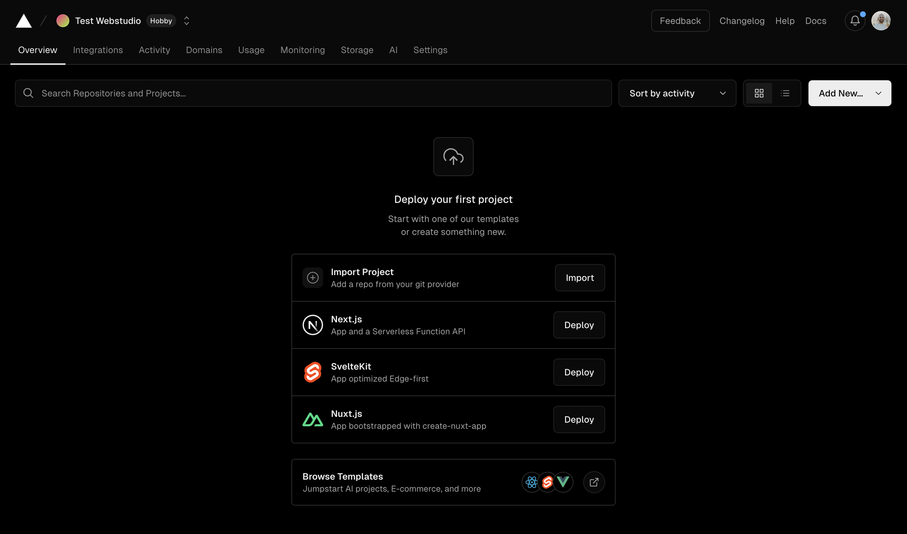

# ▶️ Vercel


How to Export and Self-Host Your Site on Vercel


[Vercel](https://vercel.com/), a popular cloud platform for static sites and Serverless Functions, is known for its ease of use and performance optimization capabilities. It provides an ideal environment for deploying your Webstudio Projects.


See [export rendering options](./#export-rendering-options) for more information about static and dynamic exports.


## Dynamic

Learn how to deploy your dynamic project to Vercel.

### **Prerequisites**

* Install the [Webstudio CLI](cli.md)
* [Build](cli.md#build) your project locally

Once you've built the project locally, you can use the [Vercel CLI](https://vercel.com/docs/cli) to deploy your site directly to Vercel:

```
vercel deploy
```

Follow the [Vercel CLI installation instructions](https://vercel.com/docs/cli). We plan to add more deployment targets in future.

#### Important Notes

If you use `vercel build` before `vercel deploy`, make sure to clean your `app` folder in the project afterward.

Vercel injects a few [files](https://github.com/vercel/vercel/blob/a8ad176262ef822860ce338927e6f959961d2d32/packages/remix/src/build.ts#L63) to support and deploy Remix using their CLI, but these files are not necessary for your project when you use it locally.

## **Static**

Learn how to upload your static site to Vercel.

<figure><figcaption></figcaption></figure>

### Prerequisites

* Export your project using one of the [export methods](./#exporting)
* Upload/commit your project to a Git provider (GitHub, Bitbucket, GitLab)

**How to upload your project to Netlify:**

* Go to dashboard
* Click “Import project” or “Add New” > “Project”
* Continue with one of the Git providers and authorize it
* Select the repository your project is in
* Click “Deploy”

See Vercel’s “[Import an existing project](https://vercel.com/docs/getting-started-with-vercel/import)” doc for a comprehensive tutorial.
